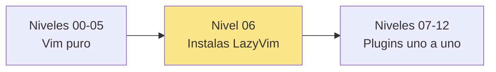
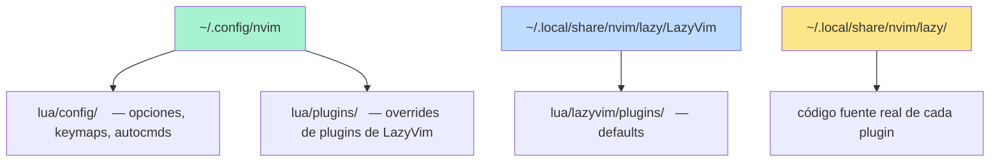
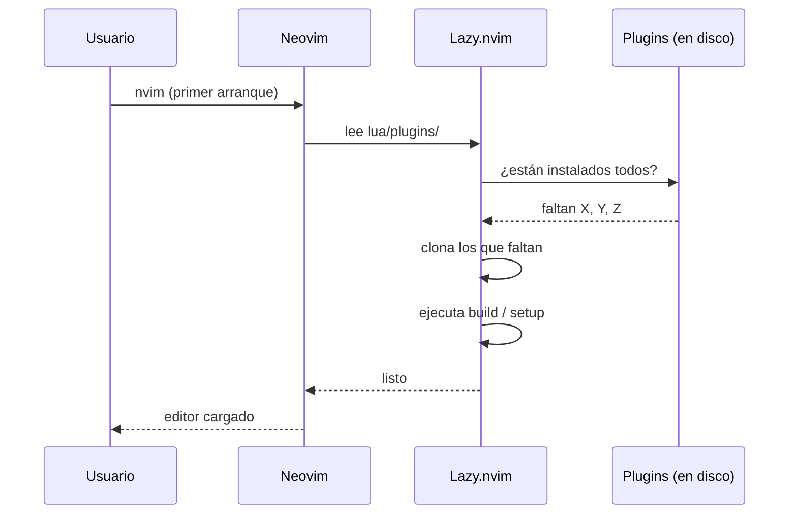
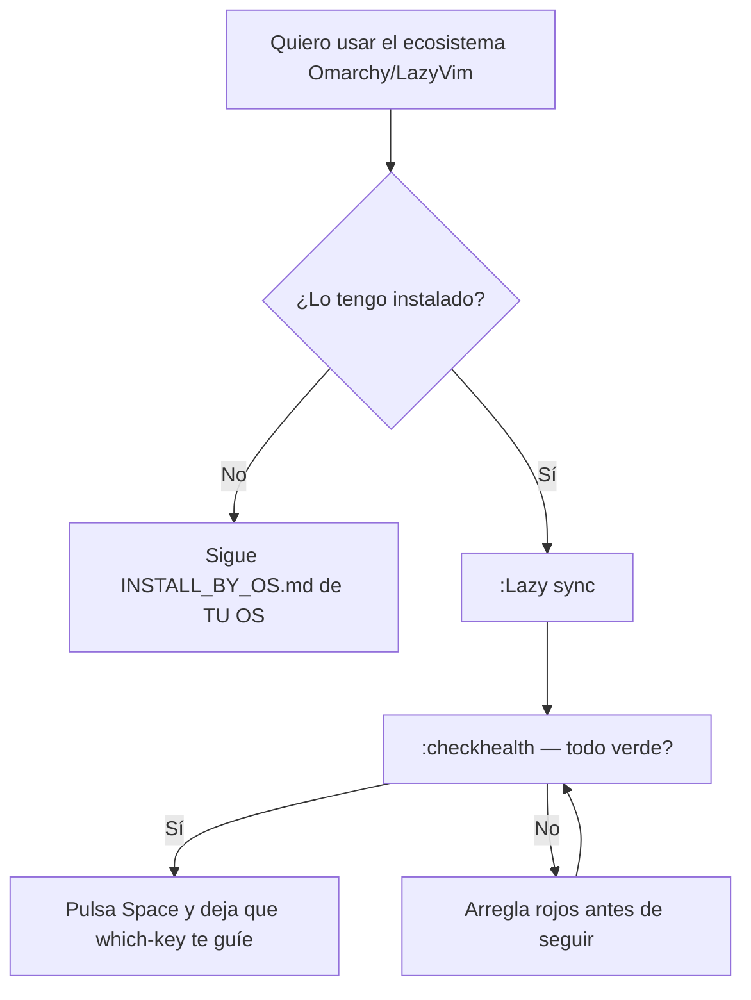

# 📘 Nivel 06 — Instalación de Omarchy / LazyVim y anatomía

---

## 1. Punto de inflexión

A partir de aquí, dejamos Vim "desnudo" y pasamos a **Neovim con la opinión de Omarchy + LazyVim**. Lo que NO cambia: todo lo de los niveles 00-05 sigue funcionando. Lo que SÍ cambia: ganas un ecosistema completo de plugins ya configurados con tecla `<leader>` y `<localleader>`, descubribles desde `which-key`.



> **La clave mental:** LazyVim NO es un editor distinto. Es Neovim + 30-40 plugins pre-configurados con buenas decisiones por defecto. Omarchy añade encima ajustes propios (theme, keymaps, integración con Hyprland). Todo lo que aprendas vale para LazyVim "vanilla" también.

---

## 2. Las tres capas que conviven en tu Neovim



- `~/.config/nvim/` es **TU** config (la editas tú).
- LazyVim vive bajo `~/.local/share/nvim/lazy/LazyVim/` como un plugin más — tiene defaults.
- Los plugins instalados viven en `~/.local/share/nvim/lazy/<plugin>/`.

> **Para el examen:** cuando alguien dice "edita tu config", siempre se refiere a `~/.config/nvim/` (Linux/Mac/WSL) o `%LOCALAPPDATA%\nvim\` (Windows). Nunca toques los directorios bajo `lazy/`: se sobreescriben al actualizar.

---

## 3. La tecla `<leader>` — el portal a TODO

LazyVim/Omarchy usan **Space (la barra espaciadora)** como `<leader>`. Es la tecla que abre los menús de `which-key`. Todos los comandos del ecosistema empiezan así.

```
<leader>           = Space
<leader>f          = Space + f  → submenú "Files"
<leader>ff         = Space + f + f → "Find File"
<leader><space>    = Space + Space → fuzzy file picker (atajo)
<leader>/          = Space + /    → grep en proyecto
<leader>e          = Space + e    → toggle explorer
<leader>gg         = Space + g + g → LazyGit
```

> **Si una vez pulsas `<leader>` y te quedas mirando**, no pasa nada: which-key te muestra un popup con las opciones siguientes. Esto es deliberado — vas descubriendo los menús sin memorizar.

---

## 4. Instalación paso a paso

La receta detallada por OS está en `INSTALL_BY_OS.md` en la raíz del bootcamp. Aquí va el RESUMEN universal:

### Resumen para cualquier Linux/Mac/WSL

```bash
# 1) Dependencias del sistema (varía según distro — ver INSTALL_BY_OS.md)
#    Necesitas: neovim ≥ 0.10, git, ripgrep, fd-find, nodejs (para algunos LSPs)

# 2) Clona el starter de LazyVim
git clone https://github.com/LazyVim/starter ~/.config/nvim
rm -rf ~/.config/nvim/.git

# 3) (OPCIONAL) Adopta encima la opinión de Omarchy
#    Esto sobreescribe theme, keymaps personalizados, etc.
git clone https://github.com/basecamp/omarchy /tmp/omarchy-src
cp -r /tmp/omarchy-src/default/neovim/* ~/.config/nvim/

# 4) Sincroniza plugins (descarga e instala los 30+ plugins en background)
nvim --headless "+Lazy! sync" +qa

# 5) Lanza nvim normalmente
nvim
```

### Resumen para Windows nativo (Git Bash)

```bash
# 1) winget install Neovim.Neovim BurntSushi.ripgrep.MSVC sharkdp.fd Git.Git OpenJS.NodeJS.LTS

# 2) Clona el starter
git clone https://github.com/LazyVim/starter "$LOCALAPPDATA/nvim"
rm -rf "$LOCALAPPDATA/nvim/.git"

# 3) Sincroniza
nvim --headless "+Lazy! sync" +qa
```

> **Si Omarchy YA está instalado en tu equipo**, salta los pasos 2-4. Solo verifica con:
> ```bash
> nvim --headless "+Lazy! sync" +qa
> ```

---

## 5. Comandos clave del ecosistema (memorízalos)

| Comando | Qué hace |
|---|---|
| `:Lazy` | abre el dashboard del gestor de plugins. Aquí ves qué está instalado, actualizado, etc. |
| `:Lazy sync` | descarga, instala, actualiza y limpia plugins en una pasada |
| `:Lazy update` | actualiza plugins instalados |
| `:Lazy clean` | borra plugins que ya no están en tu config |
| `:Mason` | abre el manager de LSPs, formatters, linters y debuggers |
| `:checkhealth` | informe completo de "qué funciona y qué no" en tu nvim |
| `:checkhealth lazy` | salud específica del gestor de plugins |
| `:checkhealth provider` | clipboard, python, node, etc. |
| `:LspInfo` | servidores LSP activos en el buffer actual |
| `:TSUpdate` | actualiza parsers de Treesitter |



---

## 6. Anatomía mínima de `lua/plugins/`

Cada archivo `.lua` en `~/.config/nvim/lua/plugins/` exporta una **tabla de plugin specs** que LazyVim entiende:

```lua
-- ~/.config/nvim/lua/plugins/example.lua
return {
  -- 1) Añadir un plugin nuevo
  {
    "folke/zen-mode.nvim",
    cmd = "ZenMode",
    keys = { { "<leader>z", "<cmd>ZenMode<cr>", desc = "Zen Mode" } },
  },

  -- 2) Cambiar opciones de un plugin que LazyVim ya configura
  {
    "nvim-lualine/lualine.nvim",
    opts = { options = { theme = "dracula" } },
  },

  -- 3) Desactivar un plugin de LazyVim
  { "akinsho/bufferline.nvim", enabled = false },
}
```

> **Para el bootcamp NO vas a tocar esto** hasta el Nivel 14 (y muy puntualmente). Solo necesitas saber QUÉ son estos archivos cuando los veas. La regla del bootcamp es: **dominar la opinión por defecto**, no inventar la tuya.

---

## 7. `:checkhealth` — el diagnóstico que evita pesadillas

`:checkhealth` recorre cada componente y reporta:
- ✅ verde → todo OK
- ⚠️ amarillo → algo no ideal (avisos)
- ❌ rojo → algo roto (necesita atención)

Categorías típicas:
- `lazy` — plugins se cargaron sin errores
- `mason` — bins de LSP disponibles
- `provider.clipboard` — copy/paste con el sistema
- `provider.node`, `provider.python` — necesarios para algunos plugins
- `treesitter` — parsers instalados

**Patrón de uso:**
```vim
:checkhealth            informe global (puede ser largo)
:checkhealth lazy       solo lazy
:checkhealth provider   solo providers (clipboard, etc.)
```

Si ves ❌ rojos al instalar, **arregla esos antes de avanzar**. La mayoría se resuelven instalando un binario que falta o un módulo de node/python.

---

## 8. Diagrama mental del Nivel 06



---

## 9. La pieza clave que cambia tu intuición — `<leader>` + which-key

A partir del Nivel 07 vas a vivir pulsando Space + algo. Hazte a la idea:

```
Space                  ← se abre menú which-key
  Space  → buscar archivo (snacks.picker)
  /      → grep en proyecto
  e      → toggle explorer
  f      → submenú Files
  s      → submenú Search
  g      → submenú Git
  c      → submenú Code (LSP)
  b      → submenú Buffer
  w      → submenú Windows
  q      → submenú Quit/session
  x      → submenú Diagnostics/quickfix
  u      → submenú UI
```

> **Regla mental:** si quieres hacer X y no sabes la tecla — pulsa Space, espera, lee el menú. En 2-3 días lo memorizarás solo.

---

## Referencia de Ejercicios

| Ejercicio | Archivo | Concepto |
|---|---|---|
| 06.01 | `ej01_verificar_requisitos.md` | Comprobar nvim, git, rg, fd, node por terminal |
| 06.02 | `ej02_instalar_lazyvim.md` | Instalar LazyVim + opcionalmente config Omarchy |
| 06.03 | `ej03_lazy_dashboard.md` | `:Lazy`, `:Lazy sync`, navegar el dashboard |
| 06.04 | `ej04_explorar_lua_y_keymaps.md` | Estructura `lua/`, listar plugins activos |
| 06.05 | `ej05_checkhealth_y_mason.md` | `:checkhealth` análisis + `:Mason` panel |

> **Cómo se verifica este nivel:** cada ejercicio te pide ejecutar comandos y pegar/anotar **salidas concretas** en el archivo. El diff comprueba que hayas escrito los marcadores `OK_*` correspondientes en las posiciones esperadas. No verifica que TU sistema esté realmente instalado — eso es responsabilidad tuya y la valida `:checkhealth`.
