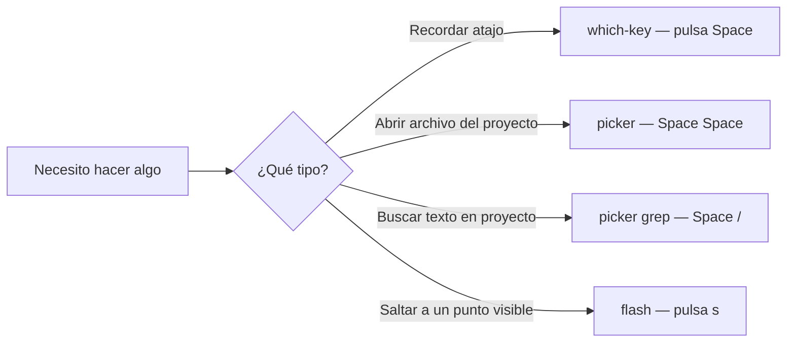
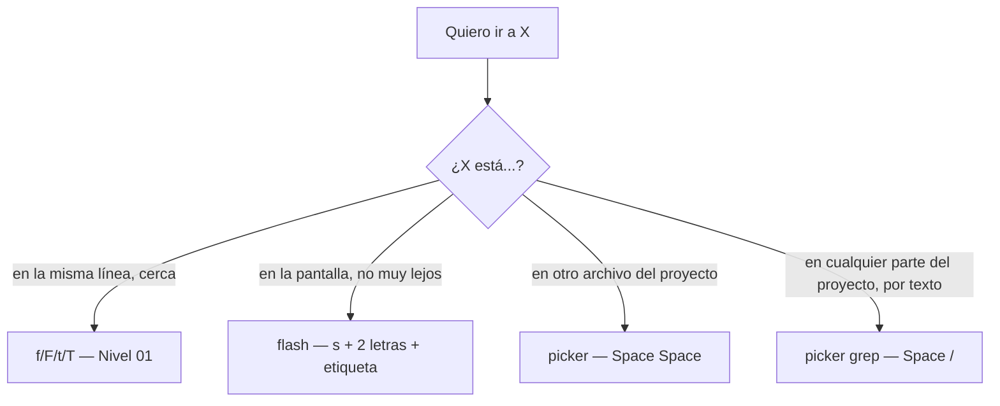
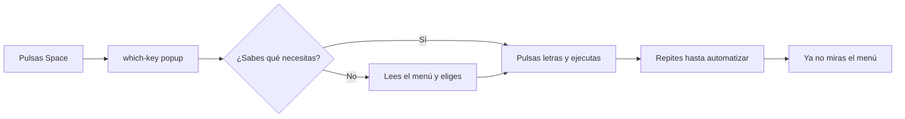

# 📘 Nivel 07 — which-key + snacks.picker + flash.nvim

---

## 1. Tres plugins que cambian la velocidad de tu día

| Plugin | Para qué | Tu rutina |
|---|---|---|
| `which-key` | Descubrir/recordar atajos sin abrir manual | Pulsas `<Space>` y esperas |
| `snacks.picker` | Encontrar archivos / texto en segundos | `<Space><Space>` y `<Space>/` |
| `flash.nvim` | Saltar en pantalla en 3 pulsaciones | `s` + 2 letras + etiqueta |



> **La clave mental:** dejas de pensar en "comandos a memorizar". Empiezas a pensar en INTENCIONES. La velocidad sale sola.

---

## 2. which-key.nvim — el coach que tienes siempre delante

### Antes de empezar — verifica instalación

```bash
# En tu config Omarchy/LazyVim, which-key ya viene instalado por defecto.
# Confirma con:
nvim --headless "+Lazy! check" +qa 2>&1 | grep -i which-key
```

Si NO sale nada, dentro de nvim ejecuta `:Lazy install which-key.nvim`.

### Cómo funciona

Pulsas `<leader>` (Space) y **esperas** ≈300ms. Sale un popup flotante con:

```
b     Buffer (submenú)
c     Code (submenú LSP)
f     Files (submenú)
g     Git (submenú)
gg    LazyGit
q     Quit/Session
r     RemoteOpen
s     Search (submenú)
u     UI toggles (submenú)
w     Windows (submenú)
x     Diagnostics/quickfix
?     Buffer Keymaps (listar TODOS)
<spc> Find File
/     Grep
:     Command History
e     Explorer
,     Switch buffer
```

Pulsas la letra y entras al submenú. Otra letra y ejecutas el comando final. Si nunca sueltas tecla y te pierdes: `<Esc>`.

### Comandos clave de which-key

| Comando | Qué hace |
|---|---|
| `<leader>` (esperar) | popup principal |
| `<leader>?` | lista TODOS los keymaps activos del buffer |
| `:WhichKey` | abre el popup desde Ex |
| `:WhichKey <leader>g` | abre el sub-popup de la categoría Git |

> **Truco mental:** cuando aprendas un atajo nuevo, repítelo deliberadamente 3-5 veces seguidas. La idea no es leer el menú toda la vida — es usarlo como rueda de aprendizaje hasta automatizar.

---

## 3. snacks.picker — el corazón del flujo Omarchy

En las últimas versiones de LazyVim, `snacks.picker` reemplaza a `telescope` por velocidad. La API es similar. Comandos típicos:

| Atajo | Acción |
|---|---|
| `<leader><space>` | "Smart find" — fuzzy find de archivos del proyecto |
| `<leader>ff` | Find File explícito |
| `<leader>fr` | Recent files |
| `<leader>fb` | Buffers abiertos |
| `<leader>fg` | Git files |
| `<leader>/` | Grep en proyecto (live grep — busca mientras escribes) |
| `<leader>sg` | Grep submenú |
| `<leader>sw` | Search Word — busca la palabra bajo el cursor |
| `<leader>sh` | Search Help (ayuda de Vim) |
| `<leader>sk` | Search Keymaps |
| `<leader>sc` | Search Command History |
| `<leader>s/` | Search en buffer actual |
| `<leader>sr` | Resume — repite la última búsqueda del picker |
| `<leader>,` | Buffer switcher (alias) |

### Dentro del picker

```
Ctrl-j / Ctrl-k    moverte por la lista
Enter              abre en el buffer actual
Ctrl-v             abre en split vertical
Ctrl-x             abre en split horizontal
Ctrl-t             abre en nueva tab
Ctrl-q             envía resultados al quickfix list
Esc                cierra el picker
```

### Anatomía del picker

```
┌─────────────────────────────┬──────────────────────┐
│ src/main/Foo.java           │  preview del archivo │
│ src/main/Bar.java           │  con sintaxis        │
│ src/test/FooTest.java       │  resaltada           │
│   ...                       │                      │
├─────────────────────────────┴──────────────────────┤
│ > Foo█                                              │
└─────────────────────────────────────────────────────┘
```

> **Para el examen mental:** el picker tiene 3 zonas — resultados (izda), preview (dcha), prompt (abajo). Estás escribiendo en el prompt; los resultados se filtran en tiempo real.

---

## 4. Algoritmo de fuzzy matching — lo que tienes que saber

Cuando escribes "fcj" en el picker, NO busca la cadena "fcj" literalmente. Busca archivos cuyas LETRAS aparezcan en orden, en cualquier posición. "fcj" matchea con:
- `Foo**C**lass**J**ava.java`
- `**F**oo**C**ontroller**J**ava.java`
- `**f**ind**c**onfig.**j**son`

> **Trucos para refinar:**
> - Empieza por una letra característica + extensión: `Foo.java` busca igual con `fj` que con `foo`.
> - Prefija con `'` (comilla) para BÚSQUEDA EXACTA: `'foo` solo matchea "foo" literal.
> - Prefija con `!` para EXCLUIR: `!test` filtra archivos sin "test".
> - Combinable: `Foo !test` busca Foo excluyendo tests.

---

## 5. flash.nvim — saltos rápidos como nunca

### Para qué es

Sustituye a `f/F/t/T` (Nivel 01) con algo más rápido para distancias **medias-grandes** dentro de la pantalla.

### Cómo funciona

1. Pulsas `s` (en Normal o después de un operador).
2. Escribes 2-3 letras (un trozo del texto al que quieres saltar).
3. Aparece una **etiqueta** (1-2 letras) sobre cada coincidencia.
4. Pulsas la etiqueta. Cursor allí, instantáneo.

```
Ejemplo:
" Texto en pantalla:
"   function calcularSuma(a, b) { return a + b; }
"   function calcularResta(a, b) { return a - b; }
"   function calcularMul(a, b) { return a * b; }
"
" Quieres saltar a 'Mul'.
" Pulsas: s
" Escribes: Mu     ← aparece una etiqueta 'a' sobre 'Mul'
" Pulsas: a        ← cursor en la 'M' de Mul. Cero esfuerzo mental.
```

### Comandos de flash

| Comando | Modo | Qué hace |
|---|---|---|
| `s` | Normal/Visual | flash adelante (jump labels) |
| `S` | Normal/Visual | flash con Treesitter (selecciona NODOS sintácticos completos) |
| `r` | Operator-pending | "remote flash" — borra/cambia en sitio remoto sin mover cursor |
| `R` | Operator-pending | flash treesitter en modo operator |

> **Truco profesional:** `c` + `r` + `2 letras` + `etiqueta` → cambias texto remoto sin mover el cursor. Vuelves automáticamente.

> **Truco con Visual:** `v` + `s` + `2 letras` + `etiqueta` → seleccionas desde donde estás hasta ese punto en una pulsación.

---

## 6. Diferencia between fuzzy picker vs. flash vs. f/t



Cada herramienta cubre una distancia distinta. No las mezcles.

---

## 7. Diagrama de descubrimiento (lo que harás los próximos días)



---

## 8. Pre-requisito antes de los ejercicios

Asegúrate de que `:checkhealth` está OK y que `:Lazy` muestra `which-key`, `snacks` y `flash` instalados:

```bash
nvim --headless "+lua print(vim.fn.exists(':WhichKey'))" "+lua print(vim.fn.exists(':Snacks'))" +qa
# debe imprimir 2 (existe) para cada uno
```

Y dentro de nvim:

```vim
:Lazy
" busca: which-key.nvim, snacks.nvim, flash.nvim
" los tres deben aparecer y estar "loaded"
```

---

## Referencia de Ejercicios

| Ejercicio | Archivo | Concepto |
|---|---|---|
| 07.01 | `ej01_whichkey_explora.md` | `<leader>` + esperar + leer menús |
| 07.02 | `ej02_picker_archivos.md` | `<leader><space>`, `<leader>ff`, `<leader>fr` |
| 07.03 | `ej03_picker_grep.md` | `<leader>/`, `<leader>sw`, filtros |
| 07.04 | `ej04_flash_saltos.md` | `s`, `S`, remote flash con operadores |
| 07.05 | `ej05_integrador_descubrimiento.md` | Workflow real combinando los tres |
