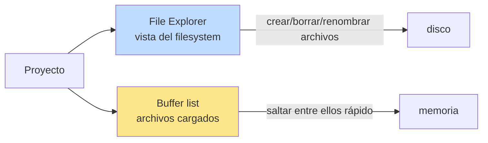
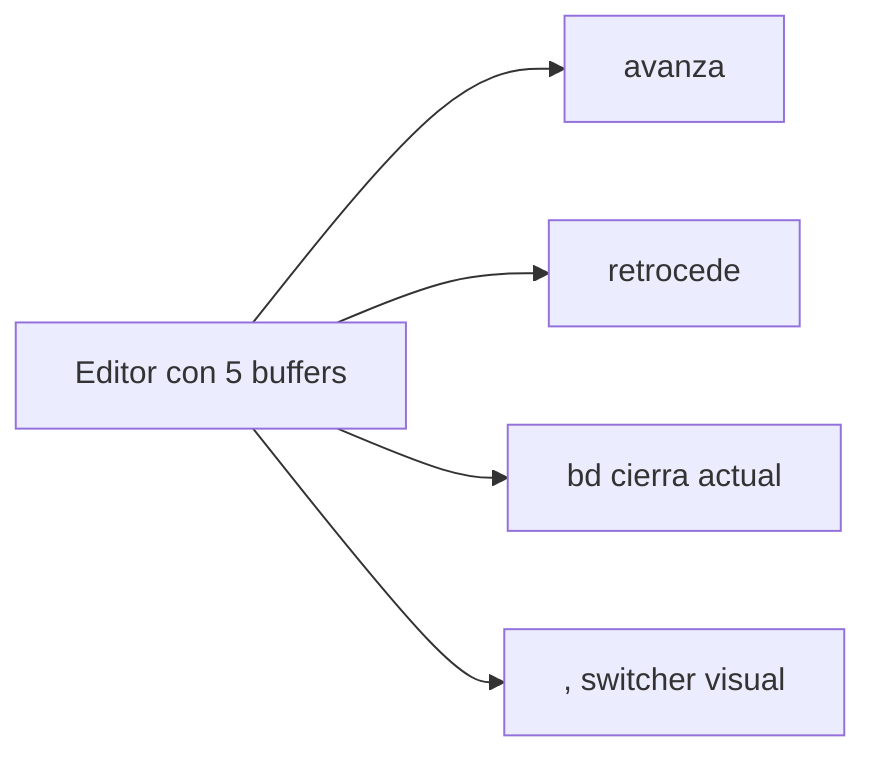
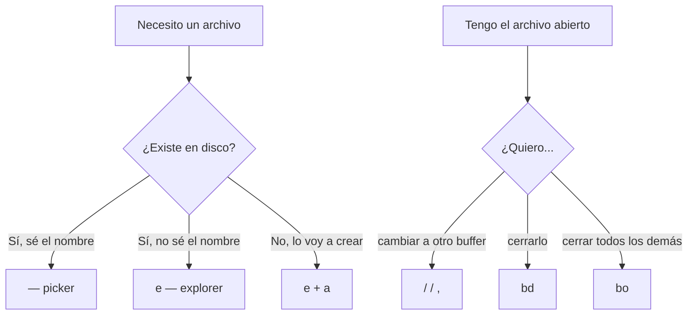

# 📘 Nivel 08 — File Explorer y gestión de Buffers

---

## 1. Dos formas de "ver" tu proyecto en Neovim



- **File Explorer** = panel lateral con árbol de carpetas (CRUD de archivos).
- **Buffer list** = los archivos cargados en memoria (navegación rápida).

LazyVim/Omarchy te dan ambos:
- File Explorer: **`snacks.explorer`** (o `neo-tree.nvim` en config más antigua).
- Buffer indicator: tope superior con pestañas (vía `bufferline` o `snacks.statuscolumn`).

> **La clave mental:** el explorer es para **acciones puntuales** (crear/renombrar/borrar archivos). El día a día se vive con el picker (`<leader><space>`) y los buffers (`H`/`L`), no con el explorer.

---

## 2. snacks.explorer / neo-tree — comandos esenciales

### Abrir / cerrar

| Atajo | Acción |
|---|---|
| `<leader>e` | toggle explorer (abre o cierra) |
| `<leader>E` | abre explorer en el cwd (no en el directorio del archivo actual) |
| `<leader>fe` | igual que `<leader>e` (alternativa) |
| `<leader>fE` | igual que `<leader>E` |

### Dentro del explorer

| Tecla | Acción |
|---|---|
| `j` / `k` | bajar / subir en el árbol |
| `l` o `Enter` | abrir archivo / expandir directorio |
| `h` | colapsar directorio (subir un nivel) |
| `a` | crear nuevo archivo (escribe nombre + Enter) |
| `A` | crear nueva carpeta |
| `d` | borrar (pide confirmación) |
| `r` | renombrar |
| `c` | copiar a registro (luego `p` pega aquí) |
| `x` | cortar |
| `p` | pegar (desde copiar/cortar) |
| `y` | copia el path absoluto al registro |
| `R` o `r` | refresh |
| `?` | muestra ayuda |
| `q` o `<Esc>` | cierra explorer |

> **Crear un archivo dentro de una carpeta**: posiciónate sobre la carpeta destino, `a`, y escribe `nombre.ext` (o `subdir/archivo.ext` para crear subcarpetas a la vez).

> **Truco para abrir en split**: posiciónate sobre el archivo, pulsa `Ctrl-v` (vertical) o `Ctrl-x` (horizontal) en lugar de `Enter`.

---

## 3. Buffers — los que dominaste en Nivel 04, con asistencia visual

LazyVim añade indicador visual de buffers en la parte superior. Atajos típicos:

| Atajo | Acción |
|---|---|
| `<S-h>` o `[b` | buffer anterior |
| `<S-l>` o `]b` | buffer siguiente |
| `<leader>,` o `<leader>bb` | switcher de buffers (con picker) |
| `<leader>fb` | picker de buffers |
| `<leader>bd` | borrar (cerrar) buffer actual |
| `<leader>bo` | borrar TODOS los buffers menos el actual |
| `<leader>bD` | borrar buffer y CERRAR ventana |
| `<leader>bp` | "pin" buffer (marca como persistente) |
| `[B` `]B` | mover buffer al inicio/fin de la lista |



> **Patrón de oro:** abre 5-10 buffers de tu proyecto y muévete entre ellos con `<S-h>` / `<S-l>` o `<leader>,`. Es 10× más rápido que abrir el explorer cada vez.

---

## 4. Sesiones — persistir layouts entre cierres

Las **sesiones** (vía `persistence.nvim` o `snacks.session`) guardan el estado de tu nvim (qué buffers, ventanas, tabs, cwd…) al salir, y lo restauran al volver.

| Atajo | Acción |
|---|---|
| `<leader>qs` | restaurar sesión del cwd actual |
| `<leader>ql` | restaurar la ÚLTIMA sesión usada |
| `<leader>qd` | NO guardar la sesión actual al salir |
| `<leader>qq` | salir |

Patrón típico:
```bash
cd ~/proyectos/foo
nvim                      # abre nvim en este directorio
# trabajas, abres archivos, splits...
:qa                       # sale (la sesión se guarda)

# al día siguiente:
cd ~/proyectos/foo
nvim
:lua require("persistence").load()   # o <leader>qs
# todo está como lo dejaste
```

> **Para el examen mental:** las sesiones se guardan automáticamente por **cwd**. Una sesión por proyecto. No las mezcles.

---

## 5. Búsqueda visual de buffers vs. explorer

| Situación | Mejor herramienta |
|---|---|
| Tengo el archivo abierto y quiero saltar a él | `<leader>,` o `<S-h>` / `<S-l>` |
| No tengo el archivo abierto pero sé el nombre | `<leader><space>` (picker fuzzy) |
| Necesito crear/renombrar/borrar un archivo | `<leader>e` (explorer) |
| Quiero ver la estructura del proyecto | `<leader>e` (explorer) |
| Tengo demasiados buffers y necesito limpiar | `<leader>bo` (delete others) |

---

## 6. Antes de empezar — instalación

Estos plugins vienen instalados con LazyVim/Omarchy. Comprueba:

```bash
nvim --headless "+Lazy! check" +qa
```

Si `snacks.nvim` no aparece "loaded", ejecuta dentro de nvim:

```vim
:Lazy install snacks.nvim
:Lazy sync
```

---

## 7. Diagrama mental del Nivel 08



---

## Referencia de Ejercicios

| Ejercicio | Archivo | Concepto |
|---|---|---|
| 08.01 | `ej01_explorer_toggle.md` | `<leader>e`, navegar, abrir archivos |
| 08.02 | `ej02_explorer_crud.md` | `a`, `A`, `r`, `d` — crear/renombrar/borrar |
| 08.03 | `ej03_buffer_nav.md` | `<S-h>`, `<S-l>`, `<leader>,`, `<leader>bd` |
| 08.04 | `ej04_sesiones.md` | `<leader>qs`, `<leader>ql`, persistencia |
| 08.05 | `ej05_integrador_workflow.md` | Workflow completo con explorer + buffers + sesiones |
