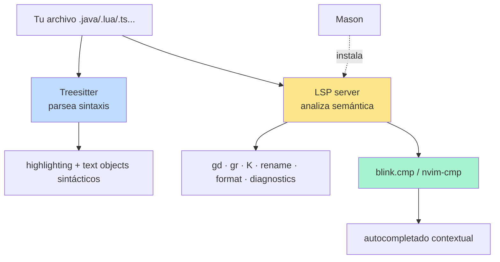

# 📘 Nivel 09 — Treesitter + LSP + Mason + Completion

---

## 1. La capa de inteligencia de código



| Pieza | Para qué |
|---|---|
| **Treesitter** | Parser ultra-rápido que entiende ESTRUCTURA del código. Da highlight y text objects sintácticos (`if`, `function`, `class`). |
| **LSP** (Language Server Protocol) | Servidor por lenguaje que da SEMÁNTICA: definiciones, referencias, errores, refactor. |
| **Mason** | Gestor de instalación de LSPs, formatters, linters, debuggers. UN comando para todo. |
| **blink.cmp / nvim-cmp** | Engine de autocompletado. Toma fuentes (LSP, snippets, buffer, path) y muestra el popup. |

> **La clave mental:** Treesitter ≠ LSP. Treesitter ve "esto es una función" porque lo SABE por la gramática. LSP ve "esta función se usa en otros 5 sitios" porque ha indexado el proyecto entero.

---

## 2. Treesitter — gramática para Vim

### Antes de empezar — instalar parsers

LazyVim trae Treesitter pre-configurado. Falta solo decirle qué parsers quieres:

```vim
:TSInstall java lua python typescript html css json yaml markdown
:TSUpdate                  " mantiene parsers al día
:TSInstallInfo             " lista de parsers disponibles
```

> En Omarchy esto suele venir con los lenguajes más comunes ya instalados. Verifica con `:TSInstallInfo`.

### Lo que cambia visualmente

Sin Treesitter: highlight por regex (rápido, impreciso).
Con Treesitter: highlight por AST (más colores, más correctos).

### Text objects sintácticos — la verdadera revolución

A los `iw`, `ip`, `i"` del Nivel 03 se añaden objetos basados en el AST:

| Text object | Qué selecciona |
|---|---|
| `if` / `af` | inner / around FUNCTION |
| `ic` / `ac` | inner / around CLASS |
| `il` / `al` | inner / around LOOP (for, while) |
| `ii` / `ai` | inner / around IF / conditional |
| `ia` / `aa` | inner / around ARGUMENT (en una llamada) |

```
" En Java:
"   public void foo(int a, int b) {
"       return a + b;        ← ponte aquí, pulsa daf
"   }                         ← se borra el método ENTERO
```

> **Para el examen:** estos text objects vienen con `nvim-treesitter-textobjects`. Si los atajos no funcionan, comprueba `:TSModuleInfo` que el módulo `textobjects` está activo, y que LazyVim incluye el extra correspondiente (en `lua/plugins/treesitter.lua` lo verás).

---

## 3. LSP — el cerebro del lenguaje

### Pre-requisito: instalar el LSP del lenguaje con Mason

```vim
:Mason                  " UI de Mason
" Pulsa 2 (LSP), busca con / y pulsa i sobre:
"   lua_ls       (para Lua)
"   jdtls        (para Java, lo veremos en Nivel 13)
"   pyright      (Python)
"   tsserver     (TypeScript)
"   marksman     (Markdown)
" Pulsa q para cerrar.
```

LazyVim suele auto-instalar LSPs cuando abres un archivo del lenguaje correspondiente, pero conviene verlo manualmente al menos una vez.

### Comandos LSP cotidianos

| Atajo | Acción |
|---|---|
| `K` | hover (documentación del símbolo bajo el cursor) |
| `gd` | go to **definition** |
| `gD` | go to **declaration** (importa en C/C++, no tanto en Java) |
| `gr` | list **references** (todas las llamadas) |
| `gi` | go to **implementation** |
| `gy` | go to **type definition** |
| `<leader>ca` | **code actions** (refactors, imports, etc.) |
| `<leader>cr` | **rename** símbolo (rename en todas las apariciones) |
| `<leader>cf` | **format** documento (si hay formatter) |
| `<leader>cd` | mostrar **diagnostic** de la línea |
| `<leader>cl` | LSP info |
| `]d` / `[d` | siguiente / anterior diagnostic |
| `]e` / `[e` | siguiente / anterior ERROR (skip warnings) |
| `<C-k>` (Insert) | signature help (firma del método mientras escribes) |

### Diagnostics — los rojos y amarillos

Mientras editas, el LSP te marca:
- 🔴 rojo = ERROR (no compila)
- 🟡 amarillo = WARNING (compila pero con avisos)
- 🔵 azul / 💡 = INFO / hint

Para verlos todos en una lista:

```vim
:lua vim.diagnostic.open_float()    " popup con la diagnostic actual
<leader>cd                          " idem
<leader>xx                          " Trouble panel (Nivel 11)
```

---

## 4. Mason — el gestor universal de bins

`:Mason` te abre el panel:

```
Pestañas (1-5):
  1 → All
  2 → LSP
  3 → DAP (debug adapters)
  4 → Linter
  5 → Formatter

Teclas dentro:
  i → install
  X → uninstall
  u → update
  /xxx → buscar
  ? → help
  q → close
```

Lista actual de instalación:
```vim
:Mason          " UI
:MasonInstall jdtls java-debug-adapter java-test stylua
:MasonUpdate
:MasonLog       " ver log si algo falla
```

> **Truco:** la lista de cosas a instalar puedes ponerla declarativamente en tu config (`lua/plugins/mason.lua`):
> ```lua
> { "williamboman/mason.nvim",
>   opts = { ensure_installed = { "jdtls", "lua_ls", "stylua" } } }
> ```
> Pero ESO ES TOCAR LA CONFIG — no lo haremos hasta el Nivel 13 (Java).

---

## 5. Completion — blink.cmp (moderno) o nvim-cmp

LazyVim ha migrado a `blink.cmp` (más rápido, escrito en Rust). El UX es similar.

### Mientras escribes en Insert

| Tecla | Acción |
|---|---|
| `<C-Space>` | abre/refuerza el popup de completion |
| `<Tab>` / `<S-Tab>` | seleccionar siguiente / anterior |
| `<CR>` (Enter) | aceptar selección |
| `<C-e>` | cancelar (cerrar popup) |
| `<C-k>` | signature help (parámetros del método) |

### Fuentes típicas

- LSP (el más útil — sugiere métodos, campos, clases)
- snippets (friendly-snippets)
- buffer (palabras del buffer actual)
- path (cuando escribes `/`, autocompleta rutas)

> **Para el examen:** el popup de completion se abre SOLO mientras estás en Insert tras escribir algunos caracteres. No aparece en Normal.

### Snippets — plantillas reutilizables

friendly-snippets te da plantillas para muchos lenguajes:

```
" En Java:
" Escribes: psvm + Tab → expande a:
"   public static void main(String[] args) {
"       <cursor>
"   }
```

Cuando un snippet tiene "huecos", `<Tab>` salta al siguiente hueco.

---

## 6. Diagrama mental del Nivel 09

```mermaid
flowchart TD
    A[Estoy editando código] --> B{¿Qué necesito?}
    B -->|Ver doc de un símbolo| C[K]
    B -->|Saltar a su definición| D[gd]
    B -->|Ver dónde se usa| E[gr]
    B -->|Renombrarlo en todo el proyecto| F[<leader>cr]
    B -->|Formatear el archivo| G[<leader>cf]
    B -->|Ver el error de esta línea| H[<leader>cd]
    B -->|Saltar al siguiente error| I[]d]
    B -->|Autocompletar mientras escribo| J[Insert + <C-Space>]
    B -->|Refactor sugerido| K[<leader>ca]
    B -->|Borrar la función entera| L[daf con treesitter]
```

---

## 7. Pre-requisito antes de los ejercicios

Necesitas tener al menos UN LSP instalado para practicar. Sugerencia: `lua_ls`.

```vim
:Mason
" pestaña 2 (LSP), busca lua_ls, instala con i, cierra con q
```

Si tienes Java instalado y quieres adelantarte, también `:MasonInstall jdtls`.

---

## Referencia de Ejercicios

| Ejercicio | Archivo | Concepto |
|---|---|---|
| 09.01 | `ej01_treesitter_textobjects.lua` | `daf`, `dac`, highlight |
| 09.02 | `ej02_mason_instalar.md` | `:Mason`, instalar lua_ls, marksman |
| 09.03 | `ej03_lsp_basico.lua` | `K`, `gd`, `gr`, `<leader>cd` |
| 09.04 | `ej04_completion.lua` | `<C-Space>`, `<Tab>`, snippets |
| 09.05 | `ej05_integrador_refactor.lua` | rename + code action + format |
