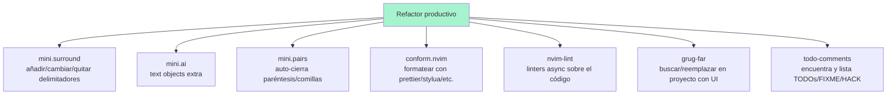

# 📘 Nivel 10 — Refactor productivo: mini.* + conform + nvim-lint + grug-far + todo-comments

---

## 1. Las pequeñas grandes herramientas



> **La clave mental:** ninguna de estas es revolucionaria por sí sola. Juntas, te hacen 3-5× más rápido refactorizando código en cualquier lenguaje.

---

## 2. mini.surround — los delimitadores son ciudadanos de primera clase

Cambia/añade/quita comillas, paréntesis, llaves, tags HTML… sobre el text object más cercano. Los atajos siguen una gramática:

| Atajo | Acción |
|---|---|
| `gsa` + objeto + delim | **Add** surround (rodea con el delim) |
| `gsd` + delim | **Delete** surround (quita el delim) |
| `gsr` + delim_old + delim_new | **Replace** surround (cambia) |
| `gsf` + delim | find delim adelante |
| `gsF` + delim | find delim atrás |
| `gsh` + delim | highlight delim |

> **Ojo con el prefijo:** depende de tu config. En LazyVim por defecto suele ser `gs*`. En algunas opiniones es `s*` (cuidado, choca con `s` de flash). Comprueba en `:WhichKey gs`.

Ejemplos:

```
" Texto:  hola
" 1) Ponte sobre 'hola'
" 2) gsaiw"   → "hola"      (add a-around-inner-word con ")
" 3) gsr"'    → 'hola'      (replace " por ')
" 4) gsd'     → hola        (delete ')
```

```
" Texto:  print("foo")
" gsdb     → print foo)     (delete brackets — depende de plugin)
" Mejor:   da( borra paréntesis y contenido (Nivel 03)
"          ds(  con mini.surround: quita los paréntesis manteniendo contenido
```

> **Patrón canónico Java/JS:** convertir `'foo'` en `"foo"` → `gsr'"` desde dentro de las comillas.

---

## 3. mini.ai — text objects MÁS extensos

Extiende los `i*`/`a*` del Nivel 03 con objetos cubriendo:

| Atajo | Qué selecciona |
|---|---|
| `ia` / `aa` | argument (igual que treesitter, pero sin parser) |
| `if` / `af` | function |
| `ic` / `ac` | class |
| `iI` / `aI` | indentation (bloque con misma indent) |
| `ig` / `ag` | gitsigns hunk (Nivel 11) |
| `i?` | "ask" — te pide dos caracteres y selecciona entre ellos |

> **Truco:** `vi?` + `<` + `>` selecciona entre cualquier par de `<...>` — incluso anidados. Útil para HTML/JSX.

---

## 4. mini.pairs — comodidad mientras escribes

Cuando escribes `(`, automáticamente:
- Aparece `)`.
- El cursor queda en medio.

Lo mismo con `[`, `{`, `"`, `'`, `` ` ``.

Pulsar `<Enter>` dentro de unas llaves vacías expande:
```
{|}    pulsas Enter
{
    |
}
```

> **Si te molesta**, puedes ignorarlo: solo escribes los `)` finales y el plugin no duplica. O lo desactivas con `enabled = false` en su spec.

---

## 5. conform.nvim — formateo unificado

Reemplaza la dispersión de "cada lenguaje su comando de formateo" con UNA acción común.

### Comandos clave

| Atajo | Acción |
|---|---|
| `<leader>cf` | formatea el buffer actual |
| `<leader>cF` | formatea el ARGUMENTO de la línea (en LazyVim opcional) |
| `:ConformInfo` | info de formatters disponibles para este buffer |

Para que funcione, necesitas el formatter del lenguaje instalado vía Mason:

```vim
:MasonInstall stylua          " Lua
:MasonInstall prettier        " JS/TS/JSON/HTML/CSS/Markdown
:MasonInstall black           " Python
:MasonInstall google-java-format   " Java
:MasonInstall clang-format    " C/C++
```

> **Format on save:** LazyVim activa esto por defecto en algunos lenguajes. Toggle con `<leader>uf` (o `<leader>uF` para el buffer actual).

---

## 6. nvim-lint — linters complementarios al LSP

El LSP da diagnostics, pero algunos linters externos son más estrictos. `nvim-lint` los integra:

```vim
:MasonInstall eslint_d        " JS/TS
:MasonInstall shellcheck      " bash
:MasonInstall pylint          " Python
:MasonInstall ruff            " Python (más moderno)
```

Estos errores aparecen como diagnostics normales (`]d`/`[d`/`<leader>cd`).

---

## 7. grug-far — search/replace en TODO el proyecto

Telescope/snacks.picker te dejan BUSCAR; grug-far te deja **BUSCAR Y REEMPLAZAR** con una UI dedicada.

| Atajo | Acción |
|---|---|
| `<leader>sr` | abre grug-far |

Dentro de grug-far:
```
┌────────────────────────────────────────┐
│ Search: foo                            │
│ Replace: bar                           │
│ Filter:                                │
│ Flags: -i  (case insensitive)          │
├────────────────────────────────────────┤
│ src/foo.java:12: foo()                 │
│ src/Bar.java:34: bar(foo)              │
│ test/FooTest.java:5: foo.run()         │
└────────────────────────────────────────┘
```

Pulsa `<leader>?` para ver atajos del panel:
- `<leader>r` → replace (aplica)
- `<leader>q` → cierra
- Puedes editar la lista de resultados — eliminar líneas significa "no las cambies".

> **Para el examen:** grug-far es MÁS SEGURO que `:%s/.../.../g` o `sed` porque te muestra todo lo que va a cambiar ANTES de hacerlo. Úsalo para refactors masivos en producción.

---

## 8. todo-comments — encuentra todos tus TODO/FIXME/HACK

Resalta y lista los marcadores comunes:

| Marcador | Color habitual |
|---|---|
| `TODO:` | azul |
| `FIXME:` | rojo |
| `HACK:` | amarillo |
| `WARN:` | amarillo |
| `NOTE:` | gris |
| `PERF:` | morado |

### Comandos

| Atajo | Acción |
|---|---|
| `]t` / `[t` | siguiente / anterior TODO |
| `<leader>st` | picker con todos los TODOs del proyecto |
| `<leader>xt` | abre el panel Trouble con los TODOs (Nivel 11) |

> **Truco:** combina `<leader>st` con el filtro del picker. `TODO` te lista solo los TODOs; `FIXME` solo los FIXMEs.

---

## 9. Antes de empezar — instalación

Estos plugins son TODOS estándar de LazyVim:

```bash
nvim --headless "+Lazy! check" +qa 2>&1 | grep -iE 'mini|conform|grug|todo|lint'
```

Si alguno falta, dentro de nvim:

```vim
:Lazy install mini.surround mini.ai mini.pairs conform.nvim nvim-lint grug-far.nvim todo-comments.nvim
:Lazy sync
```

Y los binarios externos:

```vim
:MasonInstall stylua prettier eslint_d
```

---

## 10. Diagrama mental del Nivel 10

```mermaid
flowchart TD
    A[Necesito refactorizar] --> B{¿Qué?}
    B -->|"Cambiar 'foo' por 'bar' en TODO el proyecto"| C[<leader>sr — grug-far]
    B -->|"Añadir comillas a algo"| D[gsaiw" — mini.surround]
    B -->|"Cambiar comillas simples por dobles"| E[gsr'\" — mini.surround]
    B -->|"Formatear el archivo"| F[<leader>cf — conform]
    B -->|"Ver mis TODOs pendientes"| G[<leader>st — todo-comments picker]
    B -->|"Saltar al siguiente FIXME"| H[]t — todo-comments]
    B -->|"Seleccionar el argumento de un método"| I[via — mini.ai]
```

---

## Referencia de Ejercicios

| Ejercicio | Archivo | Concepto |
|---|---|---|
| 10.01 | `ej01_mini_surround.txt` | `gsa`, `gsd`, `gsr` |
| 10.02 | `ej02_mini_ai.lua` | `via`, `if`, `iI` |
| 10.03 | `ej03_conform_format.lua` | `<leader>cf` |
| 10.04 | `ej04_grug_far.md` | `<leader>sr` |
| 10.05 | `ej05_todo_comments.md` | `]t`, `<leader>st` |
