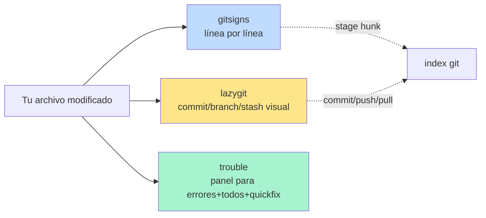
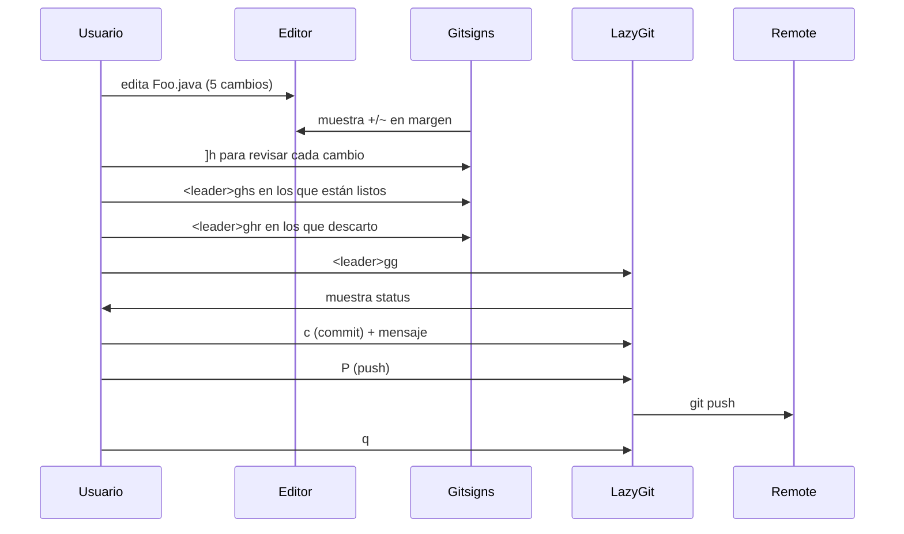

# 📘 Nivel 11 — Git en Neovim: gitsigns + lazygit + trouble

---

## 1. Tres niveles de granularidad para Git



- **gitsigns**: marcas en el margen, navegar hunks, stagear sin salir de nvim.
- **lazygit**: TUI completo (commit, branch, stash, log, rebase…).
- **trouble**: panel con TODOS los errores/warnings/TODOs del proyecto.

> **La clave mental:** gitsigns es el "día a día". Para acciones puntuales (commit/push), lazygit es UN atajo (`<leader>gg`). Trouble es el "panel de tareas pendientes".

---

## 2. gitsigns.nvim — Git en el margen izquierdo

### Antes de empezar — pre-requisito

Necesitas que la carpeta sea un repo git. Para el bootcamp, está ya inicializado.

```bash
cd "01_NeovimOmarchyMasterclass"
git status        # debe responder sin error
```

### Indicadores visuales

En el margen izquierdo (a la izquierda de los números de línea):

| Símbolo | Significado |
|---|---|
| `+` (verde) | línea AÑADIDA respecto a HEAD |
| `~` (amarillo) | línea MODIFICADA |
| `_` (rojo) | línea BORRADA (donde estaba) |
| `‾` (rojo) | línea borrada de arriba |

### Comandos

| Atajo | Acción |
|---|---|
| `]h` / `[h` | siguiente / anterior hunk |
| `<leader>ghs` | **stage** hunk actual |
| `<leader>ghr` | **reset** hunk (descarta los cambios) |
| `<leader>ghS` | **stage** todo el buffer |
| `<leader>ghu` | **undo** stage del hunk actual |
| `<leader>ghp` | **preview** del hunk en popup |
| `<leader>ghb` | **blame** de la línea (quién y cuándo la cambió) |
| `<leader>ghB` | toggle blame por línea (persistente) |
| `<leader>ghd` | **diff** del buffer contra HEAD |
| `<leader>ghD` | diff contra otro commit |

> **Para el examen:** `ih` / `ah` son text objects (inner/around hunk). Útil con operadores: `vih` selecciona el hunk, `dih` borra el hunk.

---

## 3. lazygit — TUI completo embebido

### Antes de empezar — instalar lazygit

```bash
# Arch / Omarchy
sudo pacman -S lazygit

# Fedora
sudo dnf install lazygit

# Ubuntu/Debian (via PPA o GitHub releases)
sudo add-apt-repository ppa:lazygit-team/release
sudo apt update && sudo apt install lazygit

# Windows
winget install JesseDuffield.lazygit

# macOS
brew install lazygit
```

### Atajo desde nvim

| Atajo | Acción |
|---|---|
| `<leader>gg` | lanza lazygit con el repo del cwd |
| `<leader>gG` | lanza lazygit en el repo del archivo actual |

### Dentro de lazygit (panel interactivo)

```
┌─Status────────┬─Files──────────┬─Branches──┐
│ 1 commit ahead│ M src/Foo.java │ * master  │
│               │ M README.md    │   feature │
├───────────────┼────────────────┼───────────┤
│ Commits       │ Stash          │ Tags      │
└───────────────┴────────────────┴───────────┘
```

| Tecla | Acción |
|---|---|
| `1` `2` `3` `4` `5` | cambiar de panel |
| `<Space>` | toggle stage de archivo |
| `a` | toggle stage de TODO |
| `c` | commit (te abre editor para el mensaje) |
| `P` | push |
| `p` | pull |
| `+` / `_` | crear/colapsar |
| `?` | ayuda contextual |
| `q` o `<Esc>` | salir |

> **Workflow típico:** `<leader>gg` → `<Space>` sobre cada archivo a stagear → `c` para commit → escribes mensaje → guardas y sales → `P` para push → `q`.

---

## 4. trouble.nvim — panel de errores/warnings/quickfix/TODOs

### Comandos

| Atajo | Acción |
|---|---|
| `<leader>xx` | toggle diagnostics (todo el workspace) |
| `<leader>xX` | toggle diagnostics SOLO del buffer actual |
| `<leader>xL` | location list |
| `<leader>xQ` | quickfix list |
| `<leader>xs` | symbols del buffer actual (outline) |
| `<leader>xt` | TODOs del proyecto |

### Dentro del panel trouble

```
Workspace diagnostics
  ❌ src/Foo.java (3 errors)
      45  Cannot resolve symbol 'unknownVar'
      52  Missing return statement
      78  Unhandled exception 'IOException'
  ⚠️  src/Bar.java (1 warning)
      12  Unused import

```

| Tecla | Acción |
|---|---|
| `j` / `k` | navegar |
| `<Enter>` | saltar al archivo:línea del error |
| `o` | abrir en buffer y mantener trouble abierto |
| `q` | cerrar trouble |
| `r` | refresh |
| `?` | ayuda |

---

## 5. Workflow completo: del cambio al push



---

## 6. Diagrama mental del Nivel 11

```mermaid
flowchart TD
    A[¿Qué hago con Git?] --> B{Operación}
    B -->|Ver cambios línea a línea| C[gitsigns: ]h [h <leader>ghp]
    B -->|Stagear partes pequeñas| D[gitsigns: <leader>ghs <leader>ghr]
    B -->|Commit/push/branch| E[lazygit: <leader>gg]
    B -->|Ver quién cambió esta línea| F[gitsigns: <leader>ghb]
    B -->|Ver todos los errores del proyecto| G[trouble: <leader>xx]
    B -->|Ver mis TODOs pendientes| H[trouble: <leader>xt]
```

---

## Referencia de Ejercicios

| Ejercicio | Archivo | Concepto |
|---|---|---|
| 11.01 | `ej01_gitsigns_basico.md` | `]h`, `<leader>ghp`, `<leader>ghb` |
| 11.02 | `ej02_gitsigns_stage.md` | `<leader>ghs`, `<leader>ghr`, hunks |
| 11.03 | `ej03_lazygit.md` | `<leader>gg`, commit, log |
| 11.04 | `ej04_trouble.md` | `<leader>xx`, `<leader>xt`, navegación |
| 11.05 | `ej05_integrador_git.md` | Workflow completo edit→stage→commit |
