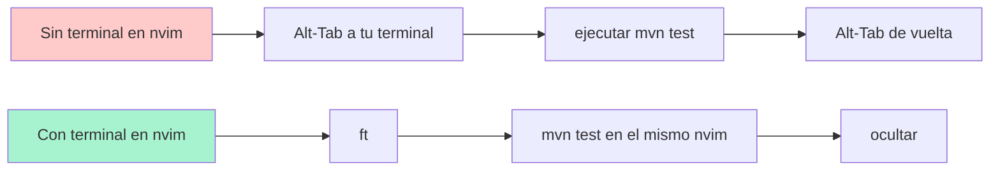
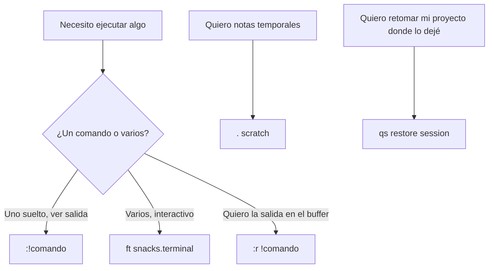

# 📘 Nivel 12 — Terminal embebida, scratch y sesiones

---

## 1. ¿Por qué quieres una terminal dentro del editor?



Cuando ejecutas comandos sin salir del editor:
- Mantienes el contexto (mismos buffers, mismas marks, misma sesión).
- Los outputs se pueden copiar con `yank` directamente al código.
- Los errores quedan visibles mientras editas.

---

## 2. Tres formas de tener terminal en Neovim

| Forma | Cuándo usarla |
|---|---|
| **`:terminal`** (nativo) | One-shot, sin plugins. Pesa nada. |
| **snacks.terminal** (Omarchy/LazyVim) | Diario. Atajos, toggle, flotante. |
| **`:!comando`** | Ejecuta UN comando shell, ves la salida y vuelves. |

### 2.1 `:terminal` nativo

```vim
:terminal                  " abre terminal en la ventana actual
:vsplit | terminal         " split vertical con terminal
:split | terminal          " split horizontal con terminal
:terminal mvn test         " arranca con un comando inicial
```

Dentro de la terminal: estás en **modo Terminal**, parecido a Insert. Para volver a Normal:

```
<C-\><C-n>      sales a Normal (puedes copiar, etc.)
i               vuelves a Terminal
```

### 2.2 snacks.terminal — la del día a día en Omarchy

| Atajo | Acción |
|---|---|
| `<leader>ft` | abre terminal flotante (toggle) |
| `<leader>fT` | nueva terminal flotante |
| `<C-/>` (en Normal) | toggle terminal rápido |
| `<C-/>` (DENTRO de terminal) | la oculta sin matarla |

> **La clave mental:** la terminal flotante de snacks **persiste** mientras nvim esté abierto. Lo que pongas a correr sigue corriendo aunque la ocultes con `<C-/>`.

### 2.3 `:!` para one-shots

```vim
:!ls -la                  " ejecuta y muestra salida
:!mvn test                " ídem
:r !date                  " inserta la salida de 'date' en el buffer
:!%                       " ejecuta el archivo actual (si es ejecutable)
```

---

## 3. Trabajar EN la terminal embebida

| Tecla | En qué modo | Acción |
|---|---|---|
| `i`, `a`, `o` | Normal de la terminal | Insert (escribir comandos) |
| `<C-\><C-n>` | Insert/Terminal | volver a Normal |
| `i` | Normal de la terminal | volver a Insert |
| escribir + `<Enter>` | Insert/Terminal | ejecuta el comando |
| `y` en Normal | sobre el output | copia, queda en el registro `"` |

> **Trucazo:** ejecutas `mvn test`, sale en rojo "expected: 5, actual: 7". Pasas a Normal con `<C-\><C-n>`, te pones sobre `7`, pulsas `yiw`, vuelves a tu test Java con `<S-h>`, navegas a la línea del expected, `ciw` + `<C-r>"` para pegar.

---

## 4. Scratch buffer — "papel de notas" sin archivo

Un scratch buffer es un buffer que NO está asociado a archivo. Vive en memoria, no se guarda en disco. Útil para:
- Notas temporales mientras programas.
- Probar un snippet de código.
- Pegar logs para procesarlos con macros.

| Atajo | Acción |
|---|---|
| `<leader>.` | toggle scratch buffer (snacks) |
| `<leader>S` | nuevo scratch buffer |
| `:new` (nativo) | nuevo buffer vacío |
| `:enew` | reemplaza el buffer actual con uno vacío |

```vim
" desde la línea de comandos puedes hacerlo a mano:
:enew
:setlocal buftype=nofile bufhidden=hide noswapfile
```

---

## 5. Sesiones — repaso profundo

Las sesiones (vía `persistence.nvim` o `snacks.session`) ya las viste en el Nivel 08. Aquí los detalles que faltaban:

### Cómo se identifica una sesión

Por el **cwd** (current working directory) cuando arrancaste nvim. Si abres dos veces `nvim` desde el mismo directorio, restauras la misma sesión.

| Atajo | Acción |
|---|---|
| `<leader>qs` | restaura sesión del cwd |
| `<leader>ql` | restaura la ÚLTIMA sesión usada (cualquier cwd) |
| `<leader>qd` | NO guardar la sesión actual al salir |
| `:lua require("persistence").select()` | picker con TODAS tus sesiones |

### Qué se guarda en una sesión

- Lista de buffers abiertos
- Layout de ventanas (splits, tamaños)
- Tabs
- Cursor position en cada buffer
- Marks globales (mA-mZ)
- Algunas opciones locales

### Qué NO se guarda

- Contenido de buffers sin archivo (scratch)
- Terminales abiertas
- Estado de plugins flotantes (Lazy, Mason panels)

> **Para el examen:** una sesión por proyecto. No mezcles cwds.

---

## 6. Diagrama mental del Nivel 12



---

## 7. Pre-requisito antes de los ejercicios

`snacks.nvim` ya viene con LazyVim/Omarchy. Verifica:

```bash
nvim --headless "+lua print(vim.fn.exists('*Snacks.terminal.toggle'))" +qa
```

Si no, instala: `:Lazy install snacks.nvim` y `:Lazy sync`.

Para los TODOs prácticos, ten también `jq` o `wc` disponibles en tu PATH (cualquier shell estándar los trae).

---

## Referencia de Ejercicios

| Ejercicio | Archivo | Concepto |
|---|---|---|
| 12.01 | `ej01_terminal_basica.md` | `<leader>ft`, `<C-\><C-n>`, `i` |
| 12.02 | `ej02_terminal_comando.md` | `:!`, `:r !`, captura de outputs |
| 12.03 | `ej03_scratch.md` | `<leader>.`, scratch buffers |
| 12.04 | `ej04_sesiones_avanzado.md` | `<leader>qs`, `<leader>ql`, persistencia |
| 12.05 | `ej05_integrador_workflow.md` | Edit + terminal + scratch + sesión |
