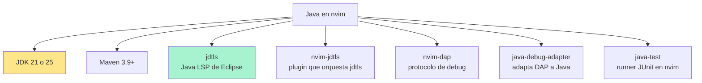
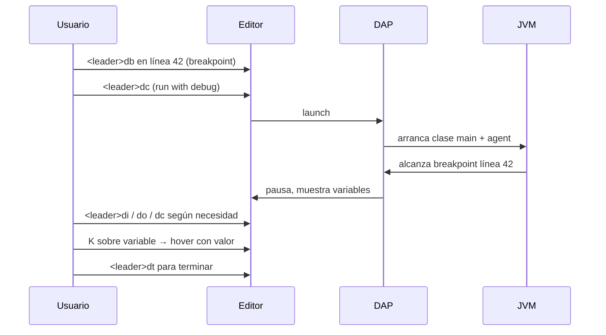
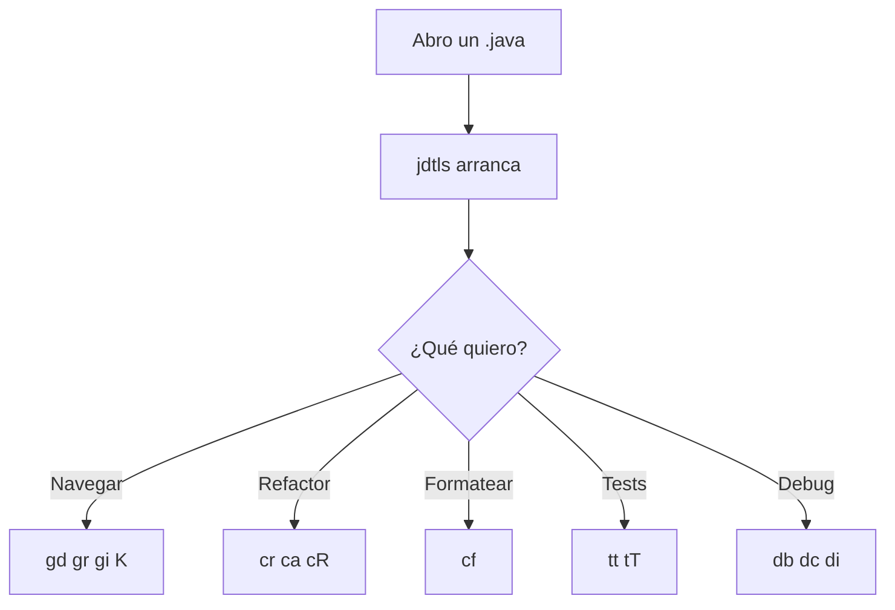

# 📘 Nivel 13 — Java en Neovim: nvim-jdtls + DAP

---

## 1. Lo que necesitas para que Java vuele



> **La clave mental:** `jdtls` es el "Eclipse Java" sin UI, hablando LSP. `nvim-jdtls` traduce los caprichos de jdtls al resto del ecosistema LazyVim. Todo lo que aprendiste en el Nivel 09 (gd, gr, K, rename, format) FUNCIONA — solo cambia la lista de code actions y comandos extra.

---

## 2. Instalación

### 2.1 JDK y Maven (sistema)

```bash
# Arch / Omarchy
sudo pacman -S --needed jdk-openjdk maven

# Fedora
sudo dnf install -y java-21-openjdk-devel maven

# Ubuntu/Debian
sudo apt install -y openjdk-21-jdk maven

# Windows
winget install EclipseAdoptium.Temurin.21.JDK Apache.Maven

# Verifica
java -version
mvn -version
```

### 2.2 LazyVim extra de Java

En LazyVim, activa el extra `lang.java`:

```vim
:LazyExtras
" navega a 'lang.java', pulsa <Tab> para alternar 'enabled'
" pulsa <Esc>
:Lazy sync                  " instala los plugins del extra
```

Alternativamente, añade manualmente a `~/.config/nvim/lua/config/lazy.lua`:

```lua
{ import = "lazyvim.plugins.extras.lang.java" },
```

### 2.3 Mason: jdtls, debug, test

```vim
:MasonInstall jdtls java-debug-adapter java-test google-java-format
```

Espera a que termine. Cuando abras un `.java`, jdtls arranca solo (puede tardar 30-60s la primera vez).

### 2.4 Verificación

Abre cualquier archivo `.java`:

```vim
:LspInfo            " debe listar 'jdtls' como activo
:checkhealth lazy   " sin rojos
```

---

## 3. Atajos LSP en Java (igual que Nivel 09, más extras)

| Atajo | Acción |
|---|---|
| `gd` | go to definition |
| `gr` | references |
| `gi` | implementation |
| `K` | hover (Javadoc + signatura) |
| `<leader>cr` | rename símbolo (clase, método, variable) |
| `<leader>ca` | code actions (organizar imports, extract method, etc.) |
| `<leader>cf` | format con google-java-format |
| `<leader>co` | organize imports (LazyVim alias) |
| `<leader>cR` | extract method (cuando hay selección Visual) |
| `<leader>cV` | extract variable |
| `<leader>cC` | extract constant |
| `<leader>cd` | line diagnostic |
| `]d` / `[d` | siguiente / anterior diagnostic |

### Code actions más útiles en Java

Cuando pulsas `<leader>ca` sobre código Java, suelen aparecer:
- **Organize imports**
- **Add unimplemented methods**
- **Override / implement methods**
- **Generate getters/setters**
- **Generate constructor**
- **Generate toString**
- **Extract to method/variable/constant**
- **Rename in file**

---

## 4. Tests JUnit desde nvim — `java-test`

Si tienes `java-test` instalado vía Mason:

| Atajo | Acción |
|---|---|
| `<leader>tt` | run nearest test (el test bajo el cursor) |
| `<leader>tT` | run all tests del archivo |
| `<leader>tr` | re-run last test |
| `<leader>tl` | run last test |
| `<leader>ts` | toggle test summary panel |
| `<leader>to` | toggle test output |

> **Truco:** ponte sobre el nombre de UN método `@Test` y pulsa `<leader>tt`. Se ejecuta SOLO ese test. Más rápido que `mvn test -Dtest=...`.

---

## 5. Debugger (DAP) — depurar Java sin abrir IntelliJ

Con `nvim-dap` + `java-debug-adapter`:

| Atajo | Acción |
|---|---|
| `<leader>db` | **toggle breakpoint** en la línea actual |
| `<leader>dB` | breakpoint **condicional** (te pide la condición) |
| `<leader>dc` | **continue** (sigue ejecución hasta el próximo breakpoint) |
| `<leader>di` | **step into** (entra dentro de la llamada) |
| `<leader>do` | **step over** (siguiente línea, sin entrar) |
| `<leader>dO` | **step out** (sale de la función actual) |
| `<leader>dr` | abre la **REPL** del debugger |
| `<leader>du` | toggle **dap-ui** (panel completo) |
| `<leader>dt` | terminate session |
| `<leader>dl` | run last config |

### Workflow típico



### Panel dap-ui

`<leader>du` abre/oculta un panel con:

```
┌─Variables───┬─Stack frames───┐
│ args = [..] │ main()         │
│ x = 5       │   foo()        │
│ result = ?  │     bar()      │
├─Watches─────┼─Breakpoints────┤
│             │ Foo.java:42    │
└─────────────┴────────────────┘
│ REPL                          │
│ > x * 2                       │
│ < 10                          │
└───────────────────────────────┘
```

> **Truco profesional:** la REPL (`<leader>dr`) te deja evaluar EXPRESIONES en tiempo de ejecución. Como un breakpoint condicional, pero interactivo.

---

## 6. Comandos jdtls específicos

| Comando | Acción |
|---|---|
| `:JdtCompile` | recompila el workspace |
| `:JdtUpdateConfig` | re-genera config tras cambiar `pom.xml` |
| `:JdtRefreshDebugConfigs` | refresca configuraciones de debug |
| `:JdtBytecode` | abre el bytecode de la clase actual |
| `:JdtSetRuntime` | cambia la versión de JDK por defecto |

---

## 7. Antes de empezar — proyecto Maven mínimo

El bootcamp ya tiene un `pom.xml` en la raíz para los niveles 13 y 14. Verifica que `mvn compile` funciona:

```bash
cd "01_NeovimOmarchyMasterclass"
mvn -q clean compile
echo $?         # debe imprimir 0
```

Si tu `pom.xml` referencia JDK 25 pero tienes JDK 21, edita la propiedad `<maven.compiler.release>21</maven.compiler.release>`.

---

## 8. Diagrama mental del Nivel 13



---

## Referencia de Ejercicios

| Ejercicio | Archivo | Concepto |
|---|---|---|
| 13.01 | `ej01_setup_jdtls.md` | `:LazyExtras`, `:MasonInstall jdtls`, `:LspInfo` |
| 13.02 | `ej02_navegacion_java.java` | `gd`, `gr`, `K`, organize imports |
| 13.03 | `ej03_refactor_java.java` | rename, extract method, code actions |
| 13.04 | `ej04_tests_junit.md` | `<leader>tt`, `<leader>tT` |
| 13.05 | `ej05_debug_dap.java` | `<leader>db`, `<leader>dc`, REPL |
