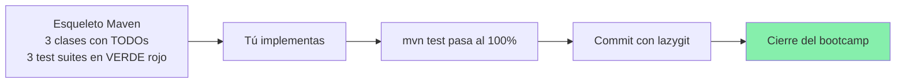
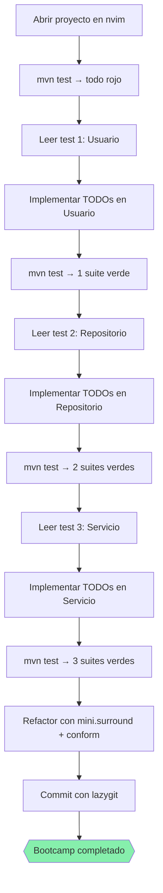

# 📘 Nivel 14 — Boss Final: proyecto Maven completo en Neovim+Omarchy

---

## 1. Misión

Construirás desde cero (a partir de esqueletos con TODOs) un proyecto Maven multinivel con JUnit, trabajado **íntegramente desde Neovim+Omarchy**. Sin ratón, sin IDE externo, sin IntelliJ. Si lo logras, has cerrado el bootcamp.



---

## 2. Estructura del proyecto

```
ejercicios/nivel14_boss_final/
├── pom.xml                                    (Java 21, JUnit 5, AssertJ)
├── README_BOSS.md                             (consignas)
└── src/
    ├── main/java/com/bootcamp/finale/
    │   ├── modelo/Usuario.java                ← TODOs
    │   ├── repositorio/UsuarioRepositorio.java  ← TODOs
    │   └── servicio/UsuarioServicio.java      ← TODOs
    └── test/java/com/bootcamp/finale/
        ├── modelo/UsuarioTest.java            ← completos
        ├── repositorio/UsuarioRepositorioTest.java   ← completos
        └── servicio/UsuarioServicioTest.java  ← completos
```

---

## 3. Las cinco fases del Boss Final

| Fase | Archivo `ej` | Objetivo | Cómo se verifica |
|---|---|---|---|
| 14.01 | `ej01_abrir_y_compilar.md` | Abrir proyecto en nvim+jdtls, `mvn clean test` (rojos esperados) | jdtls activo, `mvn` compila tests |
| 14.02 | `ej02_modelo_usuario.md` | Implementar `Usuario` modelo | `UsuarioTest` en VERDE |
| 14.03 | `ej03_repositorio.md` | Implementar `UsuarioRepositorio` (almacén en memoria) | `UsuarioRepositorioTest` en VERDE |
| 14.04 | `ej04_servicio_y_debug.md` | Implementar `UsuarioServicio` + debug un caso límite | `UsuarioServicioTest` en VERDE |
| 14.05 | `ej05_refactor_y_commit.md` | Refactor con mini.surround/conform + commit con lazygit | `mvn clean test` global VERDE + commit visible |

---

## 4. La restricción

> [!CAUTION]
> **NO uses streams, ni Optional, ni mapas auxiliares de java.util** salvo lo que el test JUnit
> espera. Implementa con lo BÁSICO. El objetivo es que la lógica sea suficientemente clara para
> que practiques navegar/editar/depurar con el editor.

> **NO toques los tests.** Están ya implementados y son tu verdad. Si crees que un test está mal,
> revisa tu implementación antes.

---

## 5. Reglas del Boss

1. **TODO se hace dentro de nvim** (incluido ejecutar mvn, lazygit, todo).
2. **Tests rojos al principio** = espera lo normal antes de implementar.
3. **Iterar pequeño**: implementa un método → `<leader>tt` → verifica → siguiente.
4. **Cuando los 3 test suites están en verde** → commit final con lazygit.
5. **El verificador** es `bash scripts/verificar.sh 14` → ejecuta `mvn clean test` y reporta.

---

## 6. Diagrama mental del Boss



---

## 7. Checklist final

- [ ] Has navegado el proyecto con `<leader>e` y `<leader><space>` sin ratón.
- [ ] Has usado `gd`, `gr`, `K`, `<leader>cr`, `<leader>ca` para entender/refactorizar.
- [ ] Has corrido tests con `<leader>tt` (java-test) o `:!mvn test`.
- [ ] Has puesto un breakpoint y depurado con `<leader>db` + `<leader>dc`.
- [ ] Has hecho commit con `<leader>gg` (lazygit).
- [ ] Has cerrado y reabierto el proyecto con sesión (`<leader>qs`).
- [ ] `bash scripts/verificar.sh 14` está en VERDE.

---

## Referencia de Ejercicios

| Ejercicio | Archivo | Acción concreta |
|---|---|---|
| 14.01 | `ej01_abrir_y_compilar.md` | Setup + `mvn test` rojo |
| 14.02 | `ej02_modelo_usuario.md` | Implementar `Usuario` |
| 14.03 | `ej03_repositorio.md` | Implementar `UsuarioRepositorio` |
| 14.04 | `ej04_servicio_y_debug.md` | Implementar `UsuarioServicio` + debug |
| 14.05 | `ej05_refactor_y_commit.md` | Refactor + commit final |
