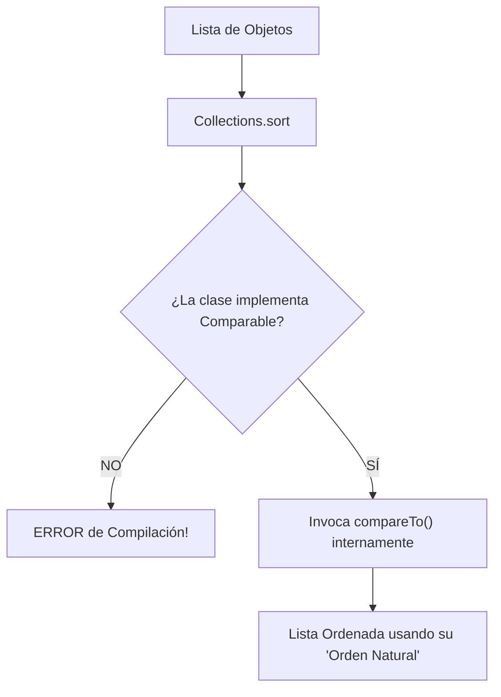
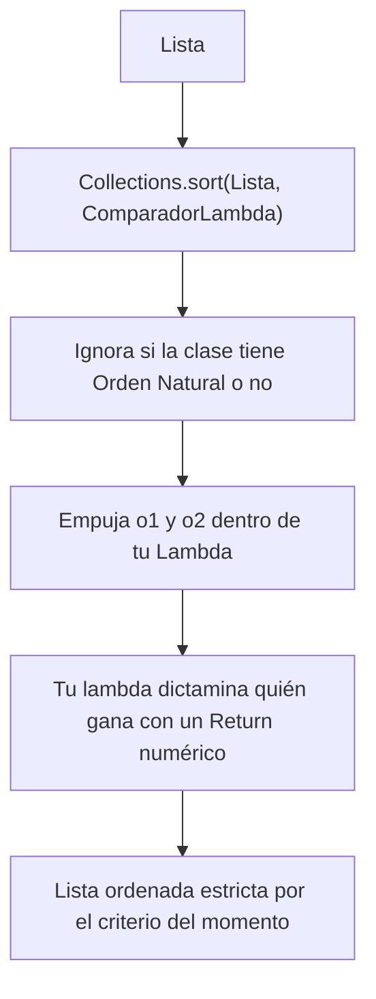

# Arquitectura de Ordenación: Comparable Vs Comparator

El primer gran dilema en Java Collections es decidir cómo ordenar un Objeto personalizado. 
Por ejemplo: Tienes una lista de `Aventurero` y le pides a Java que la ordene usando `Collections.sort(listaAventureros)`.

**Java responderá inmediatamente con un ERROR en tiempo de compilación.**
¿Por qué? Porque Java no sabe qué hace que un `Aventurero` sea mayor o menor que otro. ¿Es su fuerza? ¿Su edad? ¿El orden alfabético de su nombre?

Aquí nacen dos soluciones fundamentales:

## 1. La Interfaz Comparable (El "Orden Natural" intrínseco)

Sirve para incrustar el criterio de ordenación directamente en el **ADN del código de tu clase.**

- **El Concepto:** Modificas el código fuente de tu clase (Ej: `public class Aventurero implements Comparable<Aventurero>`).
- **El Método Oculto:** Te obliga a programar el método `compareTo(OtroAventurero)`.
- **Frecuencia:** Se usa cuando el objeto **SIEMPRE** se va a ordenar de la misma manera por defecto (Ej: Las Palabras siempre son alfabéticas, los Números de menor a mayor).
- **El Problema:** Solo puedes programarlo **UNA VEZ** por cada clase. Solo puede haber un único *Orden Natural*.

## 2. La Interfaz Comparator (El "Árbitro" externo)

Aparece como salvavidas cuando quieres ordenar a los `Aventureros` de formas MÚLTIPLES y dinámicas (un botón en tu web que ordena por Oro, otro que ordena por Edad, otro por Fama...). 

Como no puedes usar *Comparable* (que solo admite 1 forma por clase), usas CIENTOS de *Comparators*.

- **El Concepto:** No tocas para nada el código de la clase `Aventurero`. En lugar de eso, creas herramientas o funciones "externas" de un solo uso que saben cómo coger dos aventureros y compararlos.
- **El Método Oculto:** `compare(Aventurero a1, Aventurero a2)`.
- **Sintaxis Antigua:** Requería instanciar Clases Anónimas horribles.
- **Sintaxis Moderna:** **Excepcional uso para funciones Lambda**.

## Resumen 0 - 100

*   Si programas un POJO (Plain Object) genérico, plantéate dotarle de `Comparable` como pilar básico por cortesía al resto de programadores (Nivel Básico).
*   Si vas a generar vistas dinámicas, olvida `Comparable` y empieza a fabricar fábricas de `Comparator` usando tu nueva mejor amiga: La Expresión Lambda (Nivel Intermedio/Avanzado).
