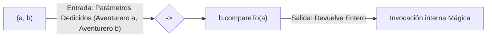

# Anatomía y Misterios de la Sintaxis Lambda en Java

Hasta que no comprendas lo que es el "Boilerplate", no entenderás el valor de una Lambda.

## El Boilerplate (Código Basura Obligatorio)

Java es estricto en el paradigma Orientado a Objetos (POO). Si quieres aislar un trozo de lógica ejecutable (como el famoso método *`compare`*), Java te imponía antiguamente un rito burocrático atroz. 

Si solo querías que una lista se ordenase alfabéticamente de la Z a la A enviando un minúsculo bloque lógico temporal al método `.sort()`, tenías que escribir TODO ESTO, al que se llama **Clase Anónima**:

```java
lista.sort( new Comparator<String>() {
    @Override
    public int compare(String a, String b) {
        return b.compareTo(a);
    }
} );
```

¿Lógica real del problema?: **1 línea** útil (`b.compareTo(a)`).
¿Basura burocrática del sistema?: **5 líneas** obligatorias que solo ensucian.

---

## El Nacimiento de la Función Flecha (La Lambda `->`)

En la versión Java 8, los ingenieros miraron esa monstruosidad y dijeron: *"Espera, en ese Comparator<String>... ¿El compilador no sabe que el único método posible que tiene dentro se llama `compare` y que siempre recibe dos Strings? ¡Claro que lo sabe!"*

Si el compilador es capaz de **adivinarlo y fingirlo por detrás**, podemos ahorrarle al programador tener que escribir toda la burocracia de instanciado.

Y así nace la deslumbrante evolución conceptual Lambda:

#### 1. Sintaxis Intermedia:
Elimina el new, interfaces y declaraciones pomposas, manteniendo los parámetros.
```java
lista.sort( (String a, String b) -> { return b.compareTo(a); } );
```

#### 2. Omisión de Tipos:
El compilador ya sabe que si la lista es de Strings, "a" y "b" solo pueden ser Strings. Bórralos.
```java
lista.sort( (a, b) -> { return b.compareTo(a); } );
```

#### 3. Sintaxis Experta (De una Sola Línea):
Si la función en su cuerpo `{ }` solamente tiene **una línea** y contiene la palabra **`return`**, puedes **borrar las llaves, borrar la palabra return** y el `punto y coma` interno. Funciona como una expresión directa matemática (lo que devuelva a derechas, es lo que computa):
```java
lista.sort( (a, b) -> b.compareTo(a) );
```

¡Boom! Has pasado de 6 horribles bloques indescifrables a 1 trozo de código brillante como un láser.



## Entender cómo piensan (El Contrato SAM)

No puedes crear Lambdas en cualquier lado de Java para sustituir polimorfismos o herencias masivas (¡Lástima!). Solo sirven para una cosa ultraespecializada.

**¿Dónde se puede usar una Lambda?**
Solamente puede implementarse allí donde se estuviera pidiendo una Intefaz **SAM** (Single Abstract Method). Es decir, **interfaces en Java que tengan SOLO un mísero método no codificado.**

Ejemplos SAM de Java perfectos para crear Lambdas al vuelo:
*   `Comparator<T>` (Solo tiene `compare`).
*   `Predicate<T>` (Solo tiene `test`, devuelve un `boolean`. ¡CRUCIAL PARA LA SECCIÓN STREAMS Y `.filter()`!)
*   `Function<T, R>` (Solo tiene `apply`, reciba un A, emite un B. Para el `.map()`).
*   `Runnable` (Solo tiene `run`, para programación y peticiones en hilos paralelos).
