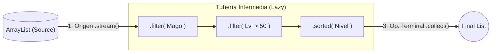

# Anatomía de los Streams (Flujos de Datos)

En Java 8, junto a las Lambdas, introdujeron la API de Streams (`java.util.stream.Stream`). 

## ¿Qué es un Stream?

Imagínate un array gigante de datos (1 millón de Aventureros). Si quieres buscar a todos los Magos y ordenarlos, antes tenías que diseñar un bucle `for` gigantesco o crear múltiples listas temporales, copiando datos inútilmente.

**Un Stream es una TUBERÍA abstracta.** No almacena datos. Solo hace que los datos *fluyan* desde una fuente inicial hasta un sumidero final cruzando estaciones lógicas.



## Las 3 Etapas Puras de Todo Stream

### Paso 1: Origen (Source)
Convierte la colección de madera y metal estática en "agua líquida" lista para meter a la tubería.
*Sintaxis más común:*
`miListaOriginal.stream()`

### Paso 2: Operaciones Intermedias (Pipelining / Lazy)
Puedes añadir en cadena infinidad de embudos lógicos y operaciones dentro de la tubería para machacar el agua. Lo alucinante es que son **LAZY (Perezosos)**. Ninguna de estas instrucciones se ejecuta de verdad hasta que no llegamos al Paso 3. Por esto los Streams son brutalmente rápidos.

- **`.filter( Predicado )`**: Pone un coladero para evitar que las gotas que no cumplen fluyan adelante.
- **`.map( Función )`**: Tritura un tipo de dato y devuelve otro diferente (Ej: Entra un objeto `Aventurero` y lo conviertes en puro String `.getNombre()`).
- **`.sorted()` / `.sorted( Comparator )`**: Como enseñaron las clases pasadas, para ordenar la tubería.
- **`.distinct()`**: Evita que fluyan datos duplicados.
- **`.limit( int )`**: Solo deja que fluyan X cantidad.

### Paso 3: Las Operaciones Terminales (Terminal Operations) 💥
Al llegar aquí ocurre la chispa de la vida y la tubería se activa succionando todo lo de atrás. **UN STREAM SOLO PUEDE SER CONSUMIDO UNA VEZ.** Si aplicas una operación terminal, el agua desaparece de la tubería.

- **`.collect( Collectors... )`**: El balde que reconvierte las gotas de agua en un Array o Diccionario real que podamos usar o guardar.
- **`.forEach( Acción )`**: Para imprimir por consola los datos cruzando al vuelo `.forEach( a -> System.out.println(A) )`.
- **`.count()`**: Cuenta las gotas finales.

### El Reto Definitivo

Antes, te llevaba 15 líneas en Java hacer una selección masiva. Ahora:

```java
// Toda esta locura en 1 SOLA LÍNEA DE CÓDIGO MAESTRO
List<String> magosPoderososNombres = listaAventureros.stream()
    .filter(a -> a.getClaseClase().equals("Mago"))  // 1. Nos quedamos los Magos
    .filter(a -> a.getNivel() > 50)                      // 2. Que sean nivel +50
    .sorted((a,b) -> Integer.compare(b.getNivel(), a.getNivel())) // 3. Ordenados por nivel
    .map(a -> a.getNombre())                             // 4. Extraemos su campo Nombre
    .collect(Collectors.toList());                       // 5. Los Guardamos en lista Array nueva
```
