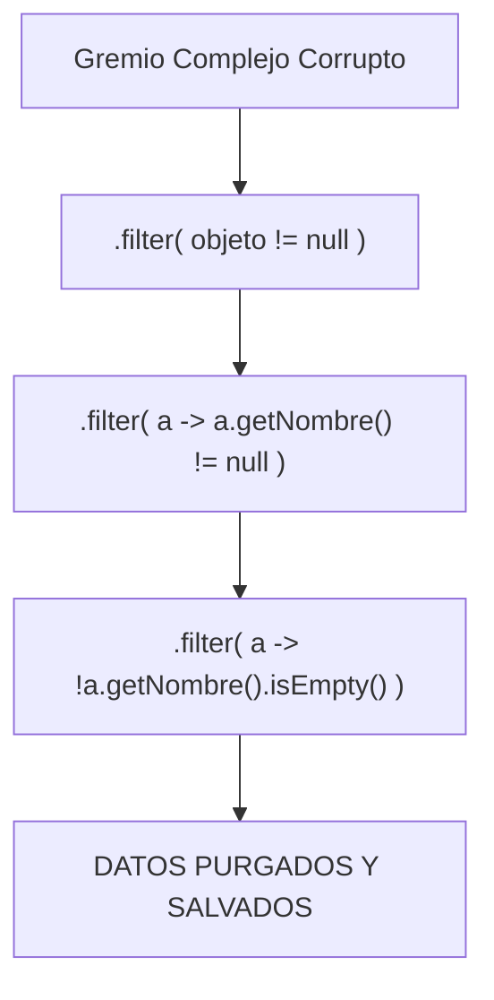

# Predicados y Exclusiones: El Arte de `.filter()`

La función `.filter()` que reside dentro del Flujo de Streams es quizás la más recurrida de la historia del análisis de datos.
Entender `.filter()` es entender el **Patrón de Interfaz Predicate**.

## ¿Qué es un Predicate de Java?

Java tiene una interfaz funcional SAM llamada simplemente `Predicate<T>`.

Su único método sin programar es:
`boolean test(T dato);`

Su único trabajo es recibir algo y escupir **VERDADERO / FALSO**. Y este es el billete de acceso con el que `.filter` deja a una gota de agua avanzar por la tubería de Stream.

## Sintaxis Lambda dentro del `.filter()`

Gracias al acortamiento y misterios de las Lambdas que aprendiste anteriormente, podemos insertar lógica de filtrado directa y masiva:

### Nivel 0 (Igualdades Obvias)

```java
// Solo quiero los perfiles cuyo campo nombre ES EXACTAMENTE "Iker"
.filter( p -> p.getNombre().equals("Iker") )
```

### Nivel Intermedio (Comparaciones Matemáticas e Internas)

```java
// Aventureros mayores de Nivel 50
.filter( a -> a.getNivel() > 50 )

// Filtrar si el oro es menor que el de otro objeto (Aritmetica)
.filter( a -> a.getOro() < obj.getPresupuesto() )

// Llamar a un método Helper booleano interno de la propia clase Aventurero
.filter( a -> a.esHeroeLegendario() )
```

### Nivel Avanzado (Anidaciones Lógicas y Exclusiones de Nulos `!=`)

Uno de los principales problemas de las Colecciones con miles de objetos es esquivar **`NullPointerException`**.
La práctica "Senior" en Java exige que en el primer paso de tu tubería Stream se filtren campos corruptos e incorrectos antes de que exploten en los niveles intermedios de ordenación.



### Anidación vs Encadenamiento

Ambas formas en la vida real se pueden usar, todo depende de legibilidad:

**Un filtro brutal anidado lógico:**
```java
.filter( a -> a.getNivel() > 20 && a.isEstadoVivo() && !a.getClaseClase().equals("Ladron") )
```

**Mismos filtros encadenados (Recomendado para separar bugs y legibilidad):**
```java
.filter( a -> a.getNivel() > 20 )
.filter( a -> a.isEstadoVivo() )
.filter( a -> !a.getClaseClase().equals("Ladron") )
```

*Importante: `.filter()` jamás borra al dato falso original de su `ArrayList` contenedor. Sólo tira al suelo la gota de agua virtual de la tubería, manteniendo a salvo y sin mutar la base de datos real.*
