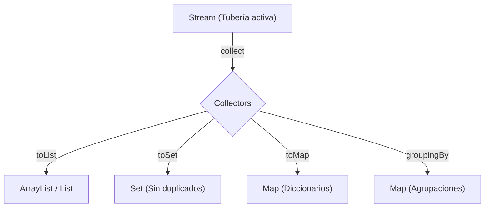

# Operaciones Terminales de Stream: Los Patrones de Retorno.

Un Stream jamás retorna directamente una estructura usable, solo retorna **OTRO STREAM MÁS MALOGRADO O LIMPIO QUE EL ANTERIOR.** 

Por eso es obligatorio terminar la tubería con un "Tapón Colector", de ahí el concepto del `.collect(...)`.



## 1. El Clásico: Almacenar en otra Lista / Array

Si tienes una colección filtrada de *Guerreros*, no puedes usar `.stream()` y ya. Sería humo. Tienes que almacenarla en una nueva variable Lista con el `Collectors`.

```java
// Opción A: Guardarlo en una List estándar generalista
List<Aventurero> miBatallon = guerrerosList.stream()
              .filter(...)
              .collect( Collectors.toList() ); // <- JAVA 8 - 15

// Opción B (Moderna Java 16+): .toList() directo!!
List<Aventurero> miBatallon = guerrerosList.stream()
              .filter(...)
              .toList(); // Directo sin el Collectors (si tu ide/sistema lo soporta)
```

## 2. Terminar un Set

¿Acaso la lista de donde recoges el Stream tiene infinitos duplicados y solo los has filtrado pero no depurado? Embotella tu flujo Stream directo en un Set (cuyo ADN prohíbe el duplicado).

```java
Set<Aventurero> setUnicos = turbaLista.stream()
              .filter(...)
              .collect( Collectors.toSet() ); 
```

## 3. Embotellado Avanzado Experto 1: `toMap`

Deseas que desde un ArrayList gigante de Aventureros, el Stream te convierta esos datos y los exporte **mágicamente a una estructura Diccionario** (`TreeMap` o `HashMap` o `Map`), de forma paralela.

Se usa `.collect( Collectors.toMap( LLAVE, VALOR ) )`

Ejemplo asombroso que recolecta a los aventureros con su NOMBRE como llave secreta y el propio OBJETO aventurero como Valor:
```java
Map<String, Aventurero> gremioDiccionario = aventurerosList.stream()
    .collect( Collectors.toMap( 
            a -> a.getNombre(), // Expresión Lambda que decide cuál es la KEY
            a -> a              // Expresión Lambda que decide cuál es el VALUE (en este caso el objeto íntegro sí mismo)
    ));
```

## 4. Embotellado Avanzado Experto 2: Aglutinado Automático `groupingBy`

Nivel Dios. En lugar de crear un diccionario 1 a 1 de Objetos manual, dices *"Java: Recolecta todos los Aventureros, lee en secreto su campo `getClaseClase()` (Magos, Guerreros, etc) y créame **SOLO** un enorme MAP de Claves Mago donde los Valores sean Sub-Listas con todos los que cumplen. Separados por el grupo que indiques*

```java
Map<String, List<Aventurero>> escuadronesSeparados = aventurerosList.stream()
               // Simplemente díctale por qué dato mágico de la clase deben agruparse.
              .collect( Collectors.groupingBy( a -> a.getClaseClase() ) );
```

¿Qué hace?: Genera un Diccionario que internamente se ve así:
```text
{"Mago"=[Gandalfo, Iker, Pedro], "Guerrero"=[Elegido, Conan, Mario]}
```
En 1 LÍNEA DE CÓDIGO.
