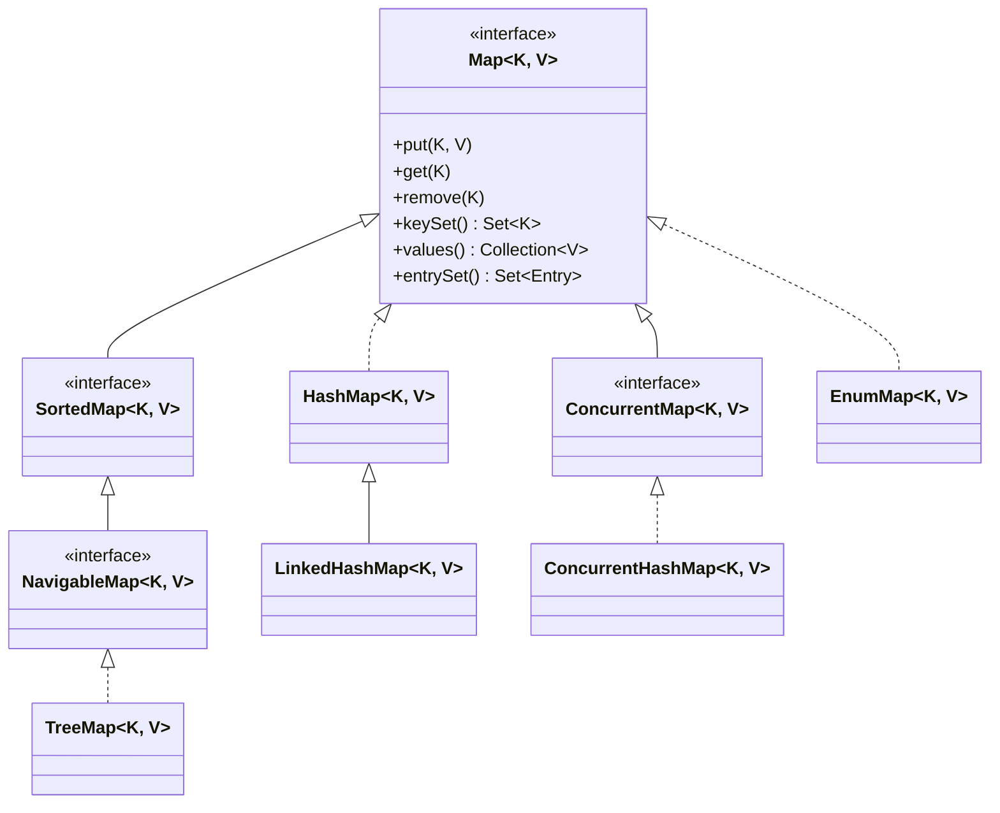

# Interfaz Map y su Jerarquía en Java

La interfaz `Map<K, V>` es una de las estructuras de datos más potentes e importantes de Java. Aunque forma parte fundamental del **Java Collections Framework**, hay un detalle técnico vital: **La interfaz Map NO hereda de la interfaz Collection**.

## ¿Por qué un Map no es una Collection?

Una `Collection` (como `List`, `Set` o `Queue`) almacena elementos individuales (`E`).
Un `Map`, por otro lado, almacena pares o duplas de Clave-Valor (`K, V`). Esta diferencia estructural hace imposible que compartan la misma interfaz padre, ya que los métodos `add(E)` no tienen sentido en un diccionario geométrico donde necesitas dar dos parámetros: `put(K, V)`.

## Diagrama de Jerarquía

## Conceptos Clave del Contrato Map

1. **Claves Únicas:** Un Map no puede contener claves duplicadas (`K`). Si intentas insertar una clave que ya existe usando `put`, el valor anterior será sobrescrito y devuelto por el método.
2. **Valores Duplicados:** A diferencia de las claves, los valores (`V`) sí pueden repetirse tanto como quieras en diferentes claves.
3. **Nulos:**
   - En implementaciones como `HashMap` o `LinkedHashMap`, puedes tener **una** clave `null` y múltiples valores `null`.
   - En implementaciones como `TreeMap` o `ConcurrentHashMap`, insertar una clave `null` lanzará un `NullPointerException` (el primero porque no puede ordenar nulos, el segundo por temas de concurrencia).

## Operaciones Fundamentales (CRUD y Análisis)

- `V put(K key, V value)`: Inserta o actualiza un par. Devuelve el valor anterior si existía la clave, o `null` si es nueva.
- `V get(Object key)`: Retorna el valor para la clave, o `null` si no existe.
- `V remove(Object key)`: Retorna el valor eliminado, o `null` si no estaba.
- `boolean containsKey(Object key)`: O(1) en HashMaps. Muy rápido para buscar si la clave existe.
- `boolean containsValue(Object value)`: O(N). Lento, obliga a recorrer todos los valores.
- `void putAll(Map<? extends K, ? extends V> m)`: Volca todos los pares del map `m` al map actual.

En los primeros ejercicios practicaremos este contrato base antes de adentrarnos a cómo recorrerlos y cómo las Lambdas y Streams revolucionaron los Maps en Java 8.
