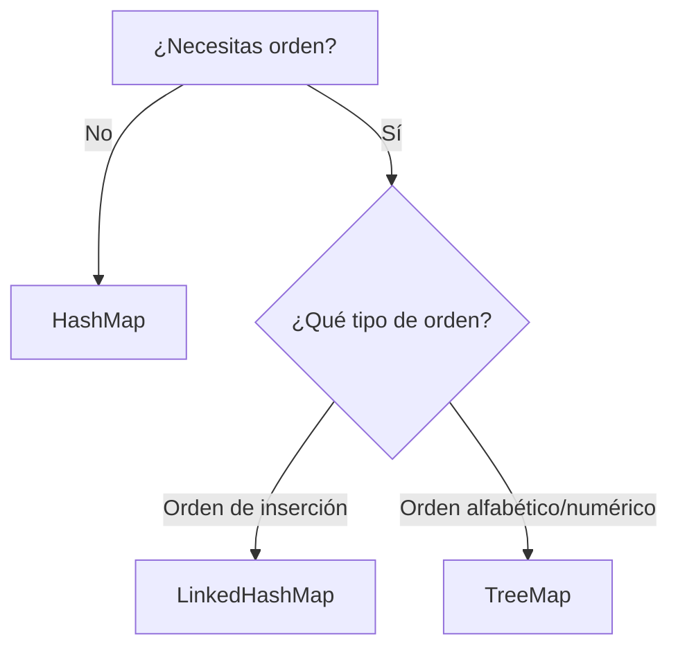

# Implementaciones de Map: ¿Cuál elegir?

La interfaz `Map` no especifica CÓMO se guardan los datos internamente, solo el contrato de qué podemos hacer con ellos. Según tus necesidades (velocidad, orden de inserción, u orden natural), debes elegir una hija distinta.

## 1. `HashMap` (La navaja suiza)
Es la implementación por defecto en el 95% de los casos.
- **Ventaja MÁXIMA:** Velocidad. Inserción `put()` y búsqueda `get()` son `O(1)` en promedio gracias a los algoritmos de Hash.
- **Desventaja:** No garantiza NINGÚN orden. Al recorrer un `HashMap`, las llaves saldrán en un orden aparentemente aleatorio y este orden puede cambiar si el mapa crece (rehashing).
- **Nulls:** Permite 1 clave `null` y múltiples valores `null`.

## 2. `LinkedHashMap` (El memorioso)
Hereda de HashMap y le añade una lista doblemente enlazada interna que conecta todos los elementos.
- **Ventaja:** Mantiene el **orden de inserción** original de las llaves. Si haces iteraciones frecuentes y necesitas que los primeros que entraron sean los primeros en salir, es tu elección ideal.
- **Desventaja:** Ocupa más memoria RAM y es ligerísimamente más lento que HashMap, aunque sus operaciones siguen siendo `O(1)`.

## 3. `TreeMap` (El ordenado)
Implementa la interfaz `NavigableMap` (que hereda de `SortedMap`). Internamente usa un árbol Rojo-Negro (Red-Black Tree).
- **Ventaja:** Las claves SIEMPRE están iteradas en **orden natural** (o mediante un `Comparator` personalizado proporcionado en el constructor). Por ejemplo: Alfabético, numérico, fechas. 
- **Poder extra:** Permite hacer consultas de rango espacial: `firstKey()`, `lastKey()`, `subMap(desde, hasta)`.
- **Desventaja:** Es más lento. Sus inserciones y búsquedas son `O(log n)`.
- **Nulls:** NO permite claves `null` (ya que ¿cómo comparamos un null con un String para saber si es mayor o menor?).

## 4. `EnumMap` (El superveloz limitado)
Una implementación súper especializada donde las claves *solo pueden ser de tipo `enum`*.
- **Ventaja:** Es absurdamente rápido y eficiente en memoria porque internamente se implementa como un simple array indexado por el ordinal del enumerado.
- **Uso:** Úsalo siempre que tus claves procedan de un `enum`.

