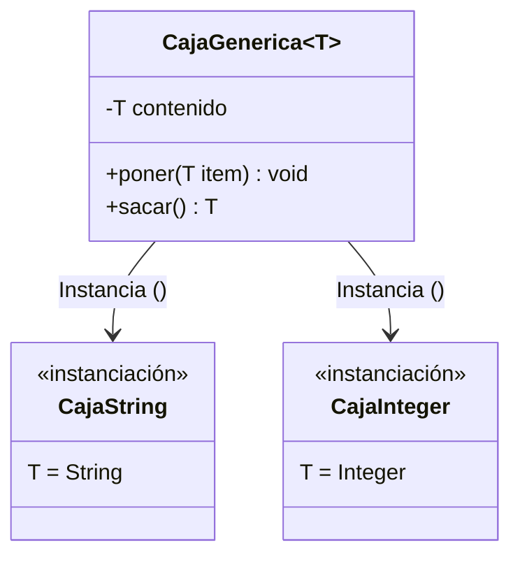

# Nivel 1: Fundamentos de Genéricos

Bienvenido al mundo de los Genéricos. En el desarrollo empresarial, vas a encontrar bases de código donde se hace uso masivo del parametrismo para evitar escribir la misma clase veinte veces para tipos de datos distintos.

## El Problema del Código "Fijo" (Strongly Typed limitante)

Imagina que creas un cofre que puede guardar Monedas. Si lo declaras fuertemente tipado:
`class Cofre { Moneda m; }`
Ese cofre jamás podrá aceptar una "Pocion". Si quieres guardar pociones, deberás crear un `CofreDePociones`. Esto viola gravemente la reutilización de código (DRY).

## Solución: El Paradigma Parametrizado

Con los Genéricos, pasamos el "Tipo" como si fuera una variable utilizando los símbolos `< >`.



Cuando declaras `<T>` en la cabecera de la clase, todo lo que pongas dentro como `T` tomará ese valor cuando un programador instancie tu clase.

### Ejemplo de uso (Momento de la Instanciación):

```java
// El diamante negro indica que T es un Boolean
CajaGenerica<Boolean> cajaSwitch = new CajaGenerica<>();

// Java ahora obliga a que .poner() admita SOLO booleans
cajaSwitch.poner(true);

// Java ahora sabe que .sacar() devuelve ESTRICTAMENTE un boolean
Boolean estado = cajaSwitch.sacar();
```

## Beneficios contra los Raw Types (`Object`)

Antaño, la solución fácil era usar `Object`:
`class Caja { Object cont; }`
El problema es que cualquiera podía meter un `String` y otro desarrollador intentaría sacarlo asumiendo que era un `Coche`, reventando la aplicación con un `ClassCastException` en tiempo de ejecución. Los genéricos mueven ese error al IDE: **No compilará**.

```mermaid
flowchart TD
    A[Caja de Objeto Puro] -->|poner(100)| B(Guarda Object=100)
    B -->|sacar()| C{¿Es Coche?}
    C -->|Falso Asumo Coche| D[ClassCastException en Runtime 💣]
    
    AA[CajaGenerica~Coche~] -->|poner(100)| BB[🔥 ERROR DE COMPILACIÓN EN VSCODE]
```

## Tus Misiones (Nivel 1)
Presta mucha atención en tus próximos ejercicios, el objetivo es blindar las clases para proporcionar los pilares arquitectónicos que exige cualquier Senior Developer.

A por tus ejercicios.
