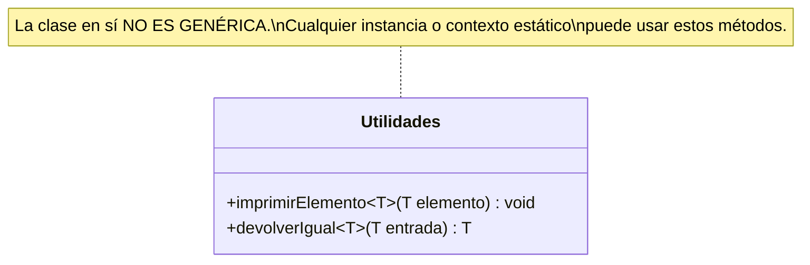

# Nivel 2: Métodos y Constructores Genéricos

Has visto cómo hacer que una **Clase entera** sea genérica (`Caja<T>`). Pero, ¿qué pasa si solo necesitas que **un único método** sea flexible y el resto de la clase permanece normal? Ahí entran en juego los **Métodos Genéricos**.

## El Poder del Alcance Local (Method-Level Generics)

A veces no quieres atar la instancia entera a un tipo de dato, solo necesitas que una operación transversal (ej. un conversor, un loggeador de sistema) procese un objeto X de manera tipada.

Para lograrlo, declaras el parámetro genérico `<T>` justo **antes** del tipo de retorno en la firma del método.



### Arquitectura de Invocación (Inferencia de Tipos)

¿Cómo sabe Java qué tipo inyectar en Runtime? La magia de la inferencia.

```mermaid
flowchart LR
    A[Método: <T> void imprimir(T o)] --> B{Invocación}
    B -->|imprimir('Hola')| C[Compilador Infíere: T = String]
    B -->|imprimir(100)| D[Compilador Infíere: T = Integer]
    
    style C fill:#0f5,stroke:#333,stroke-width:2px,color:#000
    style D fill:#0f5,stroke:#333,stroke-width:2px,color:#000
```

Se acabaron los `(String) objetoCast`. Al inferir, el compilador adapta el contrato del método internamente.

## Constructores Genéricos

Un constructor es, en su raíz, un método especial de inicialización. Aunque tu clase sea `class ServidorLog` y **no** sea genérica, su constructor puede serlo maravillosamente. Te permite aceptar cualquier tipo de carga inicial en la creación del objeto sin amarrar la instancia.

```java
public class EventoLog {
    private final String selloSistema;
    
    // <T> opera solo en este instante de la creación
    public <T> EventoLog(T fuenteDatos) {
        this.selloSistema = "LOG-" + fuenteDatos.getClass().getSimpleName();
    }
}
```

Prepara tus armas y ataca los ejercicios del Nivel 2. Toca abstraer métodos sin tocar las clases.
