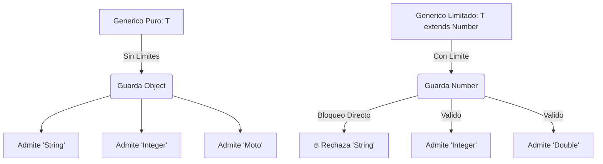
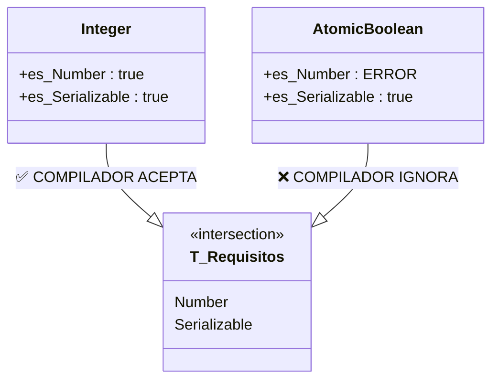

# Nivel 3: Bounded Type Parameters (Los Límites Estrictos)

A veces, otorgar un control absoluto sobre el genérico `<T>` es "demasiado libre" y peligroso. Con `<T>` en crudo, el sistema acepta un `String`, un `Motor`, o la instancia de una ventana.

Si decides programar una clase matemática, como por ejemplo una `Calculadora<T>`, ¿qué sentido tendría permitir la inserción de un `String`? Necesitas restringir las inyecciones de dependencias a tipos Numéricos. Esto se logra acotando su límite (Bound) usando la palabra reservada `extends`.

## Upper Bounds (Límites Superiores)

La directiva paramétrica `<T extends ClasePadre>` bloquea el acceso en tiempo de compilación a cualquier clase que no herede directa o indirectamente de la clase especificada (o que no implemente su Interfaz).



#### Anatomía Funcional Interna

```java
// 'Number' es la clase raíz padre abstracta de Java para los primitivos encapsulados.
public class Calculadora<T extends Number> {
    
    private T num1;
    private T num2;

    public Calculadora(T num1, T num2) {
        this.num1 = num1;
        this.num2 = num2;
    }

    public double sumarComoDouble() {
        // MÁXIMA POTENCIA: 'extends Number' inyecta inteligencia al compilador.
        // Ahora T tiene asegurado poseer el método '.doubleValue()' por la herencia.
        return num1.doubleValue() + num2.doubleValue();
    }
}
```

## Múltiples Bounds (Múltiples Límites)

¿Y si requieres que el tipo inyectado cumpla con varios roles arquitectónicos? Por ejemplo, que no solo sea un `Number` para ser sumado, sino que además sea `Serializable` para ser cacheado en un motor de base de datos de disco.
Para ello utilizamos la intersección `&`.



#### Implementación Clásica
```java
// T debe nacer de Number Y asegurar contractualmente la Interfaz Serializable.
public class PipelineDatos <T extends Number & Comparable<T>> {
    // ...
}
```
*Regla de oro transversal de Java: Si requieres una Clase (ej. Number) y múltiples Interfaces, la **Clase siempre debe dictarse primero** en la declaración `&`.*

¡Ejecuta de inmediato los patrones de diseño abordando tus ejercicios!
