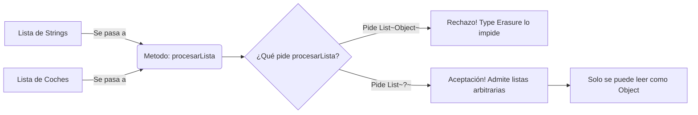
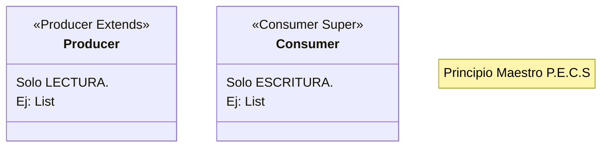

# Nivel 4: Wildcards (Comodines) y el Principio PECS

Ya dominas `<T>` y `<T extends Number>`. Pero, ¿qué ocurre cuando tu sistema actúa como puente? No controlas la declaración original y no te importa de qué tipo exacto sea el paquete que trasladas.

Ahí es donde entra el poderoso **Comodín** o Wildcard: `?`.

## 1. Unbounded Wildcard `<?>` (Comodín Desconocido)
Se traduce como "Cualquier Tipo en la inmensidad del universo". 

## 2. Upper Bounded Wildcard `<? extends T>`
Traduce: "Quiero una inyección de tipos T o de cualquiera de sus descendientes/hijos".

Aquí nace la magia **PECS**: `Producer Extends`.
Usa `extends` cuando el proveedor te **PRODUZCA** (de) datos o los quieras leer. ¿Por qué es seguro leer? Porque si pides `<? extends Number>`, sea un `Integer` o un `Double`, sabes fehacientemente que hereda de `Number`. 
¿Por qué **no puedes insertar**? Porque si insertas un `Double` en la colección a través del puente, ¡y la colección original era de `List<Integer>`, reventarías la memoria! Java lo prohíbe.

## 3. Lower Bounded Wildcard `<? super T>`
Traduce: "Quiero una colección de tipos T o de los Abuelos/Root de T".

La contraparte **PECS**: `Consumer Super`.
Usa `super` cuando serás tú o un método el que **CONSUMA** y empuje elementos a una lista externa. Si exiges `<? super Integer>`, Java garantiza que a esa lista, como mínimo o muy por encima, le caben Integers. Así que puedes meterle números con seguridad total sin riesgo estructural.

Prepara tus arsenales algoritmicos, este Nivel define a un verdadero maestro de Genéricos.
