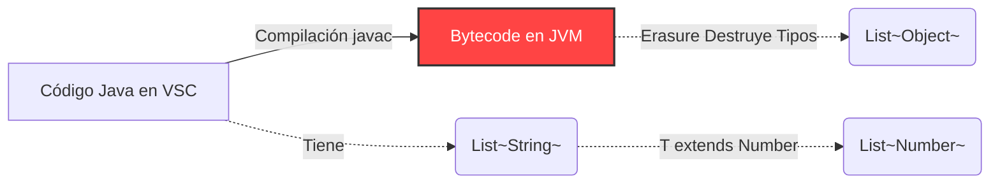
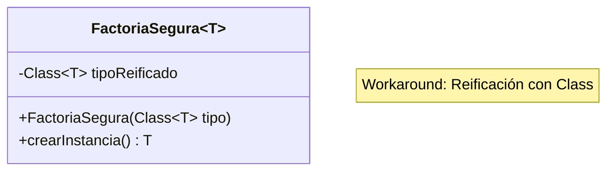

# Nivel 5: Genéricos Avanzados y Type Erasure

Si has sobrevivido hasta aquí, dominas lo que el 90% de programadores Java ignoran. Pero para ser un máster, debes comprender el "Lado Oscuro" de los genéricos: **El Type Erasure (Borrado de Tipos)**.

## ¿Qué es el Type Erasure?

Cuando los genéricos se añadieron en Java 5, los ingenieros de Sun Microsystems tenían un problema colosal: tenían que mantener retrocompatibilidad matemática con el Java 1.4 antiguo (que no tenía genéricos).
Para lograrlo, crearon una arquitectura donde los genéricos **sólo existen para el compilador**. Una vez el código se compila al `.class` final de la JVM, el operador de diamante y los `<T>` se **Borraran por completo**. 

En memoria RAM (Runtime), no existe ninguna `List<String>`. Sólo existe una simple `ArrayList` cruda que almacena `Object`. Java inyecta automáticamente los castes (Casting) ocultos por debajo para garantizar que sale un `String`.

## Restricciones Mortales del Type Erasure

Debido a que `<T>` se borra al arrancar el programa, existen **limitaciones arquitectónicas estrictas**:

1. **No puedes hacer un `new T()`**: Si Java no sabe qué es T en tiempo de ejecución, no puede alojar memoria para ello. Debes usar patrones como Component Factories / Reflexión (`Class<T> clazz`) para simularlo.
2. **No puedes comprobar tipos con `instanceof`**: No puedes preguntar si `(miLista instanceof List<String>)` porque en la memoria la lista pierde el `String`.
3. **No puedes crear Matrices Arrays de Genéricos**: `new T[10]` está prohibidísimo en Java.

Presta absoluta atención a estos tres retos que simulan los típicos "Crash" que se tragan los programadores al intentar exprimir los genéricos.
