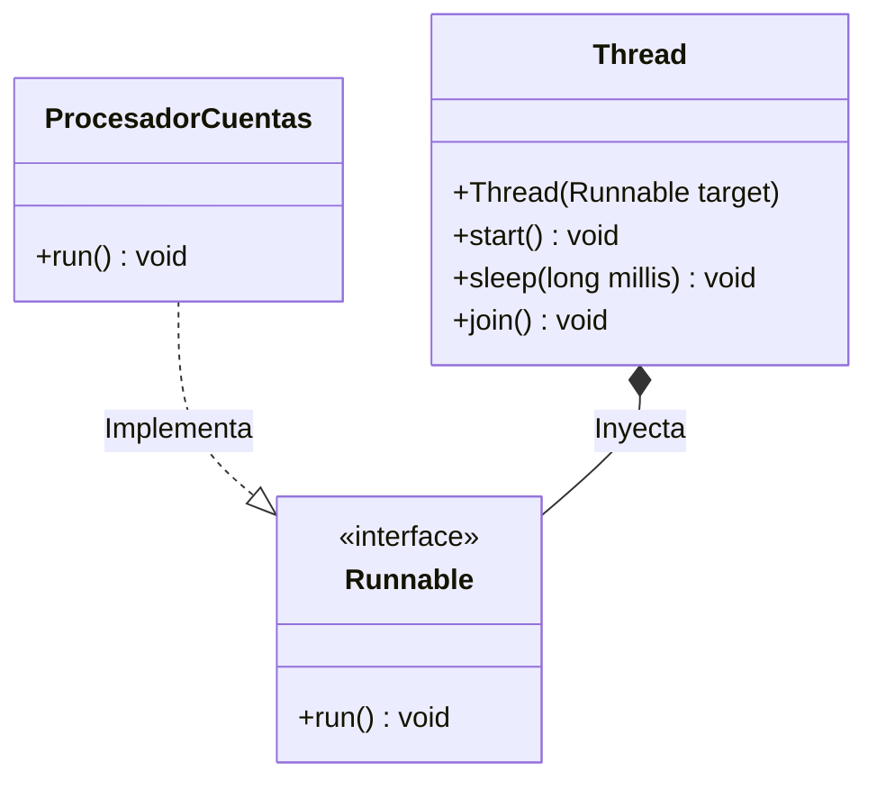
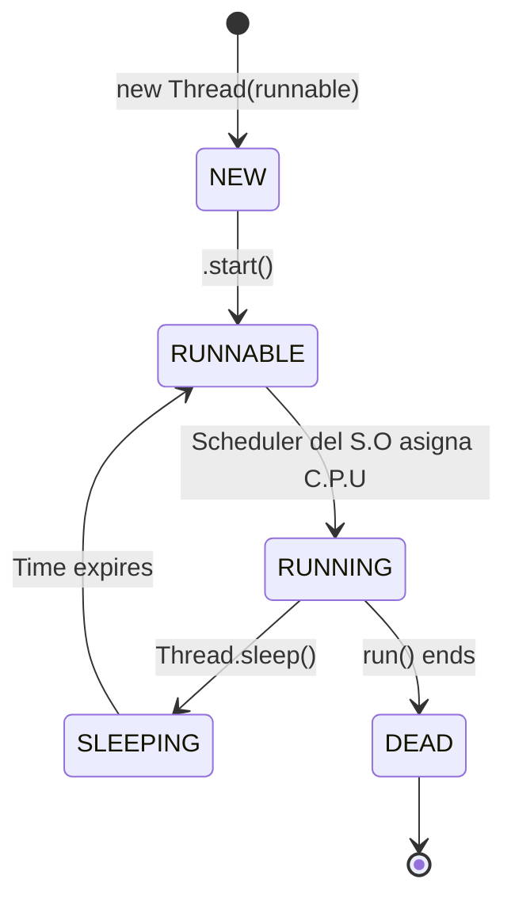

# Nivel 6: Fundamentos Básicos de Hilos

¡Has llegado al Bloque II! Todo lo que has programado hasta hoy en Java ha sido secuencial. Una sola manguera de datos procesando instrucción por instrucción.
La **Concurrencia** permite a Java ramificar esa manguera. Puedes abrir múltiples "Hilos de Ejecución" (`Threads`) simultáneos dentro de tu propio programa.

## La Arquitectura Base: `Thread` vs `Runnable`

Java clásico ofrece dos formas de arrancar un proceso concurrente:

1. **Heredar de `Thread`**: Poco recomendable, ocupa la única herencia de tu clase.
2. **Implementar `Runnable`**: Metodología estándar. Extraer el código a un paquete (Runnable) y dárselo a un Hilo (Thread) para que lo transporte.

## El Ciclo de Vida del Hilo

Arrancar un hilo **NUNCA** se hace llamando a `.run()`. Si llamas a `.run()`, el código se ejecuta en tu propio hilo principal bloqueándote por completo. El comando sagrado es `.start()`.

## El Caos del Entrelazado (Data Races Básicos)

Si el Hilo-1 y el Hilo-2 acceden al mismo `Sysout` o a la misma variable `cont`, el procesador cortará la ejecución de uno y meterá al otro en microsegundos (Context Switching). Esto significa que el comportamiento de tu salida será caótico e impredecible a no ser que aprendas a dominarlos.

Para "esperar" a un hilo y volver a sincronizarte emplearás el método `.join()`. Prepárate, los siguientes ejercicios exigirán control estricto del tiempo en ejecución.
