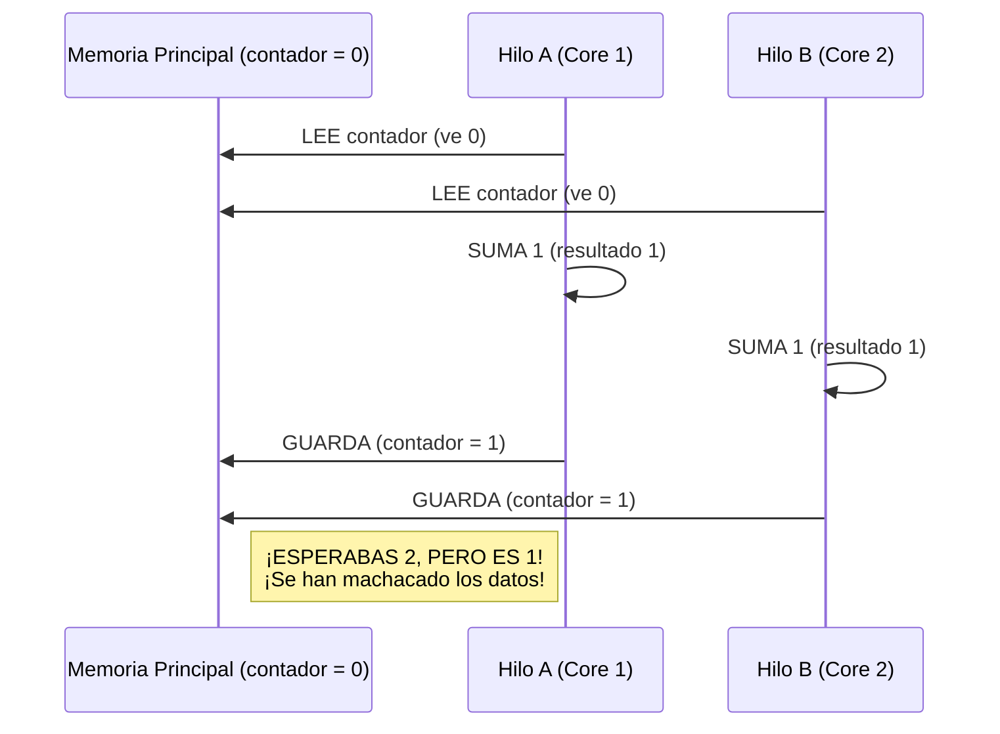
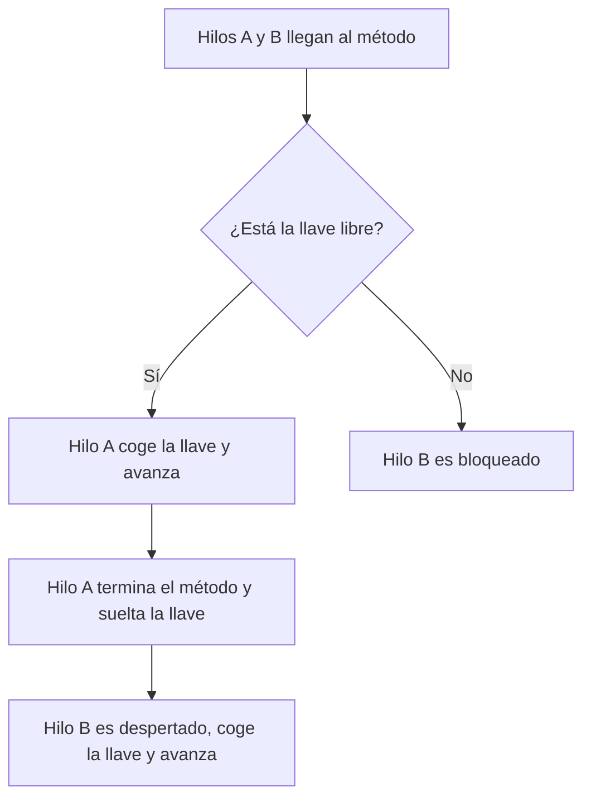

# Nivel 7: Sincronización y Monitores

El gran terror de la concurrencia es el **Data Race** (Condición de Carrera). Ocurre cuando dos o más hilos intentan modificar una misma variable en la memoria RAM exactamente al mismo tiempo (o entrelazado).

## La Anatomía de una Condición de Carrera

Imagínate que un Hilo A y un Hilo B llaman simultáneamente a `contador++`.

## El Monitor y `synchronized`

Para evitar que los hilos choquen, Java emplea **Monitores** (también llamados Cerrojos Intrínsecos). Todo objeto en Java tiene internamente una llave incrustada a nivel del hardware de la JVM. 

Si pones la palabra `synchronized` en la firma de un método, el Hilo se verá obligado a coger la llave de la clase. Si entra otro hilo, al no estar la llave disponible, será bloqueado y formará cola (Thread State: BLOCKED).

### Bloques Sincronizados (Optimización)
Sincronizar métodos enteros es costoso. Es mejor sincronizar sólamente la "Sección Crítica" usando bloques:
`synchronized (this.cerrojo) { // lógica crítica }`.

Prepárate para forzar choques de datos y arreglarlos.
