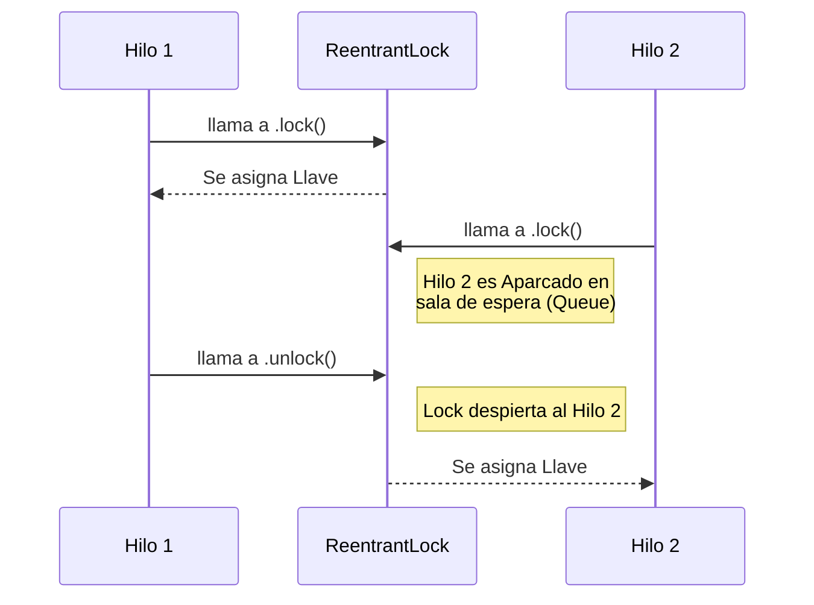

# Nivel 8: Locks Avanzados y Variables Atómicas

Sincronizar hilos con `synchronized` era la forma "vieja escuela" (Java 1.0). El problema es que `synchronized` delega la gestión total a la máquina virtual y bloquea los hilos indefinidamente.
Con Java 5 llegó un brutal upgrade a nivel de rendimiento: El paquete `java.util.concurrent.locks`.

## 1. Operaciones Atómicas (Compare-And-Swap)

Si todo lo que necesitas hacer es sumar `++`, usar `synchronized` es como matar una mosca a cañonazos. Bloquear todo un Hilo por un simple número es ineficiente. Las **Variables Atómicas** resuelven esto apoyándose directamente en transistores del procesador (Instrucción CAS o "Compare and Swap"). Estas no bloquean el Hilo, directamente actualizan el hardware en un solo pulso de reloj.

```mermaid
flowchart LR
    A[Hilo 1] -->|Atomic.incrementAndGet()| B(Memoria CAS sin bloqueo)
    C[Hilo 2] -->|Atomic.incrementAndGet()| B
    
    style B fill:#8f8,stroke:#333,stroke-width:2px,color:#000
    B --> D[Siempre garantiza precisión matemática]
```

## 2. ReentrantLock (El Cerrojo Manual)

A diferencia del monitor estático, `ReentrantLock` es un cerrojo en forma de Objeto Real. Tiene métodos explícitos `.lock()` y `.unlock()`. 
Esto te da un poder arquitectónico extremo: puedes intentar coger un lock durante un tiempo (`.tryLock()`) y, si falla, abortar elegantemente en vez de quedarte congelado esperando la llave toda la eternidad.



> **Regla de oro Backend**: Todo `.lock()` debe ir obligatoriamente sucedido de un bloque `try-finally` para asegurar liberar la llave con `.unlock()` pase lo que pase adentro (incluso si salta una Excepción severa). 

## 3. Condiciones de Bloqueo Crítico (Deadlocks)

El mayor pavor de las arquitecturas multihilo. Ocurre cuando:
1. El Hilo A tiene la "Llave 1" y espera obtener la "Llave 2".
2. El Hilo B tiene la "Llave 2" y espera obtener la "Llave 1".
**Resultado**: La aplicación se congela para siempre en el servidor y tu jefe te despide en el acto. Jamás solicites Mutex anidados en orden inverso al de otros hilos.
