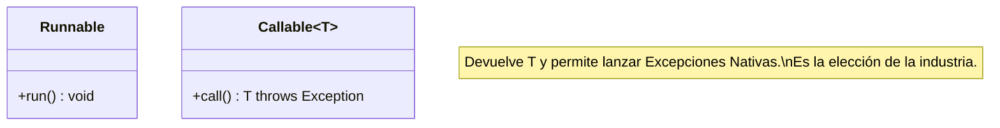

# Nivel 9: Framework de Ejecutores (Pools de Hilos)

Crear un hilo con `new Thread()` está absolutamente prohibido en el desarrollo profesional moderno. 
Arrancar un hilo a nivel de Sistema Operativo toma alrededor de ~1MB de RAM estanca y mucho tiempo de CPU. Si te entran 1000 usuarios y tú haces 1000 `new Thread()`, tu servidor explotará por Memory Leak masivo (`OutOfMemoryError`).

## La Revolución: `ExecutorService` (El Patrón Thread Pool)

La solución de Java es usar "Piscinas de Hilos" (Thread Pools). Enciendes, por ejemplo, 5 Hilos fijos. Si llegan 100 Tareas, se meten en una Cola (Queue) y los 5 hilos van absorbiendo tareas una por una de esa cola sin morir nunca.

```mermaid
flowchart LR
    subgraph Tareas Entrantes
        A(Task 1) --> Q((Cola Segura))
        B(Task 100) --> Q
    end
    
    subgraph Thread Pool (5 Hilos estables)
        Q --> T1[Hilo 1]
        Q --> T2[Hilo 2]
        Q --> T5[...Hilo 5]
    end
    
    T1 -->|Completar| F[Resultados]
    T1 -.->|Vuelve por más| Q
```

### Callable vs Runnable

Ya conoces `Runnable`, que sirve para ejecutar código ciego (`void run()`).
Pero si quieres que un Hilo procese algo complejo y **TE DEVUELVA EL RESULTADO**, entonces en el Nivel 9 introducirás `Callable<T>`.



## Ejecutores Clásicos (`Executors` Factory)

1. **`newSingleThreadExecutor()`**: Sólo corre 1 hilo. Si le das 10 tareas, las procesa una detrás de otra secuencialmente. 
2. **`newFixedThreadPool(10)`**: Fija 10 hilos matemáticamente. Usado exhaustivamente en Backend.
3. **`newScheduledThreadPool(2)`**: Actúa como un CronJob. Hilos configurados para ejecutar tareas "cada X segundos" (Ej. limpieza de Base de Datos).

Atrévete a instanciar tus primeros ejecutores. No te olvides: un ejecutor en marcha no deja que Java en VS Code termine. Deberás "apagar la central" tú mismo con `.shutdown()`.
