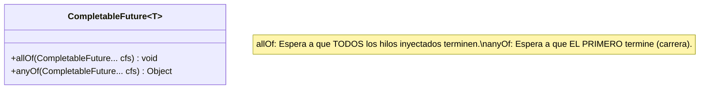

# Nivel 10: CompletableFutures y Promesas Asíncronas

Has visto que usar Executores con `Callable` te devuelve un `Future<T>`. El problema gigantesco de `Future<T>` antiguo es que si necesitas el dato desesperadamente llamas a `.get()`, y eso **BLOQUEA** al hilo principal (Main Thread) congelando el servidor hasta que el valor está listo.

Si el backend se bloquea esperando datos... ¿para qué queremos hilos?

## El Renacimiento de Java 8: `CompletableFuture`

Es la respuesta al Callback Hell y a las Promesas (Promises) de JavaScript.
Te permite crear "Cadenas de Reacción" de tal forma que tú declaras: *Cuando termine la asincronía y tengas el dato, pásaselo a esta otra función genérica y envíaselo al cliente, ¡yo me desentiendo y no espero!*

```mermaid
flowchart TD
    A[main()] -->|supplyAsync()| B{Hilo Pool Secundario}
    A --> C[Main termina Inmediatamente!]
    
    B -->|Calcula T durante 3s| D[thenApply()]
    D -->|Transforma T -> R| E[thenAccept()]
    E -->|Consumer de R| F(Log: Proceso Finalizado)
```

## Operadores Críticos

Están diseñados bajo las pautas funcionales de Interfaces Genéricas que ya conociste en el Bloque I.

1. `supplyAsync(Supplier<T>)`: Arranca el hilo. **Productor**. No pide nada, devuelve un T.
2. `thenApply(Function<T, R>)`: Enganche de mapeo. Recibe la T resultante del hilo anterior, y la **Transforma** en un tipo genérico R. (Suele usarse para mapear Entidades a DTOs).
3. `thenAccept(Consumer<T>)`: Enganche final. Recibe el resultado y lo **Consume** (PECS). Devuelve void. Generalmente aquí se envía el correo, o se responde el JSON a HTTP.

## Sincronización Avanzada (Multi-Promesas)



Estás a punto de acabar con el Bloque II (Concurrencia). Tu habilidad con Java multihilo está superando a la inmensa mayoría de Juniors. Fíjalo en tu RAM biológica.
