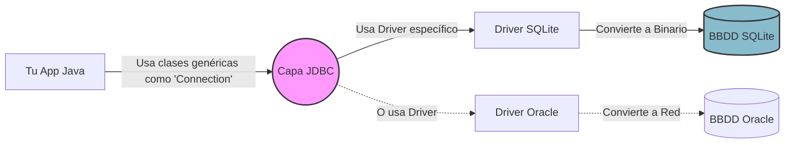

# Nivel 11: Persistencia de Datos (JDBC y SQLite)

Todo lo que has programado en tu vida, desde el Nivel 1 hasta tus complejas piscinas de Hilos del Nivel 10, ha ocurrido en un entorno volátil: la Memoria RAM.
Cuando la JVM de Java termina o el PC se apaga, los datos se desintegran. Para sobrevivir la ejecución, necesitamos guardar la información en discos duros. Para esto se usan los Motores de Bases de Datos Relacionales (SQL).

## Arquitectura de JDBC (Java Database Connectivity)

Java es agnóstico frente al tipo de base de datos (Oracle, Postgres, MySQL, SQLite...). Para comunicarse unificadamente inventaron `JDBC`, un estándar incrustado en Java que demanda un archivo en formato `.jar` (El Driver) que funciona como "traductor" entre Java y la base de datos específica.



## SQLite: Embebiendo Motores

Normalmente un motor base de datos es un programa aparte hiperpesado que requiere Puertos TCP e IPs, pero hemos elegido **SQLite** para esta Masterclass por su portabilidad. SQLite guarda TODO el motor y sus tablas dentro de un humilde archivo plano `.db` que se generará en tu propia carpeta automáticamente.

### La Conexión Base
Una vez logras descargar la dependencia del Driver (ya está configurada en tu `pom.xml`), abres la tubería conectora utilizando la factoría estática del DriverManager.

```java
// jdbc es el protocolo base. sqlite es el protocolo del driver. base.db es el archivo
String url = "jdbc:sqlite:mitabla.db";
Connection tubería = DriverManager.getConnection(url);
```

## El Protocolo Estricto de JVM

Toda conexión hacia el disco duro o internet exige la apertura estricta de un Canal Físico en la máquina. Si fallas en cerrarlo (`.close()`), causarás un desbordamiento de memoria masivo (Memory Leak). Por ello, en Java moderno es obligatorio encapsular todo lo referido a canales en bloque `try-with-resources`.

El mundo de los hilos quedó atrás por ahora, pero la sintaxis estricta acaba de empezar.
