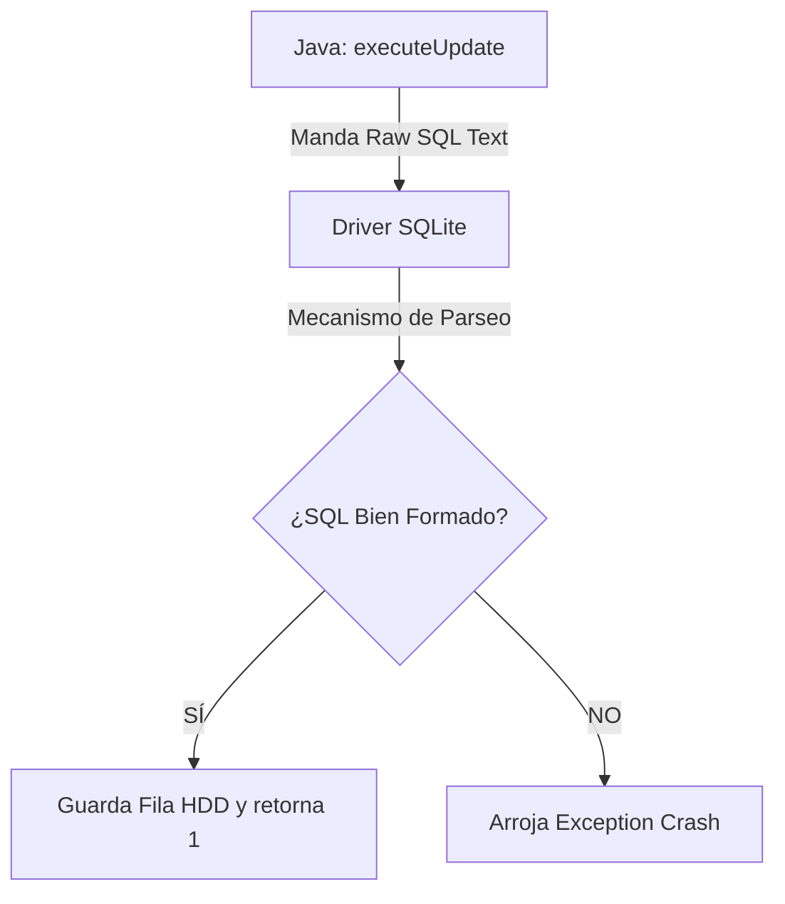
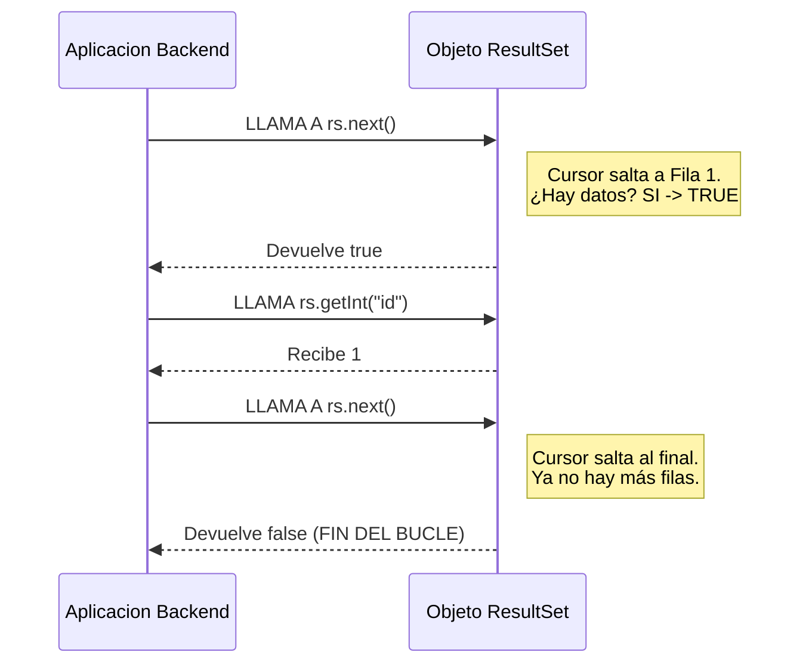

# Nivel 12: CRUD Primario (Create & Read)

CRUD hace referencia a Create, Read, Update y Delete (Las cuatro operaciones vitales arquitectónicas que se espera de un ingeniero en Base de Datos). 

Has forjado la tabla, es el momento de atacarla mutando contenido y recuperándolo.

## Insertando la Carga (El CREATE)

Para inyectar un nuevo campo de tabla o fila persistente, solicitamos un `Statement` básico.
Su función principal para mutar bases de datos es `.executeUpdate()`. Retorna un `int` informando si mutó muchas o 0 columnas.

## Absrobiendo Matrices de Datos (El READ con ResultSet)

Cuando pides un `SELECT *`, la BD no te vomita un Objeto Java mágicamente. A la base de datos no le importa Java. Te vomita una abstracción intermedia en formato "Tabla temporal" conocida en JDBC como **`ResultSet`**.

El `ResultSet` es como un cursor interativo. Inicialmente apunta "al vacío" (antes de la primera fila). Debes invocar al método `.next()` para que salte a la Fila 1. Si `.next()` devuelve *true*, la fila existe y allí extraes los datos con los métodos inyectores como `.getString("nombre_columna")`. 

Por lo tanto tu rutina universal de extracción siempre será el mítico:
`while (rs.next()) { ... }`

A la carga de los ejercicios. Muestra tus verdaderas credenciales inyectando y rehidratando Strings con bases de datos en puro crudo.
