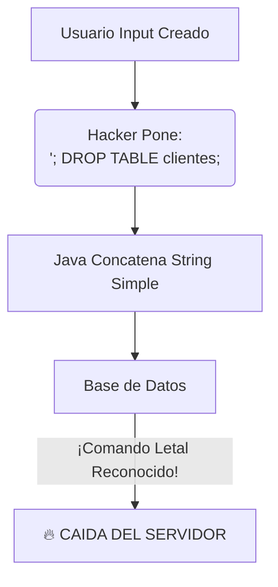
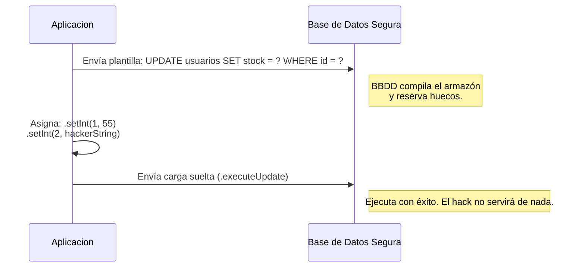

# Nivel 13: El Resto del CRUD y la Maldición de la Inyección SQL

Hemos Creado (Insert) y hemos Leído (Select). Completaremos el ecosistema ejecutando actualizaciones de campos (UPDATE) y purgando sistemas (DELETE).

Ambas operaciones en JDBC comparten exactamente la misma naturaleza que el INSERT: Se instancian en un `Statement` y se disparan mediante el método atómico `.executeUpdate()`.

## El Lado Oscuro de concatenar Strings: Inyección SQL

Hasta ahora has lanzado 'Statements' básicos utilizando Strings pegados con el '+' de Java. Ej:
`"SELECT * FROM usuarios WHERE nombre = '" + nombreInput + "'"`

Si un Hacker introduce el siguiente nombre en tu input frontend:
`"' OR 1=1; DROP TABLE usuarios; --"`

Tu servidor Backend ejecutará ciegamente la directriz. Su sesión se validará, y acto seguido tu base de datos será **borrada irremediablemente**. Has sufrido una de las vulnerabilidades más críticas y desastrosas de la red: **Inyección SQL**.

## El Escudo Blindado: PreparedStatement

Para arreglar la Inyección SQL usarás la versión hiper-dopada del objeto 'Statement': el **PreparedStatement**.
Su magia radica en que pre-pactas la query con Huecos de Interrogación `?` intocables. La Base de Datos recibe primero el armazón, y *después* le inyectas los valores a esos huecos de forma segura, garantizando que todo lo inyectado se interpreta estrictamente como datos inertes, y jamás como código.

Prepárate, a partir de hoy NUNCA MAS utilizarás `Statement`. Tu religión se basará estrictamente en `PreparedStatement`.
