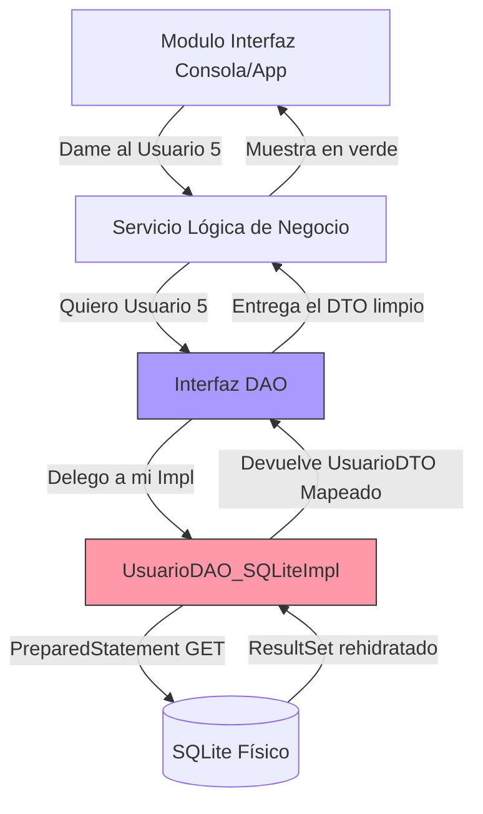

# Nivel 14: Arquitectura Patrón DAO

Tenemos Genéricos. Tenemos Concurrencia. Tenemos SQL con sus PreparedStatements.
Pero si escribes 'SELECTs' y 'UPDATEs' directamente en la Lógica de tu Servidor o dentro de tus pantallas de Frontend, tu aplicación será **inmantenible**, **ensalada de código (Spaghetti)** y **suspendida en la revisión de código de tu Senior**.

Presentamos el Patrón arquitectónico estelar de las empresas: **Data Access Object (DAO)**.

## ¿Qué es el Patrón DAO?

Consiste en arrancar de forma quirúrgica todo el código SQL y de BBDD de tu aplicación, encerrarlo en clases totalmente aisladas abstractas, de modo que el resto de tu servidor (Módulos lógicos, API Rest, Consolas) no tengan ni idea de que hay una Base de Datos SQLite detrás de todo, sólo piden y consumen datos.

## Las Partes Ocultas del DAO

1. **La Interfaz Abstracta (`UsuarioDAO`)**: Declara los contratos limitantes absolutos del CRUD, jamás tiene código subyacente.
2. **La Implementación Tecnológica (`UsuarioDAOImpl`)**: Concreta todos los métodos, asumiendo su rol purista manejando JDBC. Esta es la clase que se ensucia las manos.
3. **El Inyector / Manager**: Otras clases consumidas jamás hacen `new UsuarioDAOImpl()`. Consumen la Interfaz inyectable y son ajenos a tu implementación. 

Esta arquitectura permite que, en el futuro, si el jefe de la empresa cambia SQLite por Oracle, sólo crees una clase `UsuarioDAO_OracleImpl` y no tengas que modificar **NI UNA LÍNEA** del código en tu capa de UI ni en tu Lógica de Red, validando una escalabilidad horizontal absoluta.
