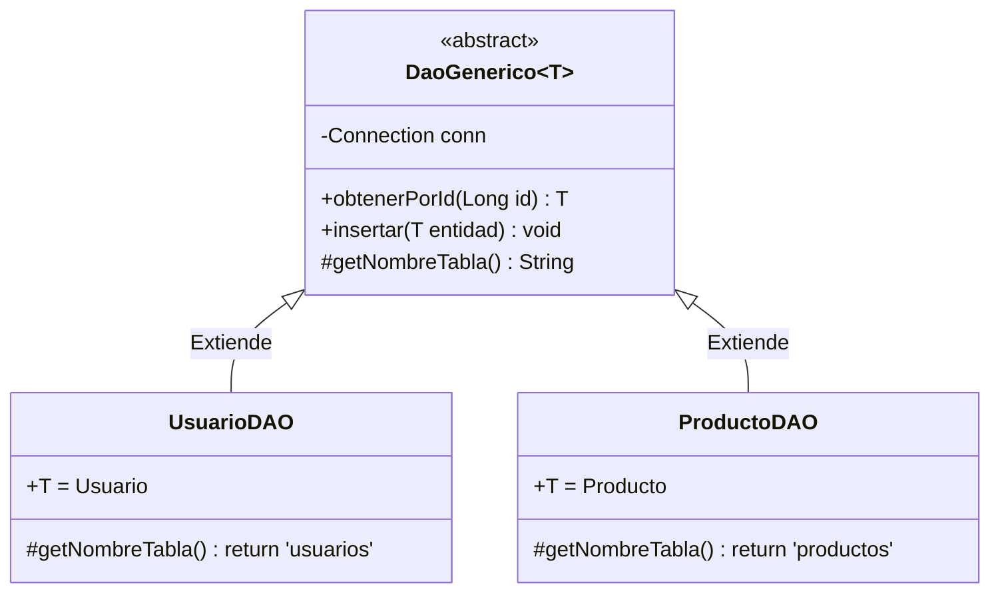

# Nivel 15: DAO Genérico Definitivo (La Matriz)

En el Bloque anterior te presenté el Patrón DAO separando la lógica de `Usuario` en `UsuarioDAOImpl`.
¿Pero sabes qué pasa cuando en tu base de datos tienes tablas para `Usuarios`, `Productos`, `Ventas` y `Descuentos`? Que tendrías que redactar 4 `DAOs` copiando y pegando el mismo código `INSERT` cuatro veces y sólo cambiando la query... Esto es inútil e inmantenible.

**Ha llegado la hora de resucitar y combinar el BLOQUE 1 (Genéricos) con el BLOQUE 3 (Bases de datos).**

Vamos a forjar un **`DaoGenerico<T>`**. Una plantilla de base de datos capaz de insertar *LO QUE SEA* en la base de datos valiéndonos del poder de parametrización.

## Arquitectura de la Plantilla Genérica en Backend

### El Reto del Borrado de Tipos (Type Erasure) en Base de Datos
Recuerda la gran limitación de los genéricos: La culpa del Type Erasure hace que la clase abstracta padre (DaoGenerico<T>) en tiempo de ejecución **NO TENGA NI IDEA** de qué tabla está usando o de qué es `<T>`. 
Por eso, las clases abstractas genéricas suelen obligar a que sus hijos respondan a un método protegido como `getNombreTabla()`, para que al menos la clase base pueda montar sus PreparedStatements dinámicos:
`"SELECT * FROM " + getNombreTabla() + " WHERE id = ?"`

¡Prepara tu armadura paramétrica! Estás a punto de codificar como un senior.
