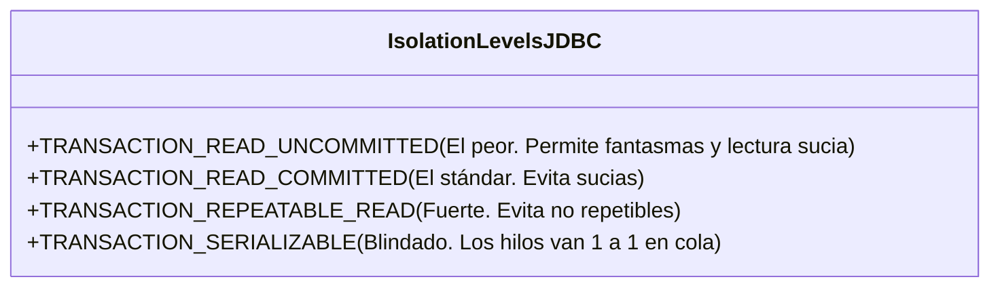

# Nivel 17: Colisión de Dimensiones (Hilos vs Bases de Datos)

Llegó el momento de la verdad absoluta. 
¿Qué ocurre si combinas los **Hilos concurrentes (Bloque II)** con el **CRUD y Transacciones (Bloque III)**? Has cruzado los rayos. Bienvenido al Caos de la Consistencia de Datos en Niel Operativo.

## Bloqueos a nivel de Fila (Row Locking)
Si el Hilo A inicia una Transacción y hace un `UPDATE` a la fila ID=5 (sin soltar a `.commit()`), el motor subyacente SQLite aplicará instantáneamente un candado físico (Lock) en el disco duro sobre esa entidad.
Si al milisegundo llega el Hilo B (Otro usuario del servidor) e intenta hacer un `UPDATE` a la ID=5, su `executeUpdate()` **se bloqueará** eternamente sin tirar error, exactamente igual que hacia un `synchronized` en el Nivel 7. Solo avanzará cuando el Hilo A tire su anhelado commit.

## Retos Nativos (Fenómenos Concurridos SQL)

Existen tres anomalías famosas que asolan a los arquitectos cuando dos hilos actúan sincronizados:

1. **Lectura Sucia (Dirty Read)**: Hilo A muta el saldo de $10 a $0. Antes de hacer commit, Hilo B lee el saldo y ve $0. Hilo B envía un "Has perdido tu dinero" al cliente. Hilo A falla y lanza Rollback (vuelve a 10$). Hilo B acaba de mentirle al cliente leyendo datos fantasmas.
2. **Lectura No Repetible (Non-Repeatable Read)**: Hilo A lee el precio ($5). Hilo B actualiza el precio a ($8) y hace commit. Hilo A vuelve a leerlo y por arte de magia cambia en su cara a $8.
3. **Lectura Fantasma (Phantom Read)**: Hilo A solicita a BBDD: "Dime todos tus usuarios" y recibe 5. Hilo B inyecta al Usuario 6. Hilo A vuelve a pedir los usuarios... y recibe 6. La dimensión ha crecido en la matriz.

En Java los puedes configurar en vivo llamando a `connection.setTransactionIsolation(...)`. A dominar el tiempo.
