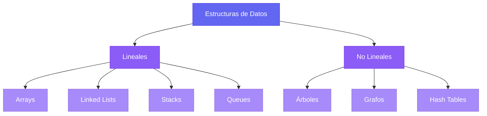
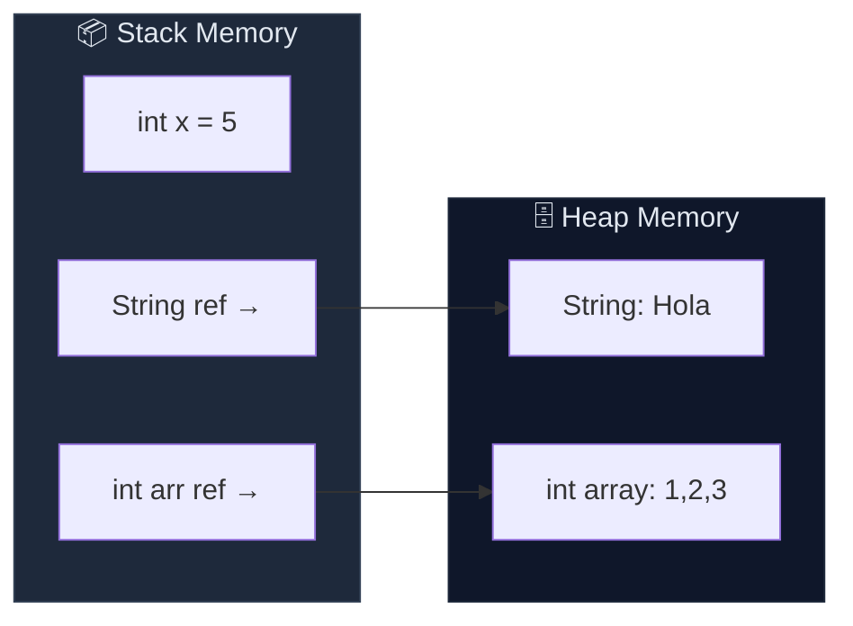
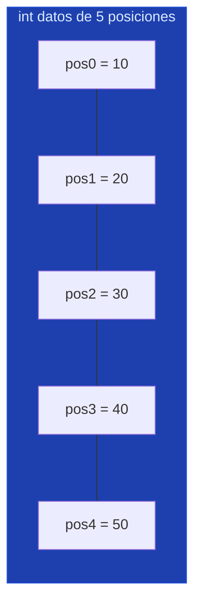
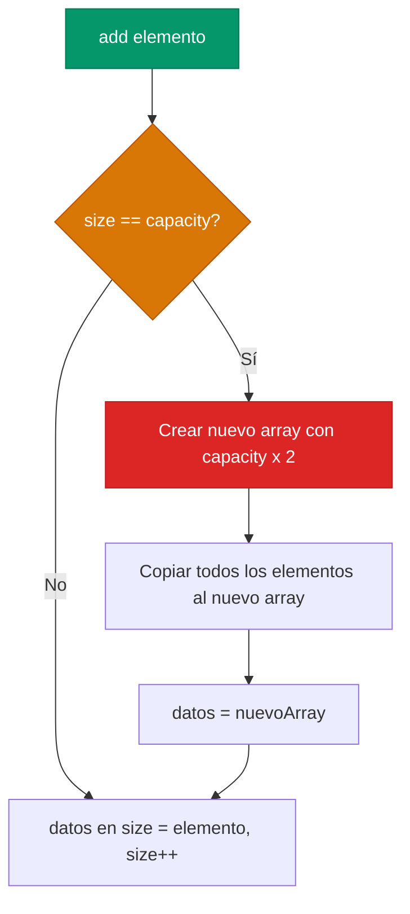
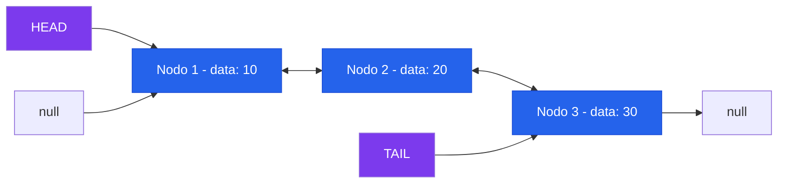
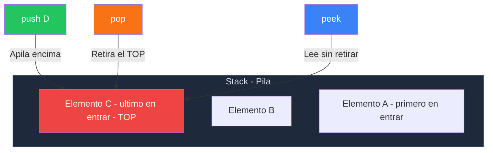
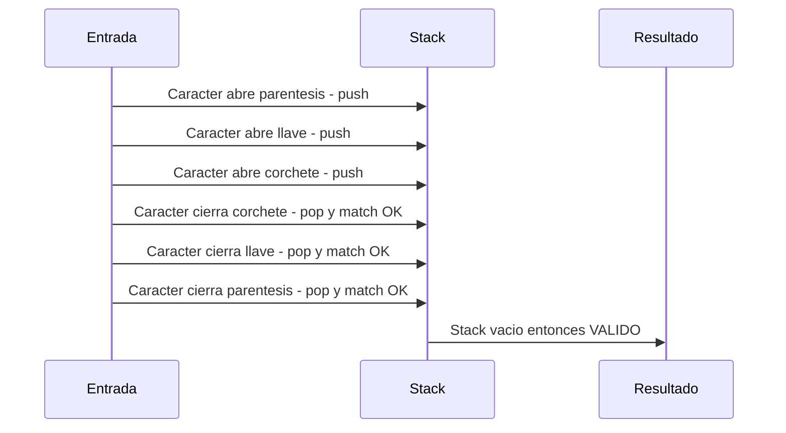
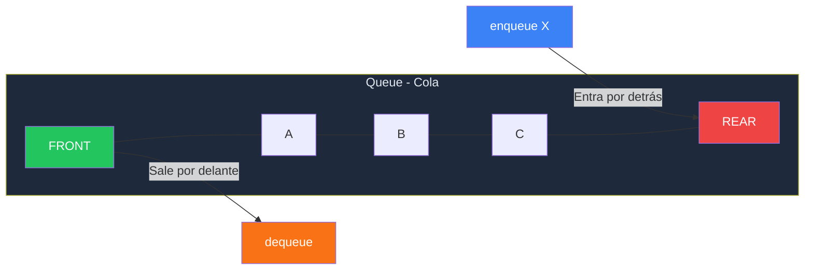
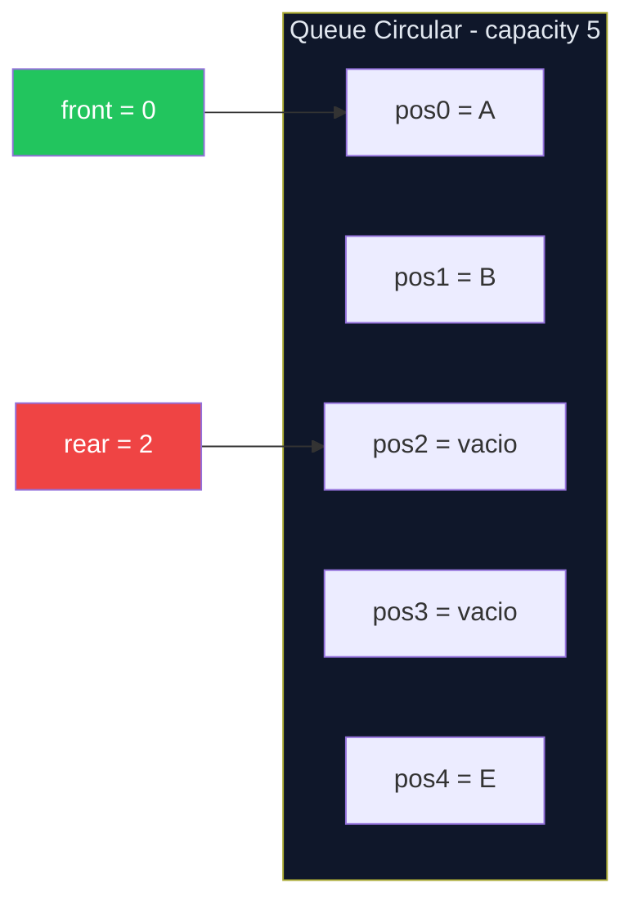
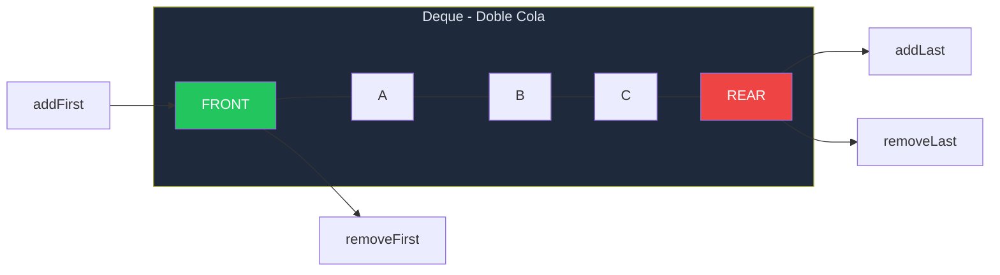

# 📚 Módulo 1: Fundamentos, Memoria y Estructuras Lineales

> **Ejercicios cubiertos**: 01 – 15  
> **Código fuente**: `src/main/java/modulo1_estructuras_lineales/`

---

## 1.1 ¿Qué es una Estructura de Datos?

Una **estructura de datos** es una forma organizada de almacenar y gestionar información en la memoria del ordenador para que pueda ser utilizada de forma eficiente. La elección de la estructura correcta puede marcar la diferencia entre un programa que responde en milisegundos y uno que tarda minutos.

### Clasificación General

---

## 1.2 La Memoria: Stack vs Heap

En Java, la memoria se divide en dos regiones fundamentales:

| Región | Almacena | Vida útil | Velocidad |
|--------|----------|-----------|-----------|
| **Stack** | Variables primitivas, referencias a objetos, frames de métodos | Se destruye al salir del scope | ⚡ Extrema |
| **Heap** | Objetos (instancias creadas con `new`) | Hasta que el Garbage Collector los reclama | 🐢 Más lenta |

### Regla de Oro
- Las **primitivas** (`int`, `double`, `boolean`...) viven en el **Stack**.
- Los **objetos** (incluidos los arrays) viven en el **Heap**; en el Stack solo se guarda la **referencia** (puntero) hacia ellos.

---

## 1.3 Arrays: La Base de Todo

Un array es un bloque **contiguo** de memoria que almacena elementos del mismo tipo. Su tamaño es **fijo** una vez creado.

### Anatomía de un Array en Memoria

### Complejidad de Operaciones en Arrays

| Operación | Complejidad | ¿Por qué? |
|-----------|-------------|------------|
| Acceso por índice | **O(1)** | Cálculo directo: `base + index * tamaño_tipo` |
| Búsqueda lineal | **O(n)** | Hay que recorrer hasta encontrar |
| Inserción al final (si hay espacio) | **O(1)** | Solo escritura |
| Inserción en posición intermedia | **O(n)** | Hay que desplazar elementos |
| Eliminación en posición intermedia | **O(n)** | Hay que compactar el hueco |

### Array Dinámico: Estrategia de Redimensionamiento

Cuando queremos un array que **crezca** automáticamente, necesitamos implementar un **array dinámico**. La estrategia clásica es duplicar la capacidad cuando se llena:

> **Amortized Cost**: Aunque el redimensionamiento es O(n), ocurre con tan poca frecuencia que el coste promedio de `add()` es **O(1) amortizado**.

---

## 1.4 Linked Lists (Listas Enlazadas)

Una lista enlazada es una colección de **nodos** donde cada nodo contiene un dato y una referencia (puntero) al siguiente nodo. No necesita memoria contigua.

### Lista Enlazada Simple (Singly Linked List)

### Lista Doblemente Enlazada (Doubly Linked List)

### Comparativa Array vs LinkedList

| Operación | Array | LinkedList |
|-----------|-------|------------|
| Acceso por índice | **O(1)** ✅ | **O(n)** ❌ |
| Insertar al inicio | **O(n)** ❌ | **O(1)** ✅ |
| Insertar al final | **O(1)** amortizado | **O(1)** con tail ✅ |
| Insertar en medio | **O(n)** | **O(1)** si tienes el nodo ✅ |
| Búsqueda | **O(n)** | **O(n)** |
| Memoria extra | Ninguna | Puntero/s por nodo |

### Detección de Ciclos: Algoritmo de Floyd (Tortuga y Liebre)

> Si hay un ciclo, la liebre (que avanza de 2 en 2) eventualmente **alcanzará** a la tortuga (que avanza de 1 en 1). Si la liebre llega a `null`, no hay ciclo.

---

## 1.5 Stacks (Pilas) — LIFO

Un Stack es una estructura **LIFO** (Last In, First Out): el último elemento que entra es el primero que sale. Piénsalo como una pila de platos.

### Operaciones Fundamentales

| Operación | Descripción | Complejidad |
|-----------|-------------|-------------|
| `push(e)` | Insertar en la cima | **O(1)** |
| `pop()` | Retirar de la cima | **O(1)** |
| `peek()` | Ver la cima sin retirar | **O(1)** |
| `isEmpty()` | ¿Está vacía? | **O(1)** |
| `size()` | Número de elementos | **O(1)** |

### Caso de Uso Clásico: Validador de Paréntesis

---

## 1.6 Queues (Colas) — FIFO

Una Queue es una estructura **FIFO** (First In, First Out): el primer elemento que entra es el primero que sale. Piénsalo como la cola de un supermercado.

### Operaciones Fundamentales

| Operación | Descripción | Complejidad |
|-----------|-------------|-------------|
| `enqueue(e)` | Insertar al final | **O(1)** |
| `dequeue()` | Retirar del frente | **O(1)** |
| `peek()` | Ver el frente sin retirar | **O(1)** |
| `isEmpty()` | ¿Está vacía? | **O(1)** |

### Queue Circular (Circular Buffer)

La Queue Circular resuelve el problema de **desperdiciar memoria** cuando se hace `dequeue()` en un array. En lugar de desplazar elementos, usamos aritmética modular:

> **Fórmula de avance**: `(índice + 1) % capacity` — Esto hace que al llegar al final del array, vuelva al principio automáticamente.

---

## 1.7 Deque (Double-Ended Queue)

Un **Deque** permite insertar y retirar elementos por **ambos extremos** (frente y final). Es la fusión de un Stack y una Queue.

Todas las operaciones del Deque son **O(1)** cuando se implementa correctamente con un array circular o una lista doblemente enlazada.

---

## 1.8 Mapa de Ejercicios del Módulo 1

| Ejercicio | Concepto Principal | Dificultad |
|-----------|-------------------|------------|
| 01 | Array Dinámico Manual (resize) | ⭐⭐ |
| 02 | Insertar en posición con desplazamiento | ⭐⭐ |
| 03 | Eliminar y compactar array | ⭐⭐ |
| 04 | Array Circular (Buffer) | ⭐⭐⭐ |
| 05 | Nodo simple y encadenamiento | ⭐ |
| 06 | LinkedList Simple desde cero | ⭐⭐⭐ |
| 07 | Doubly LinkedList completa | ⭐⭐⭐ |
| 08 | Detección de ciclos (Floyd) | ⭐⭐⭐⭐ |
| 09 | Invertir LinkedList (in-place) | ⭐⭐⭐ |
| 10 | Stack Manual con Array | ⭐⭐ |
| 11 | Stack con LinkedList | ⭐⭐ |
| 12 | Validador de Paréntesis | ⭐⭐⭐ |
| 13 | Queue Manual con Array | ⭐⭐ |
| 14 | Queue Circular | ⭐⭐⭐ |
| 15 | Deque Manual | ⭐⭐⭐⭐ |

---

> **🔗 Código fuente**: Los 15 ejercicios de este módulo se encuentran en  
> `src/main/java/modulo1_estructuras_lineales/`  
> ¡Lee esta teoría antes de tocar una sola línea de código!
