# 📚 Módulo 2: Algoritmos Base, Rendimiento y Técnicas de Punteros

> **Ejercicios cubiertos**: 16 – 30  
> **Código fuente**: `src/main/java/modulo2_algoritmos_rendimiento/`

---

## 2.1 Notación Big O — El Idioma del Rendimiento

La **notación Big O** describe el comportamiento asintótico de un algoritmo: cómo escala el tiempo (o espacio) de ejecución cuando el tamaño de la entrada crece hacia el infinito. No mide el tiempo real en segundos, sino la **tasa de crecimiento**.

### Jerarquía de Complejidades (de mejor a peor)

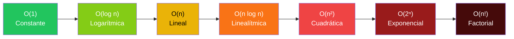

### Tabla de Referencia Rápida

| Big O | Nombre | Ejemplo | n=1000 operaciones aprox. |
|-------|--------|---------|---------------------------|
| O(1) | Constante | Acceso array por índice | 1 |
| O(log n) | Logarítmica | Búsqueda binaria | 10 |
| O(n) | Lineal | Búsqueda lineal | 1,000 |
| O(n log n) | Linealítmica | Merge Sort, Quick Sort | 10,000 |
| O(n²) | Cuadrática | Bubble Sort, Selection Sort | 1,000,000 |
| O(2ⁿ) | Exponencial | Subconjuntos, fuerza bruta | 10^301 |

### Reglas de Oro para Calcular Big O

1. **Ignorar constantes**: O(2n) = O(n), O(500) = O(1).
2. **Domina el término mayor**: O(n² + n) = O(n²).
3. **Bucles secuenciales se SUMAN**: O(n) + O(m) = O(n + m).
4. **Bucles anidados se MULTIPLICAN**: O(n) × O(m) = O(n × m).

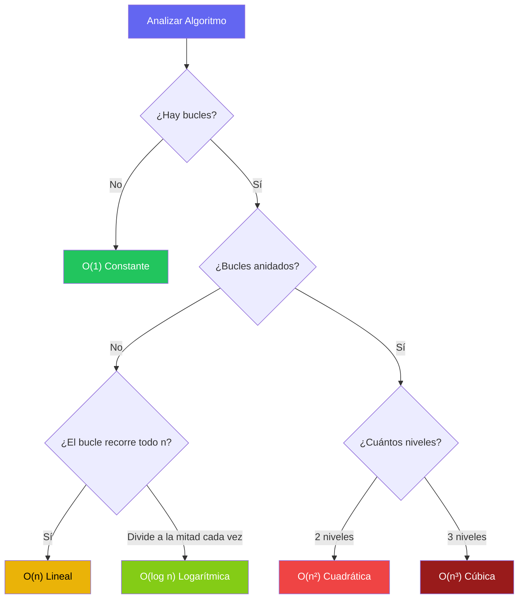

---

## 2.2 Algoritmos de Búsqueda

### Búsqueda Lineal (Linear Search) — O(n)

Recorrer el array elemento por elemento hasta encontrar el objetivo o agotar el array.

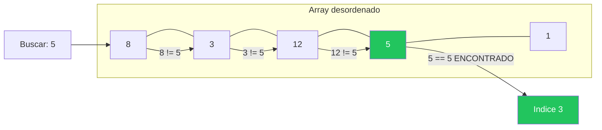

### Búsqueda Binaria (Binary Search) — O(log n)

Requiere un array **ordenado**. En cada paso, descarta la mitad del array comparando con el elemento central.

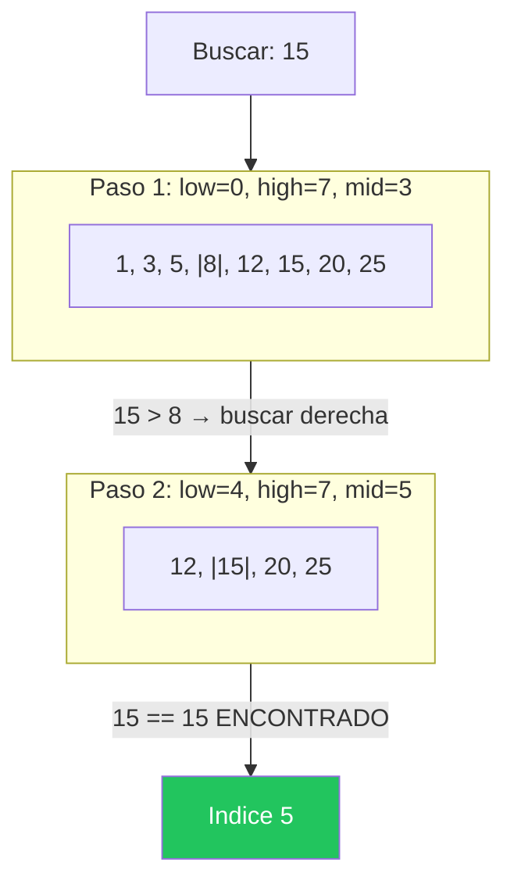

---

## 2.3 Algoritmos de Ordenamiento

### Bubble Sort — O(n²)

Compara pares adyacentes e intercambia si están desordenados. "Burbujea" los mayores hacia el final.

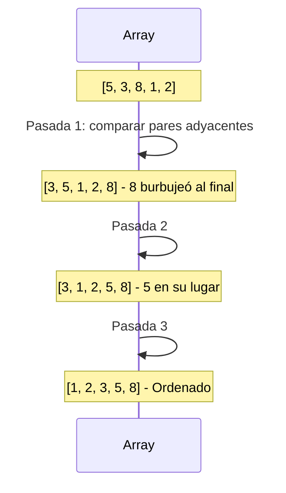

### Selection Sort — O(n²)

En cada pasada, encuentra el mínimo del subarray no ordenado y lo coloca en su posición final.

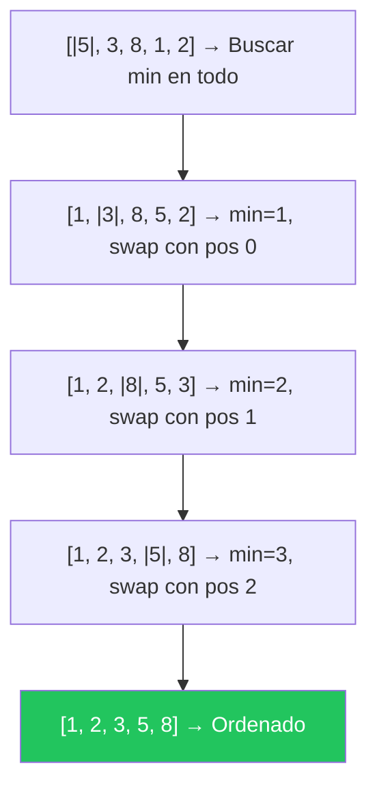

### Insertion Sort — O(n²) peor, O(n) mejor

Como ordenar cartas: toma cada elemento y lo inserta en su posición correcta dentro de la parte ya ordenada.

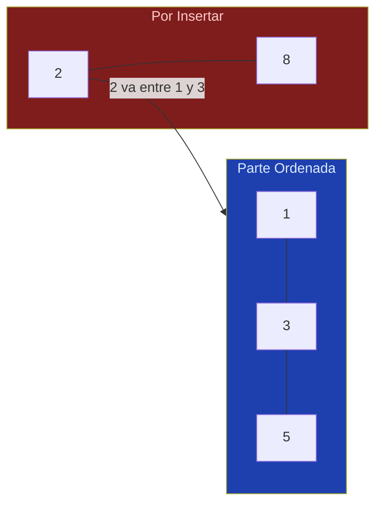

### Merge Sort — O(n log n)

Divide el array en mitades recursivamente hasta tener subarrays de 1 elemento, luego los fusiona (merge) en orden.

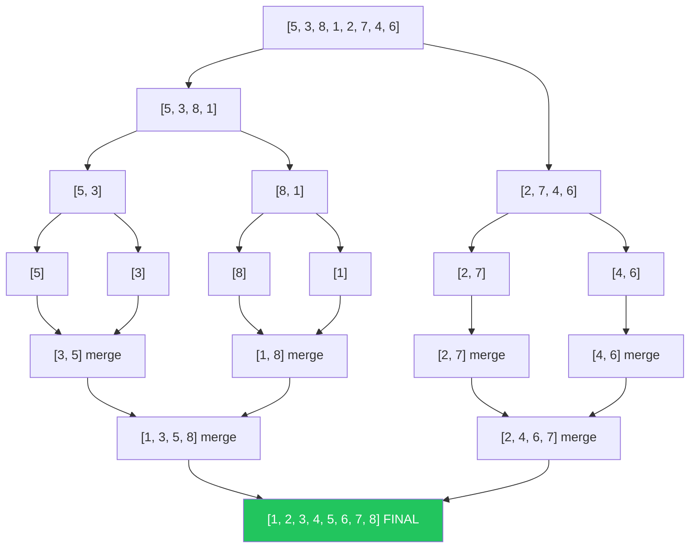

### Quick Sort — O(n log n) promedio, O(n²) peor

Elige un **pivote**, particiona el array en menores y mayores que el pivote, y repite recursivamente.

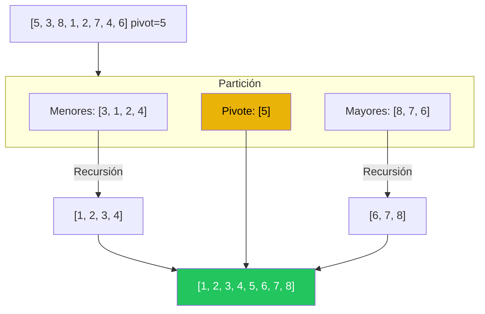

---

## 2.4 Comparativa de Algoritmos de Ordenamiento

| Algoritmo | Mejor | Promedio | Peor | Espacio | Estable |
|-----------|-------|----------|------|---------|---------|
| Bubble Sort | O(n) | O(n²) | O(n²) | O(1) | ✅ Sí |
| Selection Sort | O(n²) | O(n²) | O(n²) | O(1) | ❌ No |
| Insertion Sort | O(n) | O(n²) | O(n²) | O(1) | ✅ Sí |
| Merge Sort | O(n log n) | O(n log n) | O(n log n) | O(n) | ✅ Sí |
| Quick Sort | O(n log n) | O(n log n) | O(n²) | O(log n) | ❌ No |
| Counting Sort | O(n + k) | O(n + k) | O(n + k) | O(k) | ✅ Sí |

> **Estable** = Preserva el orden relativo de elementos iguales.

---

## 2.5 Técnica: Two Pointers (Dos Punteros)

Usa dos punteros que se mueven estratégicamente por el array (generalmente uno desde el inicio y otro desde el final) para resolver problemas en O(n) que normalmente requerirían O(n²).

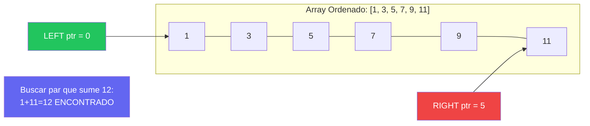

### Estrategia

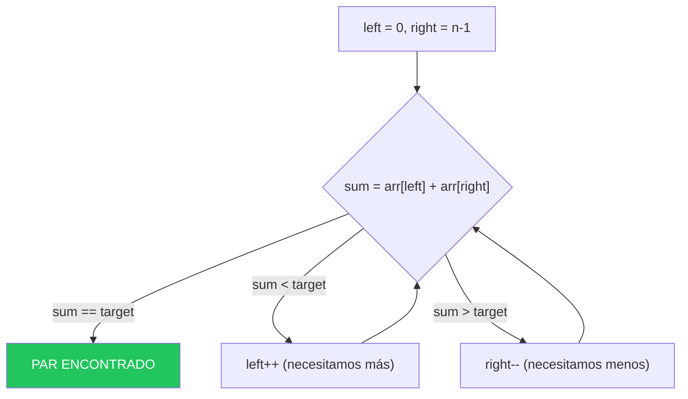

---

## 2.6 Técnica: Sliding Window (Ventana Deslizante)

Mantiene una "ventana" de tamaño fijo o variable que se desliza por el array, actualizando el resultado de forma incremental sin recalcular todo desde cero.

### Ventana de Tamaño Fijo

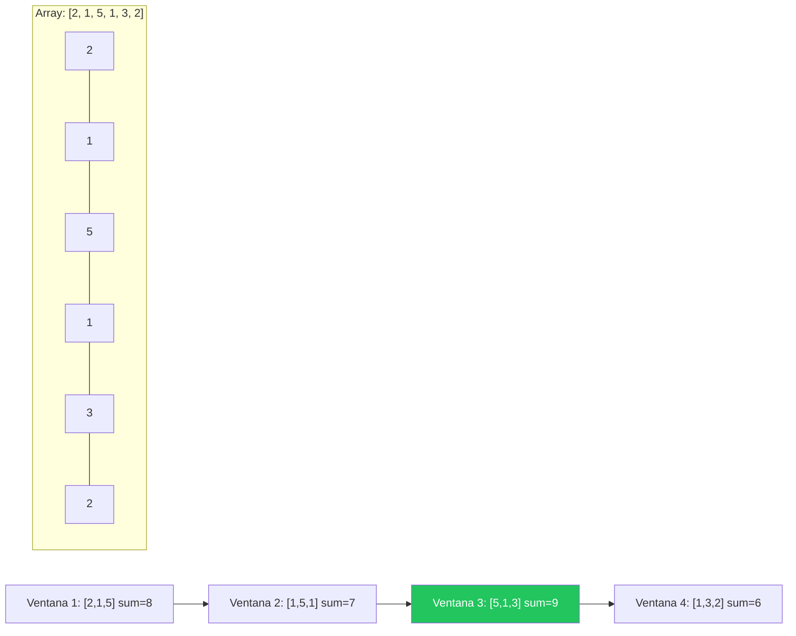

> **Clave**: Al deslizar, en vez de sumar k elementos de nuevo: `newSum = oldSum - salio + entro`. Esto convierte O(n×k) en O(n).

### Ventana de Tamaño Variable

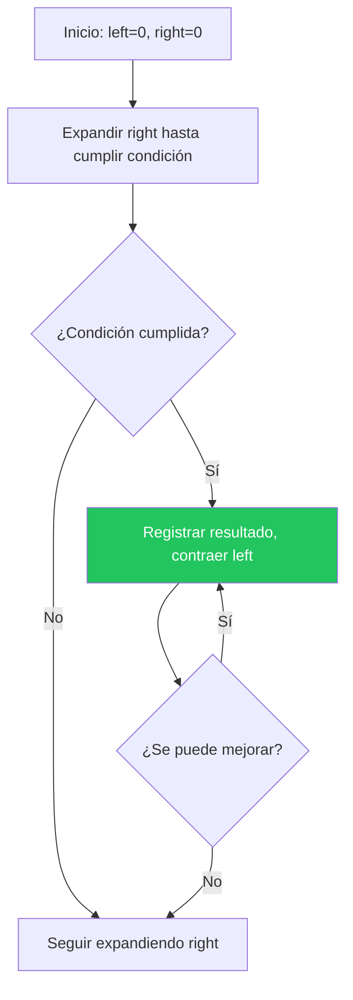

---

## 2.7 Mapa de Ejercicios del Módulo 2

| Ejercicio | Concepto Principal | Dificultad |
|-----------|-------------------|------------|
| 16 | Búsqueda Lineal | ⭐ |
| 17 | Búsqueda Binaria (iterativa + recursiva) | ⭐⭐ |
| 18 | Bubble Sort | ⭐⭐ |
| 19 | Selection Sort | ⭐⭐ |
| 20 | Insertion Sort | ⭐⭐ |
| 21 | Merge Sort (divide and conquer) | ⭐⭐⭐⭐ |
| 22 | Quick Sort (partición Lomuto/Hoare) | ⭐⭐⭐⭐ |
| 23 | Counting Sort (no comparativo) | ⭐⭐⭐ |
| 24 | Análisis Big O práctico | ⭐⭐ |
| 25 | Two Pointers: Par con suma objetivo | ⭐⭐⭐ |
| 26 | Two Pointers: Palíndromos e inversiones | ⭐⭐ |
| 27 | Sliding Window: Suma máxima (tamaño fijo) | ⭐⭐⭐ |
| 28 | Sliding Window: Subcadena (tamaño variable) | ⭐⭐⭐⭐ |
| 29 | Búsqueda Binaria: Variantes avanzadas | ⭐⭐⭐ |
| 30 | Benchmark Comparativo de Sorting | ⭐⭐⭐ |

---

> **🔗 Código fuente**: Los 15 ejercicios de este módulo se encuentran en  
> `src/main/java/modulo2_algoritmos_rendimiento/`  
> ¡Lee esta teoría antes de tocar una sola línea de código!
