# 📚 Módulo 3: Estructuras Avanzadas y Grafos

> **Ejercicios cubiertos**: 31 – 45  
> **Código fuente**: `src/main/java/modulo3_estructuras_avanzadas/`

---

## 3.1 Árboles Binarios

Un **árbol binario** es una estructura jerárquica donde cada nodo tiene como máximo **dos hijos**: izquierdo y derecho. El nodo superior se llama **raíz** (root).

### Anatomía de un Árbol Binario

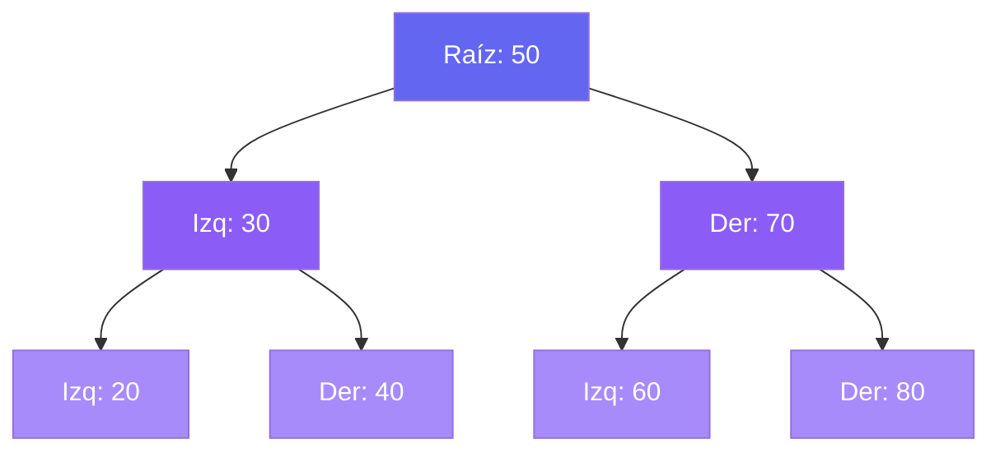

### Terminología Clave

| Término | Definición |
|---------|-----------|
| **Raíz** | Nodo sin padre (el más alto) |
| **Hoja** | Nodo sin hijos |
| **Altura** | Aristas del camino más largo raíz → hoja |
| **Profundidad** | Aristas desde la raíz hasta el nodo |
| **Subárbol** | Árbol formado por un nodo y todos sus descendientes |
| **BST** | Binary Search Tree: izq < padre < der |

### Árbol Binario de Búsqueda (BST)

En un BST, para **todo** nodo N:
- Todos los valores del subárbol **izquierdo** son **menores** que N.
- Todos los valores del subárbol **derecho** son **mayores** que N.

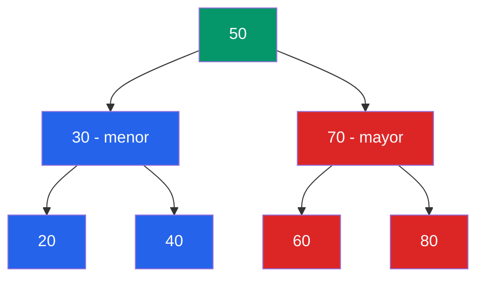

### Recorridos de un Árbol Binario

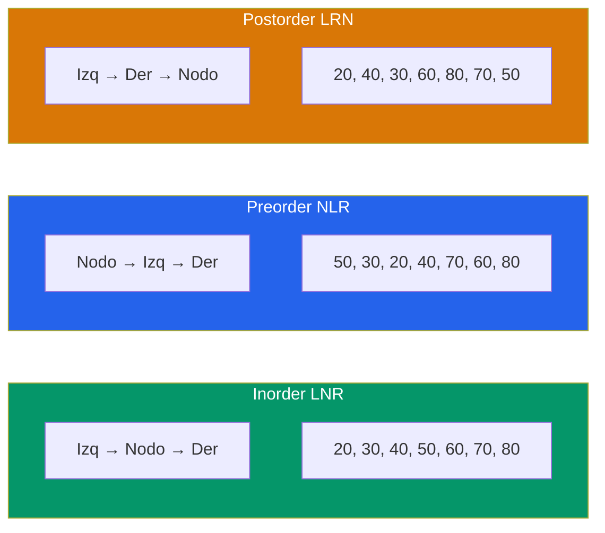

> **Dato clave**: El recorrido **Inorder** de un BST produce los elementos en **orden ascendente**.

### Operaciones BST y Complejidad

| Operación | Promedio | Peor caso (degenerado) |
|-----------|----------|------------------------|
| Buscar | O(log n) | O(n) |
| Insertar | O(log n) | O(n) |
| Eliminar | O(log n) | O(n) |
| Recorrido | O(n) | O(n) |

> Un BST **degenerado** es cuando todos los nodos van en una sola dirección (como una linked list). Por eso existen los árboles balanceados (AVL, Red-Black).

---

## 3.2 Hash Maps (Tablas de Dispersión)

Un **HashMap** almacena pares clave-valor y permite acceso en **O(1)** promedio. Internamente usa una **función hash** para convertir la clave en un índice del array de buckets.

### Funcionamiento Interno

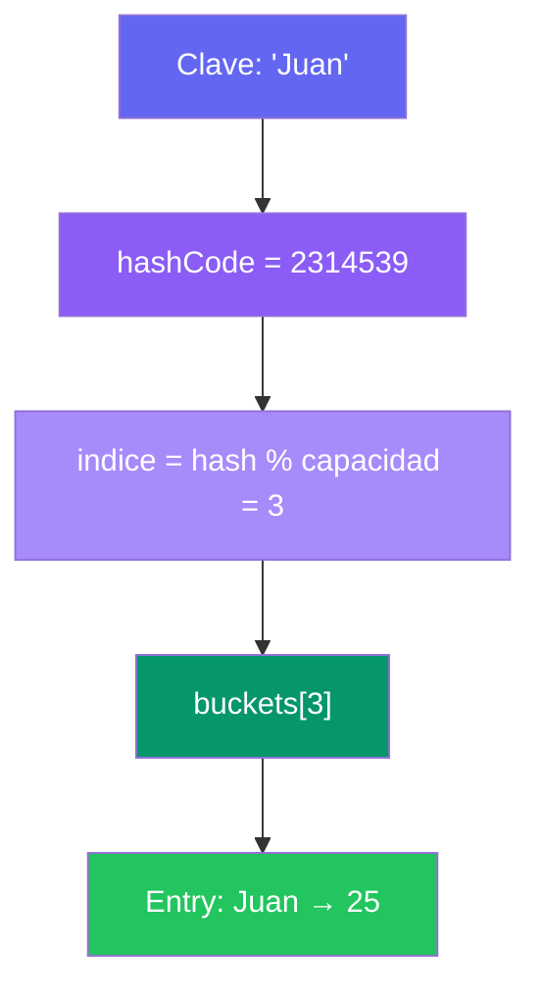

### Colisiones: Encadenamiento (Chaining)

Cuando dos claves producen el **mismo índice**, se almacenan en una lista enlazada en ese bucket:

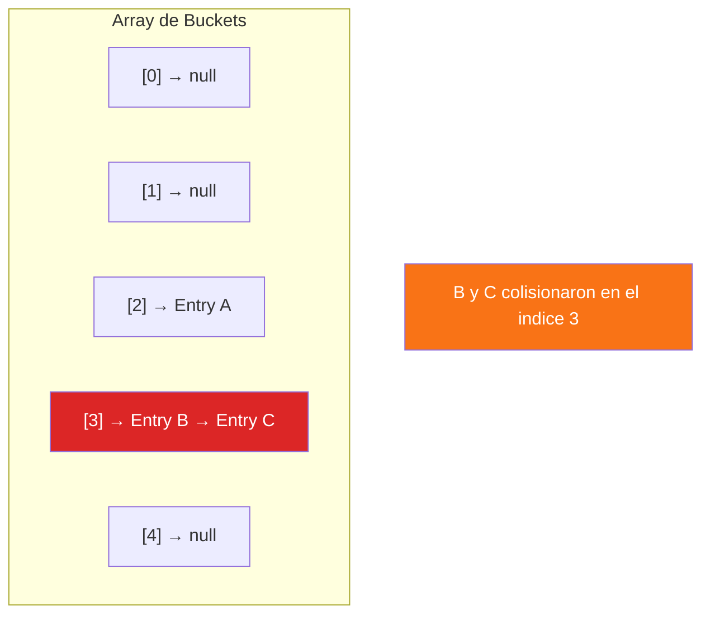

### Factor de Carga y Redimensionamiento

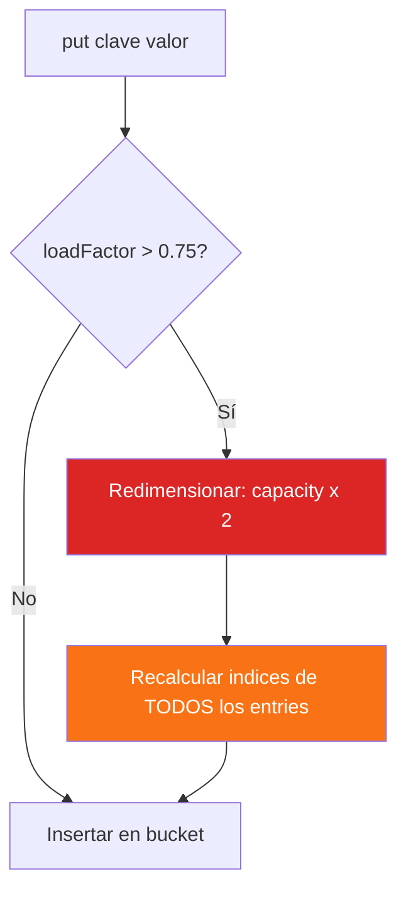

> **Load Factor** = size / capacity. Cuando supera 0.75, se duplica la capacidad y se re-hashean todas las entradas.

---

## 3.3 Heaps (Montículos)

Un **Heap** es un árbol binario completo que cumple la propiedad del heap:
- **Min-Heap**: El padre siempre es **menor o igual** que sus hijos.
- **Max-Heap**: El padre siempre es **mayor o igual** que sus hijos.

### Representación en Array

Un heap se implementa eficientemente sobre un **array** usando aritmética de índices:

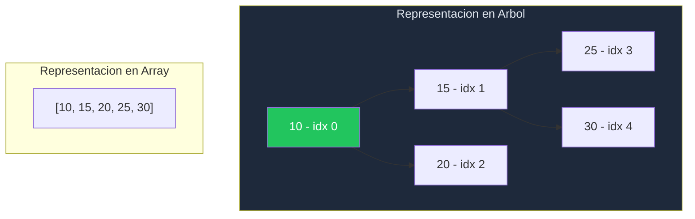

| Relación | Fórmula |
|----------|---------|
| Padre de i | `(i - 1) / 2` |
| Hijo izquierdo de i | `2 * i + 1` |
| Hijo derecho de i | `2 * i + 2` |

### Operaciones del Heap

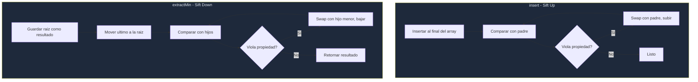

| Operación | Complejidad |
|-----------|-------------|
| insert | O(log n) |
| extractMin/Max | O(log n) |
| peek | O(1) |
| heapify (construir) | O(n) |

---

## 3.4 Grafos

Un **grafo** es un conjunto de **vértices** (nodos) conectados por **aristas** (edges). Son la estructura de datos más versátil y modelan redes, mapas, dependencias, etc.

### Tipos de Grafos

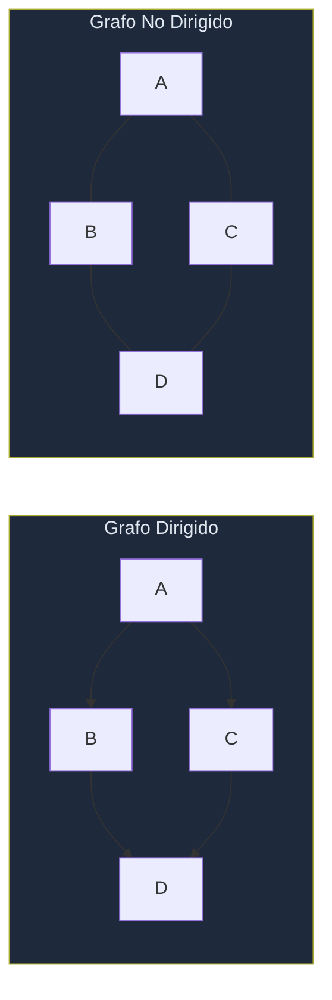

### Representaciones

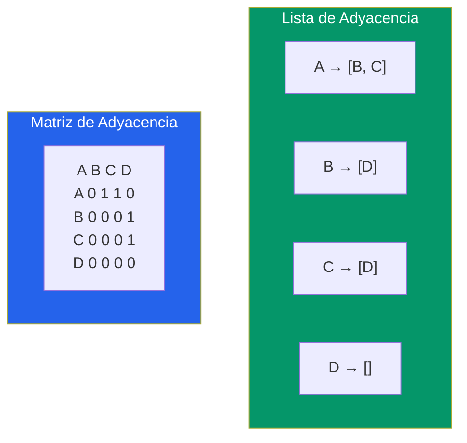

| Representación | Espacio | Agregar arista | Verificar arista | Vecinos |
|----------------|---------|----------------|------------------|---------|
| Lista Adyacencia | O(V + E) | O(1) | O(grado) | O(grado) |
| Matriz Adyacencia | O(V²) | O(1) | O(1) | O(V) |

### BFS (Breadth-First Search) — Recorrido en Amplitud

Explora todos los vecinos del nivel actual **antes** de avanzar al siguiente nivel. Usa una **Queue**.

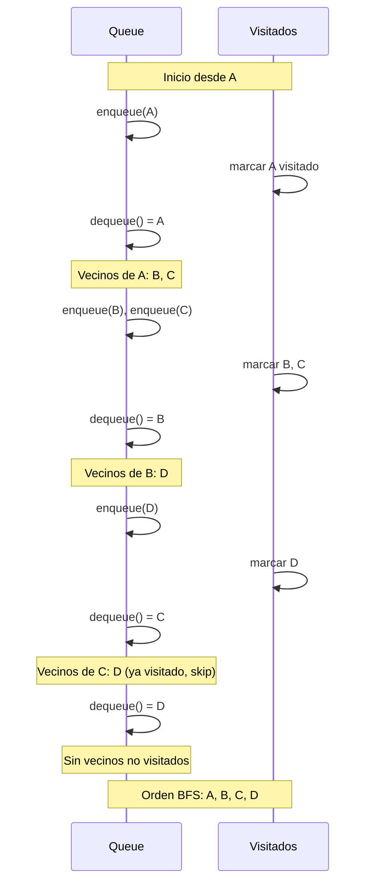

### DFS (Depth-First Search) — Recorrido en Profundidad

Explora lo más profundo posible **antes** de retroceder. Usa un **Stack** o recursión.

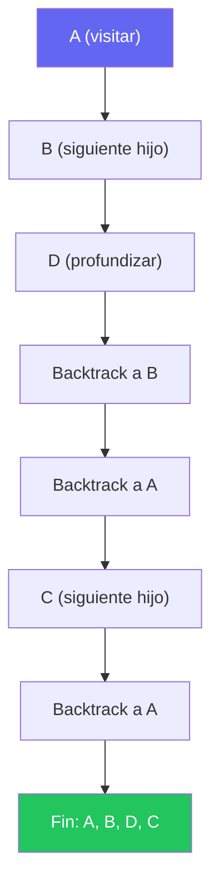

| Algoritmo | Estructura | Encuentra camino mas corto | Complejidad |
|-----------|-----------|---------------------------|-------------|
| BFS | Queue | Si en grafos no ponderados | O(V + E) |
| DFS | Stack/Recursion | No garantiza | O(V + E) |

---

## 3.5 Mapa de Ejercicios del Módulo 3

| Ejercicio | Concepto Principal | Dificultad |
|-----------|-------------------|------------|
| 31 | Nodo de Árbol Binario y recorridos básicos | ⭐⭐ |
| 32 | BST: inserción y búsqueda | ⭐⭐⭐ |
| 33 | BST: recorridos Inorder, Preorder, Postorder | ⭐⭐ |
| 34 | BST: eliminación, altura, balanceo | ⭐⭐⭐⭐ |
| 35 | HashMap Manual desde cero | ⭐⭐⭐⭐ |
| 36 | Colisiones Hash (Chaining) | ⭐⭐⭐ |
| 37 | Redimensionamiento y Load Factor | ⭐⭐⭐ |
| 38 | HashSet Manual | ⭐⭐ |
| 39 | Min-Heap Manual | ⭐⭐⭐ |
| 40 | Max-Heap y Priority Queue | ⭐⭐⭐ |
| 41 | Heap Sort | ⭐⭐⭐ |
| 42 | Grafo con Lista de Adyacencia | ⭐⭐⭐ |
| 43 | BFS (Breadth-First Search) | ⭐⭐⭐ |
| 44 | DFS (Depth-First Search) | ⭐⭐⭐ |
| 45 | Camino más corto (BFS no ponderado) | ⭐⭐⭐⭐ |

---

> **🔗 Código fuente**: `src/main/java/modulo3_estructuras_avanzadas/`  
> ¡Lee esta teoría antes de tocar una sola línea de código!
