# 📚 Módulo 4: Patrones de Diseño Creacionales (GoF)

> **Ejercicios cubiertos**: 46 – 60  
> **Código fuente**: `src/main/java/modulo4_patrones_creacionales/`

---

## 4.1 ¿Qué son los Patrones de Diseño?

Los **Patrones de Diseño** son soluciones reutilizables a problemas comunes en el diseño de software. Fueron catalogados por el "Gang of Four" (GoF) en 1994 en 23 patrones clasificados en tres categorías:

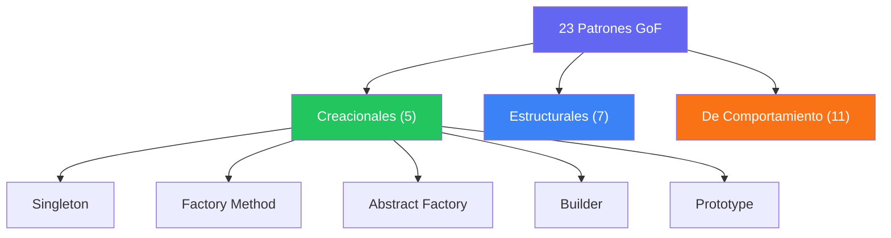

Los patrones **Creacionales** se encargan de la creación de objetos, abstrayendo el proceso de instanciación para hacer el sistema independiente de cómo se crean, componen y representan sus objetos.

---

## 4.2 Singleton — Una Sola Instancia Global

### Intención
Garantizar que una clase tenga **exactamente una instancia** y proporcionar un punto de acceso global a ella.

### Diagrama UML

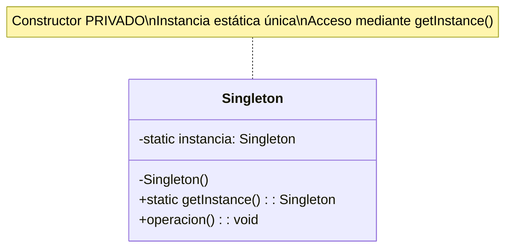

### Variantes de Implementación

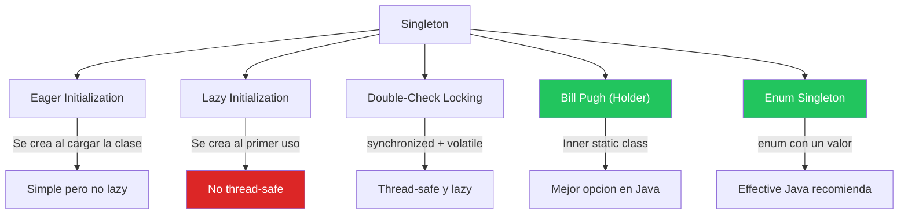

### Cuándo usar
- Acceso a recursos compartidos (conexión BD, configuración, logger).
- Cuando exactamente una instancia coordina acciones del sistema.

### Cuándo NO usar
- Si necesitas testabilidad (dificulta mocking/testing).
- Si necesitas múltiples instancias en el futuro.

---

## 4.3 Factory Method — Delegar la Creación a Subclases

### Intención
Definir una interfaz para crear un objeto, pero permitir que las **subclases** decidan qué clase instanciar.

### Diagrama UML

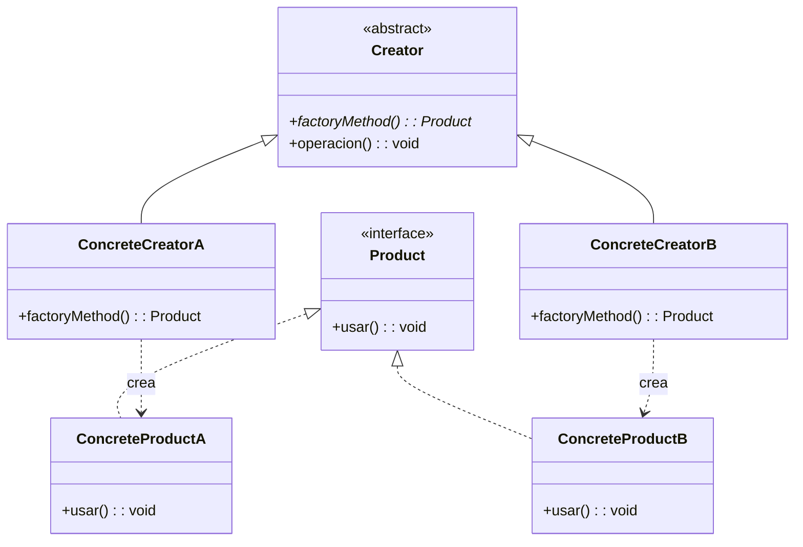

### Flujo de Ejecución

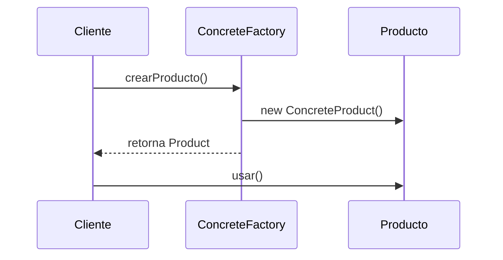

### Cuándo usar
- No sabes de antemano los tipos exactos de objetos que necesitas.
- Quieres que las subclases especifiquen qué objetos crear.
- Necesitas centralizar la lógica de creación.

---

## 4.4 Abstract Factory — Familias de Objetos Relacionados

### Intención
Proporcionar una interfaz para crear **familias** de objetos relacionados sin especificar sus clases concretas.

### Diagrama UML

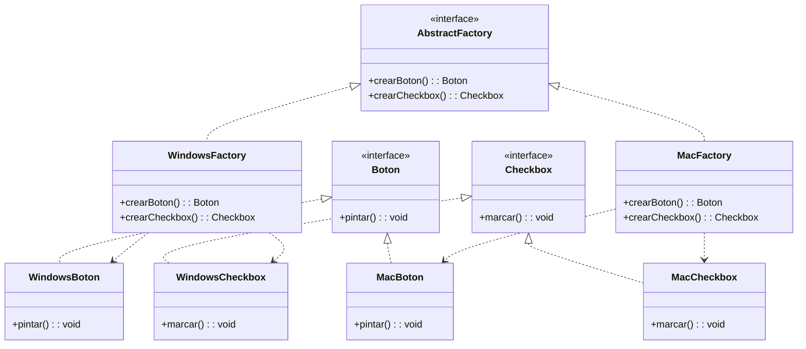

### Diferencia Factory Method vs Abstract Factory

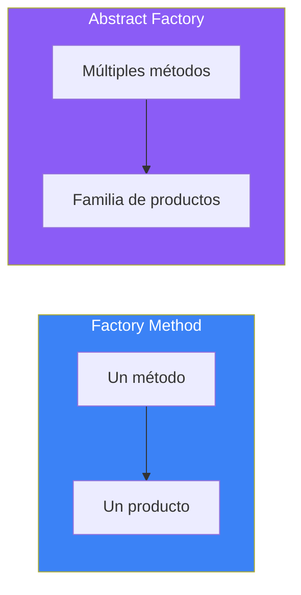

---

## 4.5 Builder — Construir Objetos Complejos Paso a Paso

### Intención
Separar la construcción de un objeto complejo de su representación, permitiendo construirlo **paso a paso** con diferentes configuraciones.

### Diagrama UML

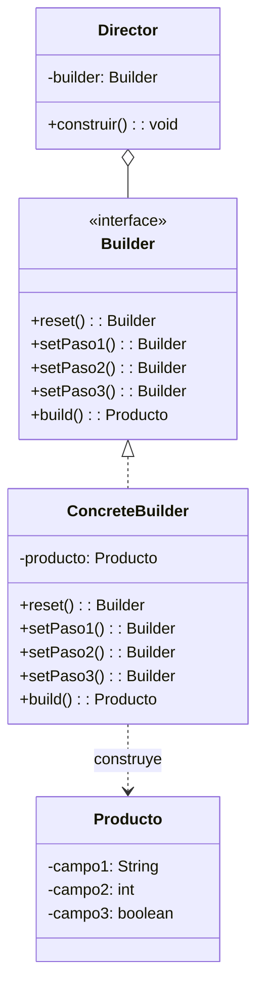

### Flujo con Fluent API (Method Chaining)

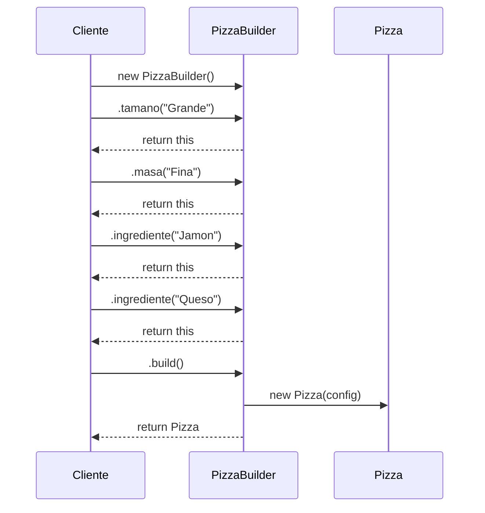

### Cuándo usar
- Objetos con muchos parámetros opcionales (evitar constructores telescópicos).
- Diferentes representaciones del mismo tipo de objeto.
- Construcción paso a paso con validación.

---

## 4.6 Prototype — Clonar Objetos Existentes

### Intención
Crear nuevos objetos **clonando** un prototipo existente, evitando el coste de creación desde cero.

### Diagrama UML

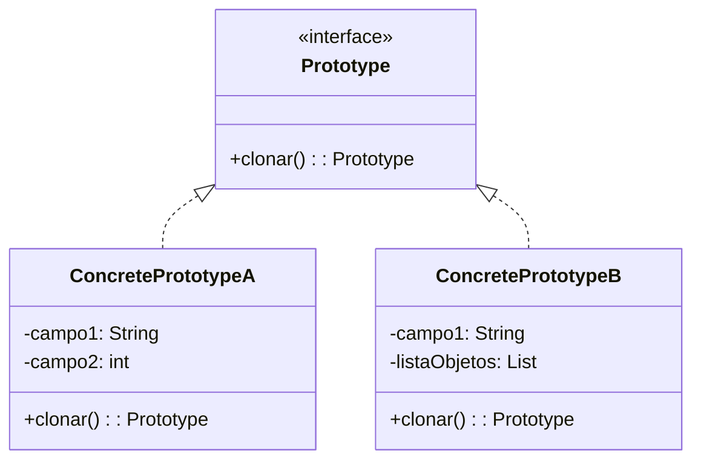

### Shallow Copy vs Deep Copy

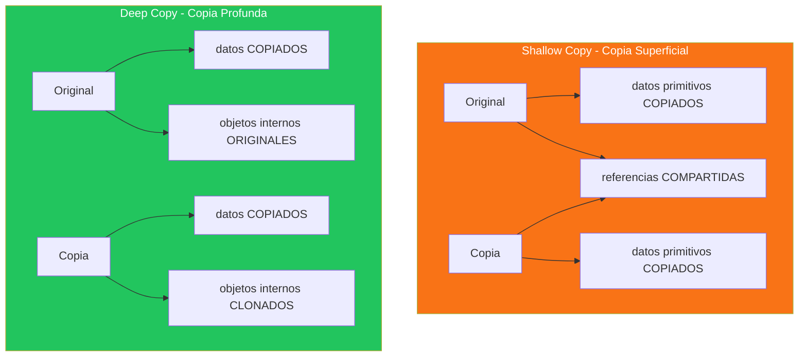

---

## 4.7 Mapa de Ejercicios del Módulo 4

| Ejercicio | Patrón | Concepto | Dificultad |
|-----------|--------|----------|------------|
| 46 | Singleton | Variantes Eager, Lazy, Double-Check | ⭐⭐ |
| 47 | Singleton | Singleton de Configuración con Properties | ⭐⭐⭐ |
| 48 | Singleton | Singleton Registry y problemas de testing | ⭐⭐⭐ |
| 49 | Factory Method | Fábrica de documentos (PDF, Word, Excel) | ⭐⭐⭐ |
| 50 | Factory Method | Fábrica de notificaciones con registro | ⭐⭐⭐ |
| 51 | Factory Method | Fábrica parametrizada con enums | ⭐⭐⭐ |
| 52 | Abstract Factory | Familias de componentes UI | ⭐⭐⭐⭐ |
| 53 | Abstract Factory | Temas Dark/Light para aplicación | ⭐⭐⭐⭐ |
| 54 | Abstract Factory | Sistema cross-platform (DB + Cache) | ⭐⭐⭐⭐ |
| 55 | Builder | Builder básico para objeto complejo | ⭐⭐⭐ |
| 56 | Builder | Builder con Director | ⭐⭐⭐ |
| 57 | Builder | Fluent API (Method Chaining) | ⭐⭐⭐ |
| 58 | Prototype | Shallow Copy manual | ⭐⭐ |
| 59 | Prototype | Deep Copy recursiva | ⭐⭐⭐ |
| 60 | Prototype | Prototype Registry (catálogo) | ⭐⭐⭐⭐ |

---

> **🔗 Código fuente**: `src/main/java/modulo4_patrones_creacionales/`  
> ¡Lee esta teoría antes de tocar una sola línea de código!
