# 📚 Módulo 5: Patrones de Diseño Estructurales (GoF)

> **Ejercicios cubiertos**: 61 – 75  
> **Código fuente**: `src/main/java/modulo5_patrones_estructurales/`

---

## 5.1 Visión General de los Patrones Estructurales

Los patrones estructurales se encargan de la **composición** de clases y objetos para formar estructuras más grandes. Se centran en cómo las clases y objetos se combinan para crear nuevas funcionalidades.

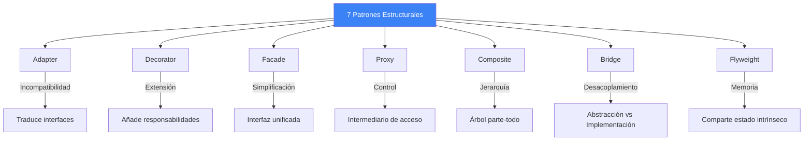

---

## 5.2 Adapter — Traducir Interfaces Incompatibles

### Intención
Convertir la interfaz de una clase en otra que el cliente espera. Permite que clases con interfaces incompatibles trabajen juntas.

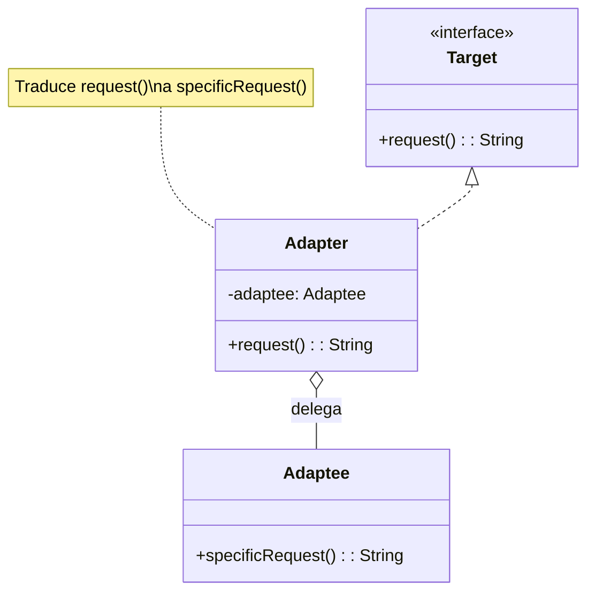

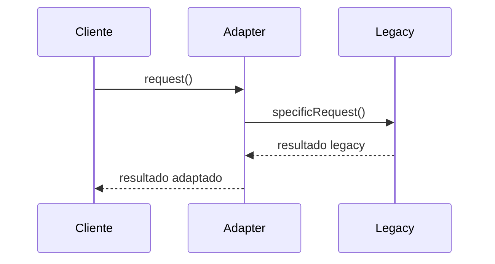

> **Analogía**: Un adaptador de enchufes europeo⟶americano.

---

## 5.3 Decorator — Añadir Responsabilidades Dinámicamente

### Intención
Añadir responsabilidades adicionales a un objeto de forma dinámica. Los decoradores proporcionan una alternativa flexible a la herencia para extender funcionalidad.

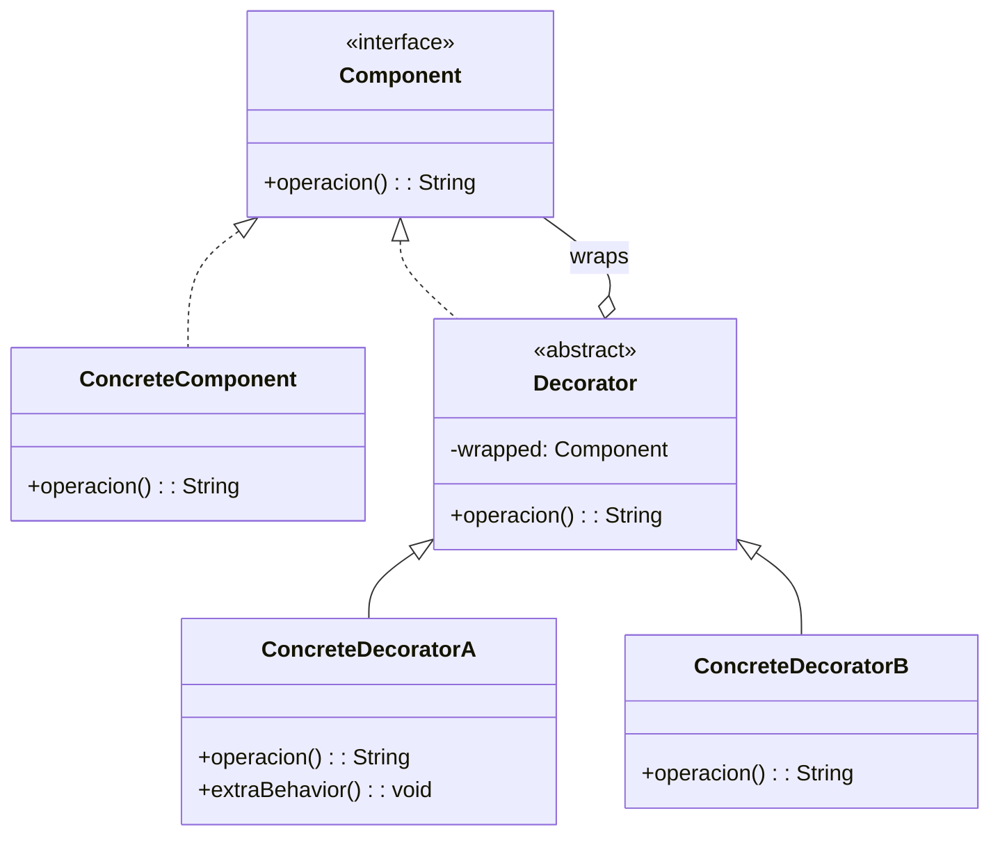

> **Clave**: Los decoradores se apilan como capas de cebolla.

---

## 5.4 Facade — Simplificar Sistemas Complejos

### Intención
Proporcionar una interfaz unificada y simplificada a un conjunto de interfaces de un subsistema.

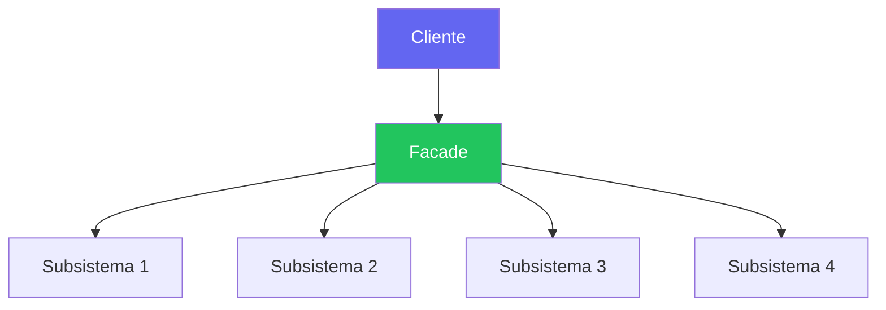

> **Analogía**: Un camarero en un restaurante. Tú no hablas con el cocinero, el sommelier y el cajero por separado. Le dices al camarero lo que quieres y él coordina todo.

---

## 5.5 Proxy — Intermediario de Acceso

### Intención
Proporcionar un sustituto o representante de otro objeto para controlar el acceso a él.

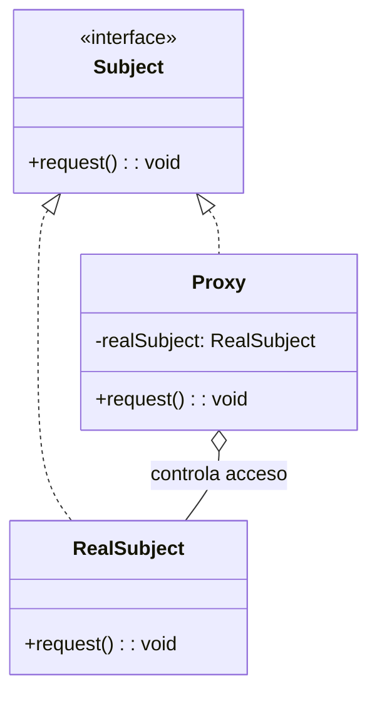

### Tipos de Proxy

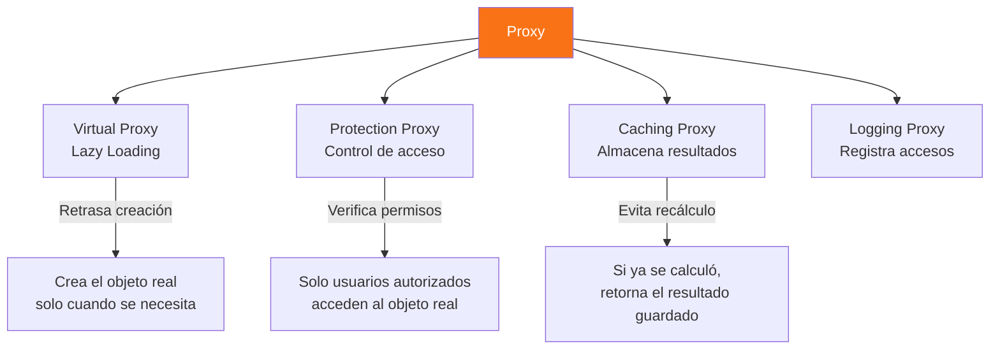

---

## 5.6 Composite — Tratar Simples y Compuestos Igual

### Intención
Componer objetos en estructuras de árbol para representar jerarquías parte-todo. Permite tratar objetos individuales y composiciones de manera uniforme.

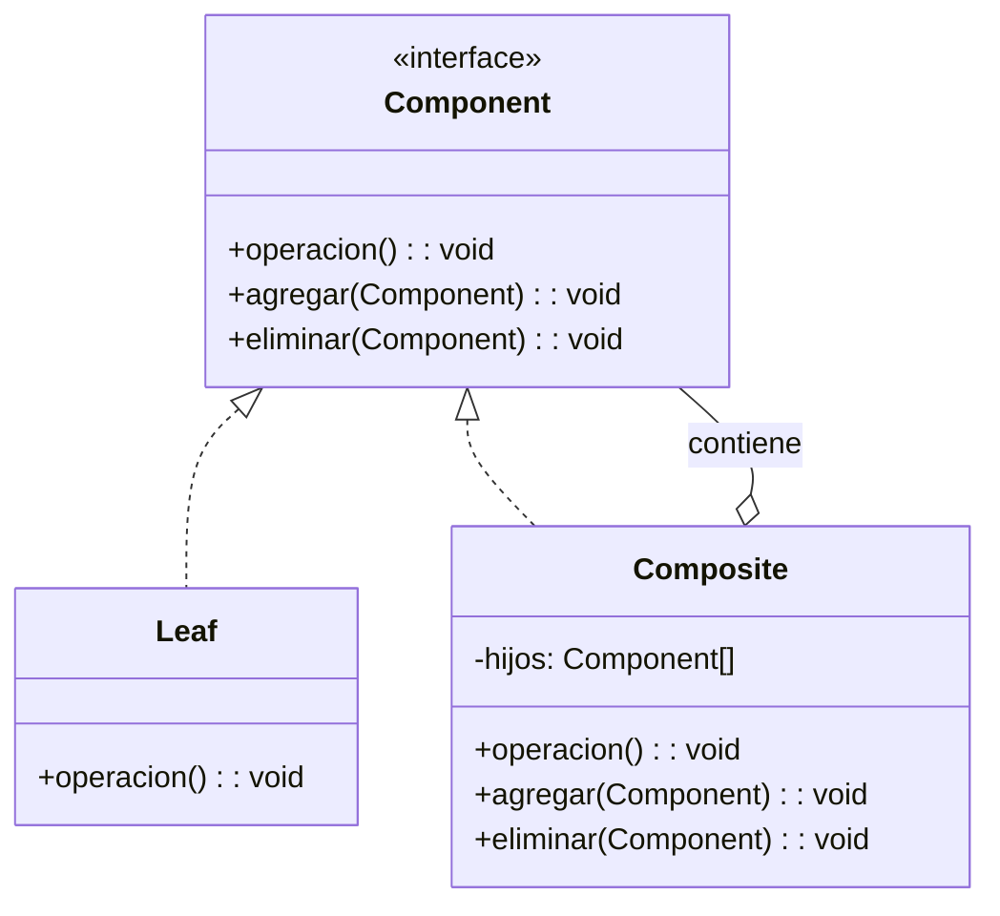

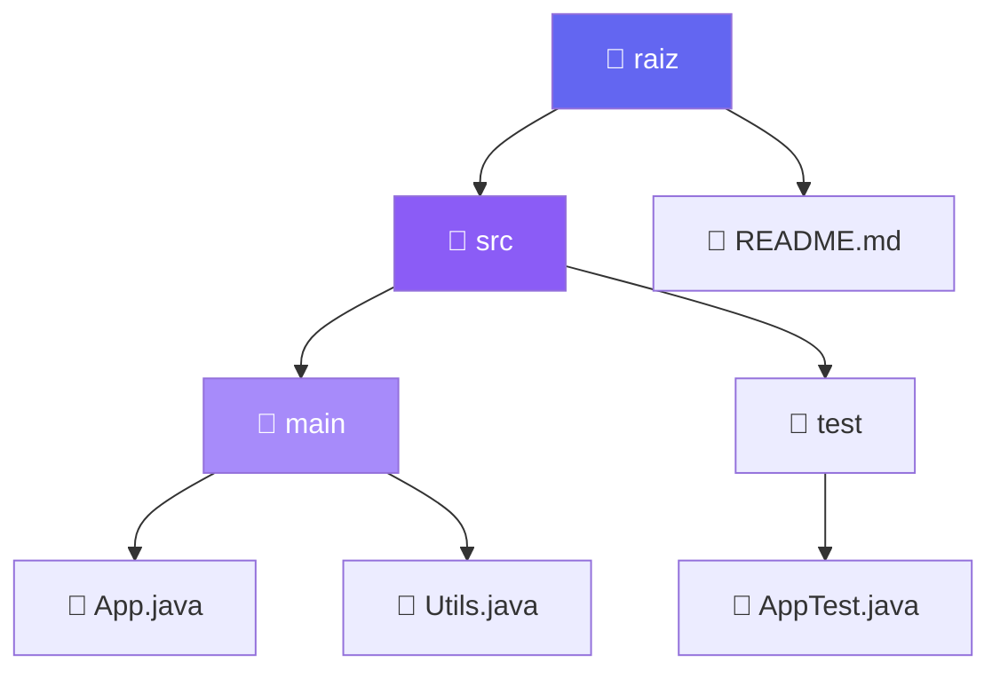

---

## 5.7 Bridge — Separar Abstracción de Implementación

### Intención
Desacoplar una abstracción de su implementación para que ambas puedan variar independientemente.

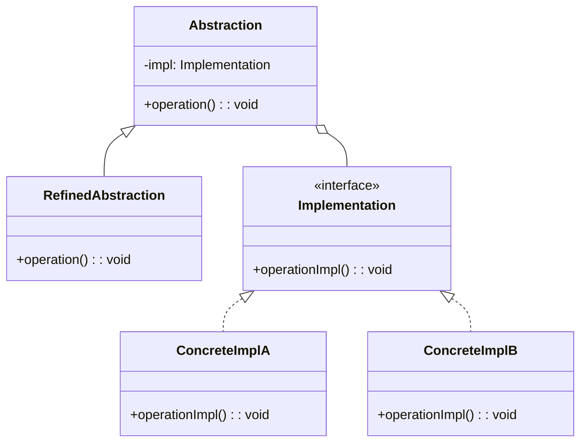

> **Sin Bridge**: N abstracciones × M implementaciones = N×M clases.  
> **Con Bridge**: N abstracciones + M implementaciones = N+M clases.

---

## 5.8 Flyweight — Compartir Para Ahorrar Memoria

### Intención
Usar compartición para soportar eficientemente un gran número de objetos de grano fino.

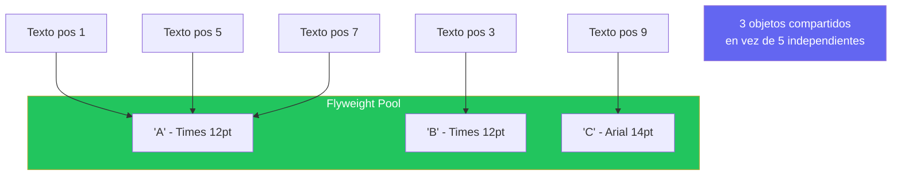

| Concepto | Descripción |
|----------|-------------|
| **Estado intrínseco** | Compartido, inmutable (carácter, fuente) |
| **Estado extrínseco** | Único por contexto (posición, color) |

---

## 5.9 Mapa de Ejercicios del Módulo 5

| Ejercicio | Patrón | Concepto | Dificultad |
|-----------|--------|----------|------------|
| 61 | Adapter | Adaptar API legacy de pagos | ⭐⭐⭐ |
| 62 | Adapter | Adapter bidireccional XML↔JSON | ⭐⭐⭐ |
| 63 | Decorator | Decoradores de bebidas (Starbucks) | ⭐⭐⭐ |
| 64 | Decorator | Decoradores de flujo de datos (cifrado, compresión) | ⭐⭐⭐⭐ |
| 65 | Facade | Facade de Home Theater | ⭐⭐⭐ |
| 66 | Facade | Facade de proceso de pedido e-commerce | ⭐⭐⭐ |
| 67 | Proxy | Proxy de Protección con roles | ⭐⭐⭐ |
| 68 | Proxy | Proxy de Caché con lazy loading | ⭐⭐⭐ |
| 69 | Composite | Sistema de archivos (árbol) | ⭐⭐⭐⭐ |
| 70 | Composite | Organigrama empresarial | ⭐⭐⭐ |
| 71 | Bridge | Dispositivos y controles remotos | ⭐⭐⭐ |
| 72 | Bridge | Formas y renderizadores (SVG, Canvas) | ⭐⭐⭐ |
| 73 | Flyweight | Editor de texto con caracteres compartidos | ⭐⭐⭐⭐ |
| 74 | Combinado | Adapter + Decorator para streams | ⭐⭐⭐⭐ |
| 75 | Integración | Mini-framework con múltiples patrones | ⭐⭐⭐⭐⭐ |

---

> **🔗 Código fuente**: `src/main/java/modulo5_patrones_estructurales/`  
> ¡Lee esta teoría antes de tocar una sola línea de código!
