# 📚 Módulo 6: Patrones de Diseño de Comportamiento (GoF)

> **Ejercicios cubiertos**: 76 – 100  
> **Código fuente**: `src/main/java/modulo6_patrones_comportamiento/`

---

## 6.1 Visión General

Los patrones de comportamiento se ocupan de la **comunicación** entre objetos y la **asignación de responsabilidades**. Definen cómo los objetos interactúan y distribuyen la lógica.

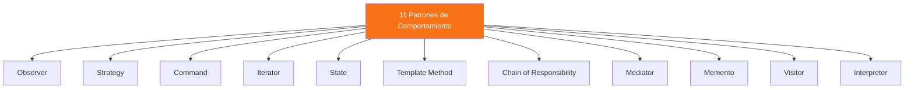

---

## 6.2 Observer — Suscripción a Eventos

Cuando un objeto cambia de estado, notifica automáticamente a todos sus dependientes (observadores).

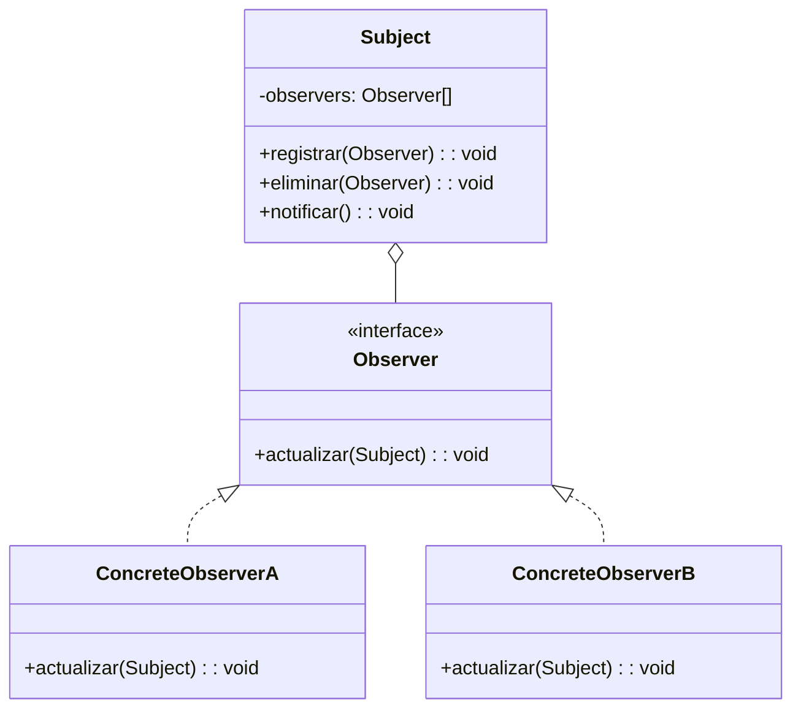

> **Analogía**: YouTube — te suscribes a un canal y recibes notificaciones.

---

## 6.3 Strategy — Intercambiar Algoritmos en Runtime

Encapsula una familia de algoritmos y los hace intercambiables. El cliente elige qué estrategia usar sin cambiar su código.

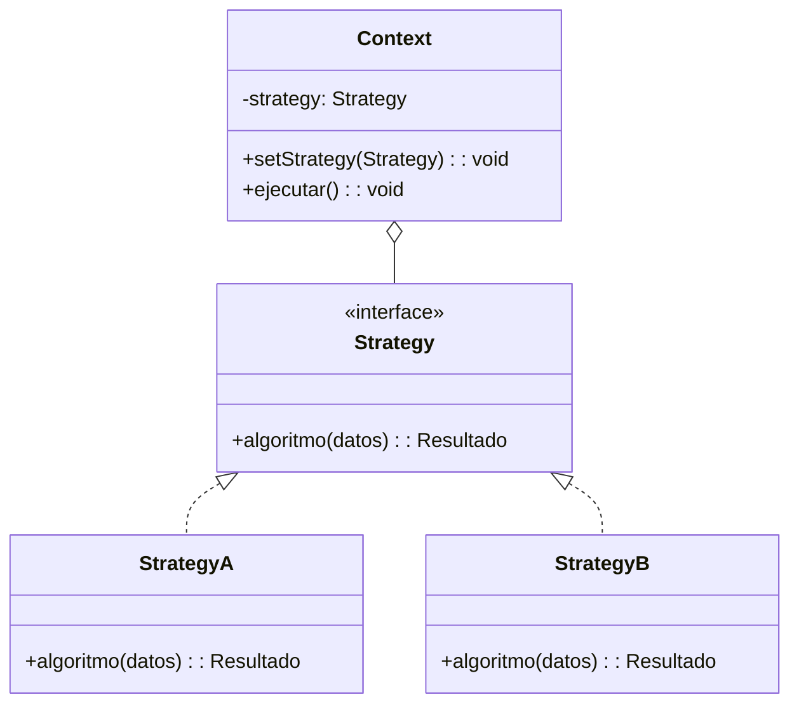

---

## 6.4 Command — Encapsular Acciones como Objetos

Convierte una solicitud en un objeto independiente que contiene toda la información sobre la solicitud. Permite deshacer, rehacer y encolar operaciones.

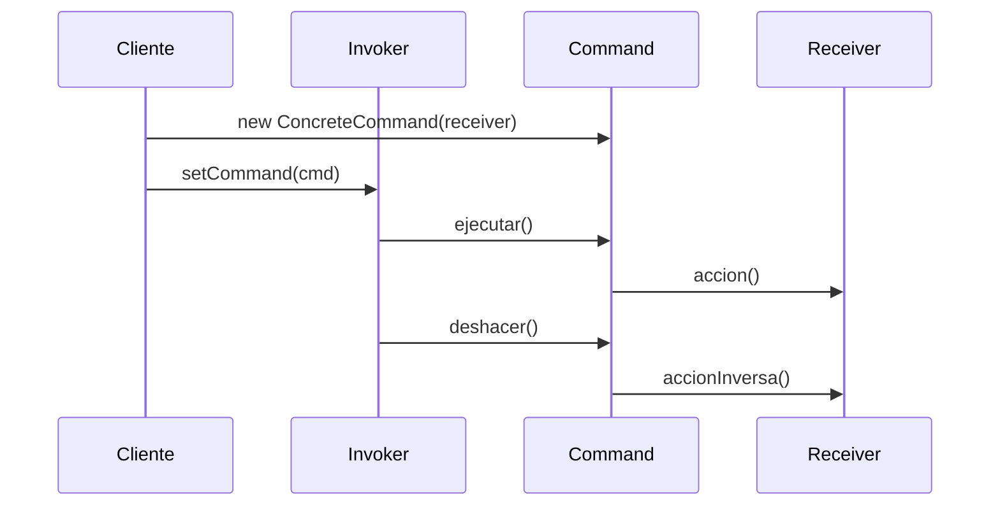

---

## 6.5 Iterator — Recorrer sin Exponer

Proporciona acceso secuencial a los elementos de una colección sin exponer su representación interna.

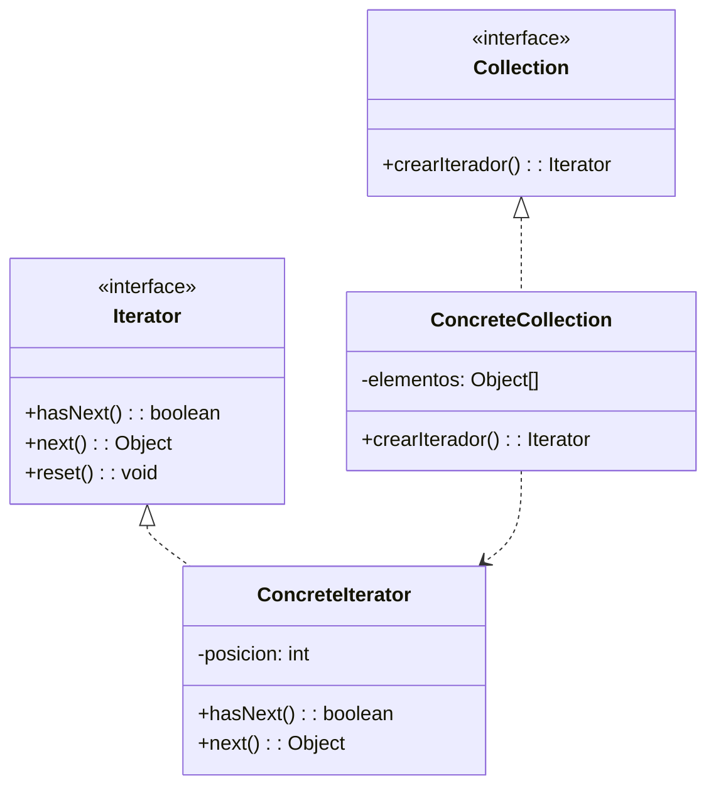

---

## 6.6 State — Comportamiento que Cambia con el Estado

Permite que un objeto altere su comportamiento cuando cambia su estado interno. Parece que el objeto cambia de clase.

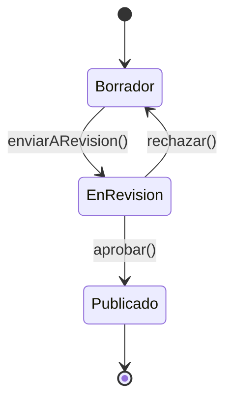

---

## 6.7 Template Method — Algoritmo con Pasos Customizables

Define el esqueleto de un algoritmo en la superclase, permitiendo que las subclases redefinan ciertos pasos sin cambiar la estructura.

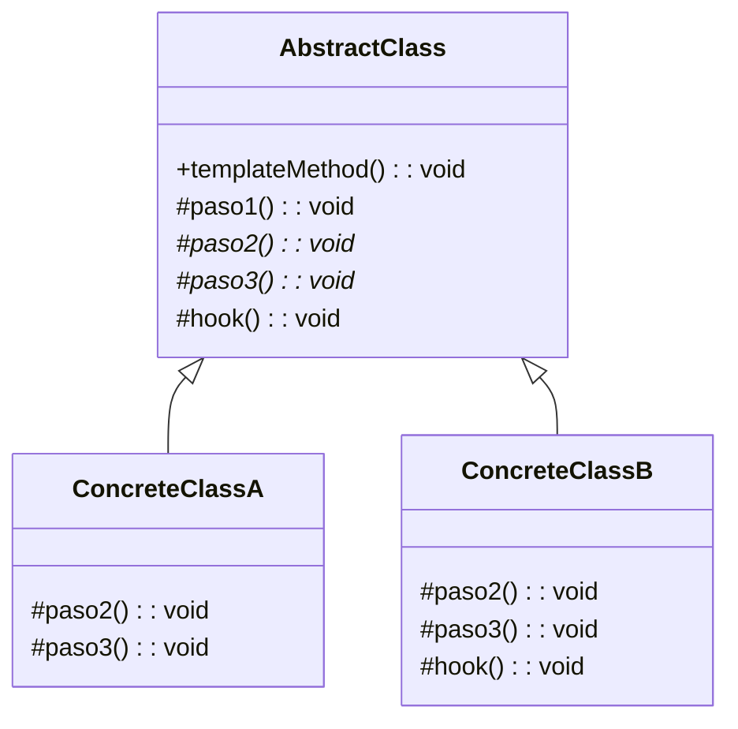

> Los **hooks** son pasos opcionales con implementación vacía por defecto.

---

## 6.8 Chain of Responsibility — Cadena de Manejadores

Pasa la solicitud a lo largo de una cadena de manejadores. Cada manejador decide si procesa la solicitud o la pasa al siguiente.

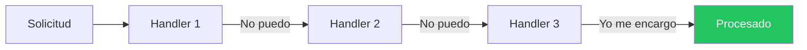

---

## 6.9 Mediator — Coordinador Central

Reduce las dependencias directas entre objetos forzando la comunicación a través de un mediador central.

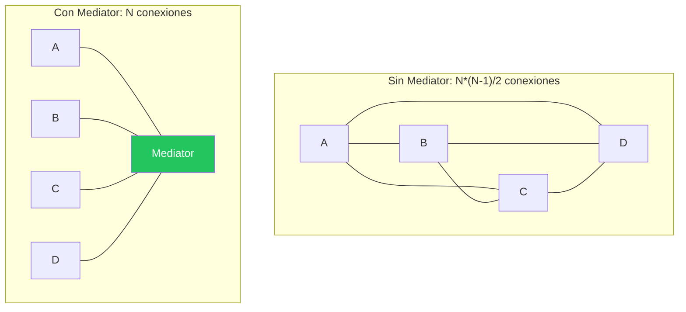

---

## 6.10 Memento — Guardar y Restaurar Estado

Captura y almacena el estado interno de un objeto para poder restaurarlo posteriormente sin violar la encapsulación.

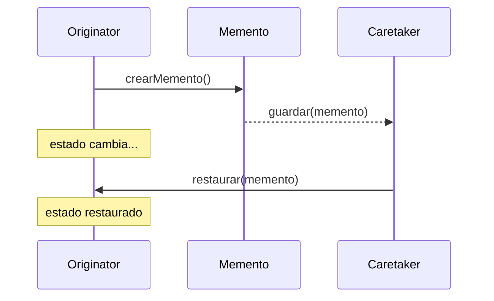

---

## 6.11 Visitor — Operaciones sobre Estructuras

Permite añadir nuevas operaciones a una estructura de objetos sin modificar las clases de los elementos.

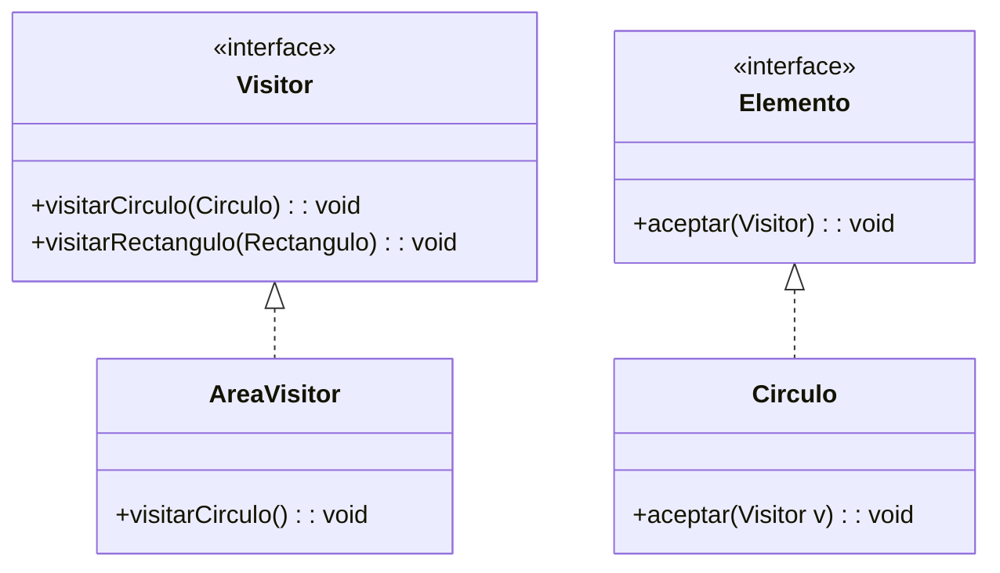

> **Double Dispatch**: `elemento.aceptar(visitor)` → `visitor.visitarCirculo(this)`

---

## 6.12 Interpreter — Evaluar Gramáticas

Define una representación de gramática y un intérprete que la evalúa.

---

## 6.13 Mapa de Ejercicios del Módulo 6

| Ejercicio | Patrón | Concepto | Dificultad |
|-----------|--------|----------|------------|
| 76 | Observer | Sistema de eventos / newsletter | ⭐⭐⭐ |
| 77 | Observer | Estación meteorológica con displays | ⭐⭐⭐ |
| 78 | Strategy | Algoritmos de ordenamiento intercambiables | ⭐⭐⭐ |
| 79 | Strategy | Sistema de descuentos en tienda | ⭐⭐⭐ |
| 80 | Command | Editor de texto con Undo/Redo | ⭐⭐⭐⭐ |
| 81 | Command | Control domótico con macros | ⭐⭐⭐ |
| 82 | Iterator | Iterador sobre colección manual | ⭐⭐⭐ |
| 83 | Iterator | Iterador sobre árbol binario | ⭐⭐⭐⭐ |
| 84 | State | Máquina expendedora | ⭐⭐⭐⭐ |
| 85 | State | Flujo de publicación (borrador→revisión→publicado) | ⭐⭐⭐ |
| 86 | Template Method | Generador de reportes (PDF, HTML, CSV) | ⭐⭐⭐ |
| 87 | Template Method | Pipeline de procesamiento de datos | ⭐⭐⭐ |
| 88 | Chain of Resp. | Middleware HTTP (auth, logging, validation) | ⭐⭐⭐⭐ |
| 89 | Chain of Resp. | Soporte técnico multi-nivel | ⭐⭐⭐ |
| 90 | Mediator | Chat room con usuarios | ⭐⭐⭐ |
| 91 | Mediator | Torre de control de aeropuerto | ⭐⭐⭐ |
| 92 | Memento | Editor con historial y Ctrl+Z | ⭐⭐⭐ |
| 93 | Memento | Sistema de checkpoints en juego | ⭐⭐⭐ |
| 94 | Visitor | Calcular área/perímetro de formas | ⭐⭐⭐⭐ |
| 95 | Visitor | Exportar AST a distintos formatos | ⭐⭐⭐⭐ |
| 96 | Interpreter | Evaluador de expresiones matemáticas | ⭐⭐⭐⭐ |
| 97 | Combinado | MVC mini-framework (Observer+Strategy+Command) | ⭐⭐⭐⭐⭐ |
| 98 | Combinado | Juego RPG (State+Strategy+Observer+Command) | ⭐⭐⭐⭐⭐ |
| 99 | Combinado | Sistema de workflows (Chain+State+Command+Memento) | ⭐⭐⭐⭐⭐ |
| 100 | FINAL | Proyecto integrador: 23 patrones GoF | ⭐⭐⭐⭐⭐ |

---

> **🔗 Código fuente**: `src/main/java/modulo6_patrones_comportamiento/`  
> ¡Lee esta teoría antes de tocar una sola línea de código!
