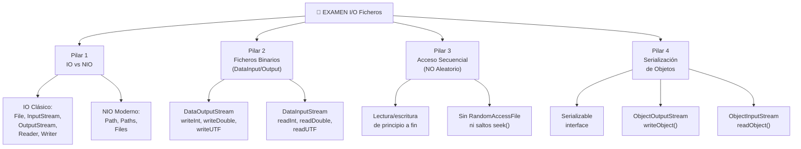
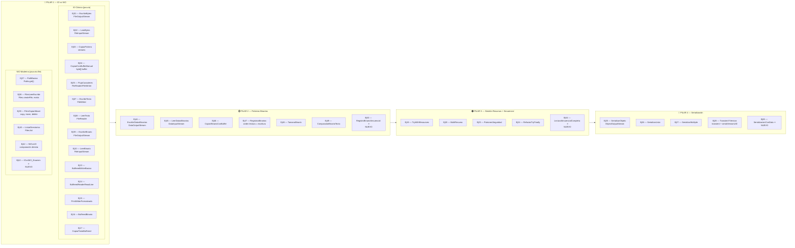
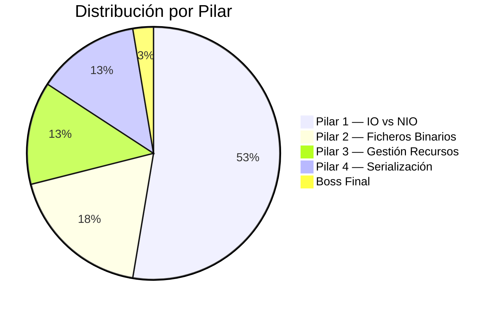

# 🏆 RUTA DORADA — Guía de Estudio para el Examen

> **Última actualización:** 30/04/2026
>
> Este documento es tu **brújula de examen**. Recoge TODOS los ejercicios que
> entran en el examen, los organiza por pilar temático y te indica en qué orden
> atacarlos para maximizar tu rendimiento.

---

## 📋 Los 4 Pilares del Examen



---

## ⚠️ CONTENIDO EXCLUIDO DEL EXAMEN

Los siguientes bloques y ejercicios **NO entran** en el examen. Puedes
practicarlos si quieres ampliar tu conocimiento, pero **no son prioritarios**:

| Bloque | Ejercicios | Motivo |
|--------|-----------|--------|
| Bloque 3C — Acceso Aleatorio | Ej50 a Ej55 | ❌ **RandomAccessFile NO entra.** El examen se centra en acceso secuencial |
| Bloque 6 — CSV | Ej31 a Ej36 | 🔷 Complementario — no evaluado |
| Ejercicios complementarios sueltos | Ej06, Ej11, Ej12, Ej18, Ej21, Ej22, Ej29, Ej30, Ej41 | 🔷 No evaluados |

---

## 🗺️ MAPA COMPLETO: Ejercicios que Entran en Examen



---

## 🚀 RUTA DE ESTUDIO RECOMENDADA (Orden Secuencial)

### Fase 1 — IO Clásico: Fundamentos de Flujo (13 ejercicios)

> **Teoría:** `01_Flujos_De_Datos.md` → `02_Texto_vs_Binario.md` → `03_Bufferizacion.md`

| # | Ejercicio | Concepto Clave | Teoría | Dificultad |
|---|-----------|---------------|--------|------------|
| 1 | `Ej01_EscribirBytes` | `FileOutputStream`, `write()` | 01, §4 | ⭐ |
| 2 | `Ej02_LeerBytes` | `FileInputStream`, `read()`, EOF (-1) | 01, §3 | ⭐ |
| 3 | `Ej03_CopiarFichero` | Copia byte a byte con streams | 01, §3-4 | ⭐⭐ |
| 4 | `Ej04_CopiarConBufferManual` | `read(byte[], 0, len)`, buffer manual | 01, §5 | ⭐⭐ |
| 5 | `Ej05_FlujoCaracteres` | `FileReader` / `FileWriter` | 01, §6 | ⭐ |
| 6 | `Ej07_EscribirTexto` | `FileWriter` con texto y append | 02, §2 | ⭐ |
| 7 | `Ej08_LeerTexto` | `FileReader`, cast `(char)` | 02, §2 | ⭐ |
| 8 | `Ej09_EscribirBinario` | `FileOutputStream` con datos binarios | 02, §3 | ⭐ |
| 9 | `Ej10_LeerBinario` | `FileInputStream`, bytes crudos | 02, §3 | ⭐ |
| 10 | `Ej13_BufferedWriterBasico` | `BufferedWriter`, `newLine()`, `flush()` | 03, §3 | ⭐⭐ |
| 11 | `Ej14_BufferedReaderReadLine` | `BufferedReader`, `readLine()`, null=EOF | 03, §4 | ⭐⭐ |
| 12 | `Ej15_PrintWriterFormateado` | `PrintWriter`, `println()`, `printf()` | 03, §5 | ⭐⭐ |
| 13 | `Ej16_BufferedBinario` | `BufferedInputStream` / `BufferedOutputStream` | 03, §6 | ⭐⭐ |
| 14 | `Ej17_CopiarTextoBuffered` | Lectura+escritura simultánea buffered | 03, §4 | ⭐⭐⭐ |

> **Checkpoint Fase 1:** Debes dominar la diferencia entre Reader/Writer (texto) vs InputStream/OutputStream (binario), saber cuándo usar buffer, y entender el patrón `while (read != -1)` y `while (readLine != null)`.

---

### Fase 2 — Ficheros Binarios: DataInput / DataOutput (6+1 ejercicios)

> **Teoría:** `03B_ArchivosBinarios.md`

| # | Ejercicio | Concepto Clave | Teoría | Dificultad |
|---|-----------|---------------|--------|------------|
| 15 | `Ej44_EscribirDatosBinarios` | `DataOutputStream`, `writeInt()`, `writeDouble()`, `writeUTF()` | 03B, §3 | ⭐⭐ |
| 16 | `Ej45_LeerDatosBinarios` | `DataInputStream`, **orden = escritura** | 03B, §4-5 | ⭐⭐ |
| 17 | `Ej46_CopiarBinarioConBuffer` | Copia binaria con `byte[]` buffer | 03B, §6 | ⭐⭐ |
| 18 | `Ej47_RegistrosBinarios` | Registros con múltiples tipos primitivos | 03B, §5 | ⭐⭐⭐ |
| 19 | `Ej48_TamanoBinario` | Cálculo de tamaño: int=4, double=8... | 03B, §3 | ⭐⭐ |
| 20 | `Ej49_ComparadorBinarioTexto` | Comparar tamaño texto vs binario | 03B, §7 | ⭐⭐⭐ |
| 21 | ⭐ `Ej63_RegistroBinarioSecuencial` | **NUEVO** — Leer N registros secuencialmente con EOFException | 03B, §4-5 | ⭐⭐⭐ |

> **Checkpoint Fase 2:** Debes saber escribir y leer datos primitivos con `DataOutputStream`/`DataInputStream`, recordar los tamaños en bytes de cada tipo, y dominar la regla: **el orden de lectura debe ser idéntico al de escritura**.

---

### Fase 3 — Gestión de Recursos + Acceso Secuencial (4+1 ejercicios)

> **Teoría:** `04_Gestion_Segura_Recursos.md`

| # | Ejercicio | Concepto Clave | Teoría | Dificultad |
|---|-----------|---------------|--------|------------|
| 22 | `Ej19_TryWithResources` | Sintaxis `try (recurso)`, cierre automático | 04, §3 | ⭐⭐ |
| 23 | `Ej20_MultiRecurso` | Múltiples recursos, cierre en orden inverso | 04, §3 | ⭐⭐ |
| 24 | `Ej23_PatronesSeguridad` | Buenas prácticas de cierre | 04, §6 | ⭐⭐⭐ |
| 25 | `Ej24_RefactorTryFinally` | Migrar try-finally → try-with-resources | 04, §2-3 | ⭐⭐⭐ |
| 26 | ⭐ `Ej64_LecturaSecuencialCompleta` | **NUEVO** — Procesar fichero secuencial completo: leer, transformar, escribir resultado | 04, §6 + 03B | ⭐⭐⭐ |

> **Checkpoint Fase 3:** Debes dominar `try-with-resources`, entender el cierre automático, y saber que leemos secuencialmente de principio a fin (**sin seek ni saltos**).

---

### Fase 4 — Serialización de Objetos (4+1 ejercicios)

> **Teoría:** `05_Serializacion.md`

| # | Ejercicio | Concepto Clave | Teoría | Dificultad |
|---|-----------|---------------|--------|------------|
| 27 | `Ej25_SerializarObjeto` | `ObjectOutputStream.writeObject()`, cast al leer | 05, §3-4 | ⭐⭐ |
| 28 | `Ej26_SerializarLista` | Serializar `ArrayList<Producto>` | 05, §5 | ⭐⭐ |
| 29 | `Ej27_SerializarMultiple` | Múltiples writeObject + EOFException | 05, §3-4 | ⭐⭐⭐ |
| 30 | `Ej28_TransientYVersion` | `transient`, `serialVersionUID` | 05, §6 | ⭐⭐⭐ |
| 31 | ⭐ `Ej65_SerializacionConData` | **NUEVO** — Serializar "a mano" con DataOutputStream (sin ObjectOutputStream) vs Serializable | 05 + 03B | ⭐⭐⭐⭐ |

> **Checkpoint Fase 4:** Debes saber implementar `Serializable`, usar `writeObject()`/`readObject()`, entender `transient` y `serialVersionUID`, y gestionar `EOFException`.

---

### Fase 5 — NIO Moderno: Path, Paths, Files (5+1 ejercicios)

> **Teoría:** `07_NIO2.md`

| # | Ejercicio | Concepto Clave | Teoría | Dificultad |
|---|-----------|---------------|--------|------------|
| 32 | `Ej37_PathBasico` | `Paths.get()`, `getFileName()`, `getParent()` | 07, §2 | ⭐ |
| 33 | `Ej38_FilesLeerEscribir` | `Files.createFile()`, `Files.exists()`, `Files.writeString()` | 07, §3 | ⭐⭐ |
| 34 | `Ej39_FilesCopiarMover` | `Files.copy()`, `Files.move()`, `Files.delete()` | 07, §3 | ⭐⭐ |
| 35 | `Ej40_ListarDirectorios` | `Files.list()` con Streams | 07, §4 | ⭐⭐⭐ |
| 36 | `Ej42_NIOvsIO` | Comparación `java.io.File` vs `java.nio.file` | 07, §0, §6 | ⭐⭐⭐ |
| 37 | ⭐ `Ej62_IOvsNIO_Examen` | **NUEVO** — Resolver el MISMO problema con IO clásico y NIO lado a lado | 07, §0, §6 | ⭐⭐⭐⭐ |

> **Checkpoint Fase 5:** Debes saber crear `Path` con `Paths.get()`, usar `Files` para leer/escribir/copiar/mover/borrar, y explicar las diferencias entre `java.io.File` y `java.nio.file`.

---

### Fase 6 — Boss Final Actualizado (1 ejercicio integrador)

| # | Ejercicio | Concepto Clave | Dificultad |
|---|-----------|---------------|------------|
| 38 | `Ej43_GestionInventario` | Integra TODOS los pilares: IO, NIO, Data, Serialización | ⭐⭐⭐⭐⭐ |

> **Este ejercicio es tu simulacro de examen.** Si puedes resolverlo sin consultar la teoría, estás listo.

---

## 📊 Resumen: 38 Ejercicios de Examen



| Pilar | Ejercicios | Estado |
|-------|-----------|--------|
| **IO Clásico** (Bloques 1-3) | Ej01-05, 07-10, 13-17 | ✅ Ya existen |
| **Ficheros Binarios** (Bloque 3B) | Ej44-49 + ⭐Ej63 | ✅ + 🆕 Nuevo |
| **Gestión Recursos** (Bloque 4) | Ej19-20, 23-24 + ⭐Ej64 | ✅ + 🆕 Nuevo |
| **Serialización** (Bloque 5) | Ej25-28 + ⭐Ej65 | ✅ + 🆕 Nuevo |
| **NIO Moderno** (Bloque 7) | Ej37-40, 42 + ⭐Ej62 | ✅ + 🆕 Nuevo |
| **Boss Final** | Ej43 | ✅ Ya existe |

---

## 🆕 Ejercicios Nuevos Añadidos

Los siguientes 4 ejercicios se han añadido para cerrar huecos en la cobertura
del examen. Cada uno tiene su archivo de código (`src/`) y tests (`test/`).

### ⭐ Ej62 — IO vs NIO: Comparativa de Examen
- **Ubicación:** `src/main/java/bloque7/Ej62_IOvsNIO_Examen.java`
- **Concepto:** Resolver las mismas 7 operaciones (crear, escribir, leer, copiar,
  borrar, verificar existencia, listar) con IO clásico (`File`, `FileWriter`,
  `FileReader`) y con NIO (`Path`, `Files`) lado a lado.
- **Por qué es necesario:** El Ej42 ya cubre la comparación, pero este ejercicio
  obliga a codificar **ambas soluciones** para la misma tarea, garantizando
  la memorización de ambas APIs.

### ⭐ Ej63 — Registro Binario Secuencial con EOFException
- **Ubicación:** `src/main/java/bloque3b/Ej63_RegistroBinarioSecuencial.java`
- **Concepto:** Escribir N registros (int + double + boolean + UTF) con
  DataOutputStream y leerlos **todos** secuencialmente con un bucle `while(true)`
  + `EOFException`. Incluye descarte manual de campos.
- **Por qué es necesario:** Los ejercicios Ej44-49 cubren escritura/lectura
  unitaria, pero faltaba un ejercicio que fuerce el patrón de lectura
  secuencial completa con detección de fin de fichero — exactamente lo que
  pide el examen.

### ⭐ Ej64 — Lectura Secuencial Completa: Pipeline de Transformación
- **Ubicación:** `src/main/java/bloque4/Ej64_LecturaSecuencialCompleta.java`
- **Concepto:** Leer un fichero de texto/binario completo de principio a fin,
  aplicar transformaciones (filtrar, acumular, convertir) y escribir el
  resultado. Combina `try-with-resources` + lectura secuencial + escritura.
- **Por qué es necesario:** Refuerza que el acceso es **siempre secuencial**
  (de principio a fin) sin necesidad de `seek()`, consolidando los
  pilares 1 y 3.

### ⭐ Ej65 — Serialización Manual vs Automática
- **Ubicación:** `src/main/java/bloque5/Ej65_SerializacionConData.java`
- **Concepto:** Serializar un objeto "a mano" usando `DataOutputStream`
  (escribir cada campo primitivo individualmente) y compararlo con la
  serialización automática vía `ObjectOutputStream`/`Serializable`.
- **Por qué es necesario:** El enunciado del examen mezcla `DataOutputStream`
  con serialización. Este ejercicio conecta ambos mundos: el alumno entiende
  que `DataOutputStream` es serialización "manual" campo a campo, mientras que
  `ObjectOutputStream` es serialización "automática" de objetos completos.

---

## 🧠 Cheatsheet Rápido de Examen

### IO Clásico — Clases Clave
```
ESCRITURA TEXTO:   FileWriter → BufferedWriter → PrintWriter
LECTURA TEXTO:     FileReader → BufferedReader (readLine)
ESCRITURA BINARIO: FileOutputStream → BufferedOutputStream → DataOutputStream
LECTURA BINARIO:   FileInputStream  → BufferedInputStream  → DataInputStream
```

### NIO Moderno — Clases Clave
```
RUTA:    Path p = Paths.get("ruta", "al", "fichero.txt");
EXISTE:  Files.exists(p)
LEER:    Files.readString(p)  /  Files.readAllLines(p)
ESCRIBIR: Files.writeString(p, "texto")  /  Files.write(p, lista)
COPIAR:  Files.copy(src, dst, StandardCopyOption.REPLACE_EXISTING)
MOVER:   Files.move(src, dst)
BORRAR:  Files.deleteIfExists(p)
CREAR:   Files.createDirectories(p)
LISTAR:  Files.list(p)  (cerrar con try-with-resources!)
```

### DataOutputStream / DataInputStream — Tamaños
```
writeInt(int)         → 4 bytes    → readInt()
writeDouble(double)   → 8 bytes    → readDouble()
writeFloat(float)     → 4 bytes    → readFloat()
writeLong(long)       → 8 bytes    → readLong()
writeShort(short)     → 2 bytes    → readShort()
writeBoolean(boolean) → 1 byte     → readBoolean()
writeChar(char)       → 2 bytes    → readChar()
writeUTF(String)      → 2+N bytes  → readUTF()
```

### Serialización — Receta
```java
// 1. La clase DEBE implementar Serializable
public class Producto implements Serializable {
    private static final long serialVersionUID = 1L;
    // campos...
    private transient String secreto; // NO se serializa
}

// 2. ESCRIBIR
try (ObjectOutputStream oos = new ObjectOutputStream(
        new FileOutputStream("datos.dat"))) {
    oos.writeObject(producto);
}

// 3. LEER
try (ObjectInputStream ois = new ObjectInputStream(
        new FileInputStream("datos.dat"))) {
    Producto p = (Producto) ois.readObject(); // cast obligatorio
}
```

### Patrón Secuencial — Lectura Completa
```java
// TEXTO: readLine() → null = EOF
while ((linea = br.readLine()) != null) { ... }

// BYTES: read() → -1 = EOF
while ((b = fis.read()) != -1) { ... }

// DATA: readInt() → EOFException = EOF
try { while (true) { int n = dis.readInt(); } }
catch (EOFException e) { /* normal */ }

// OBJETOS: readObject() → EOFException = EOF
try { while (true) { Obj o = (Obj) ois.readObject(); } }
catch (EOFException e) { /* normal */ }
```

---

## 📌 Regla de Oro Final

> **En este examen NO usas `RandomAccessFile` ni `seek()`.
> Todo se lee de principio a fin. El acceso es SIEMPRE secuencial.**
