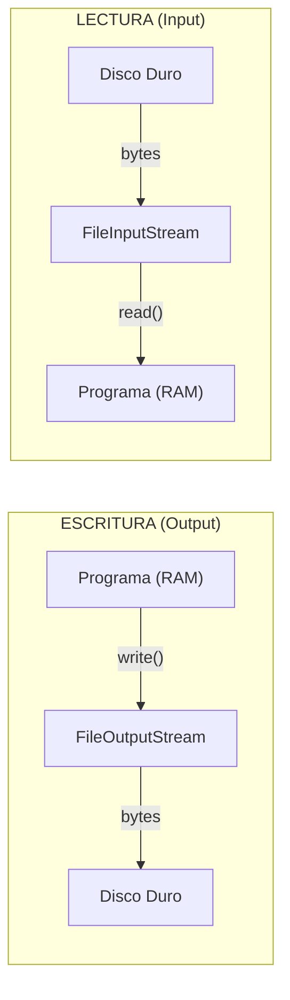
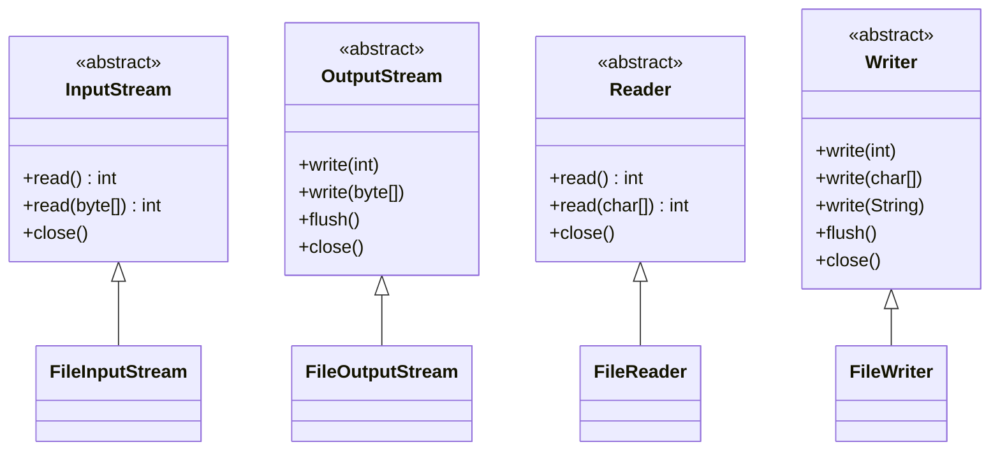
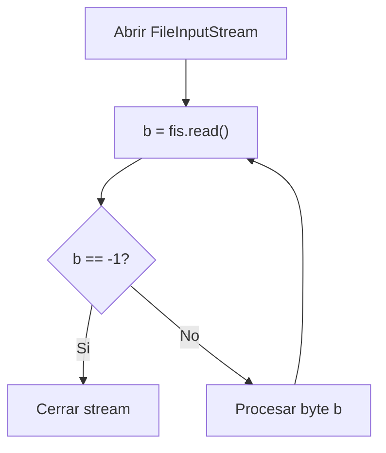
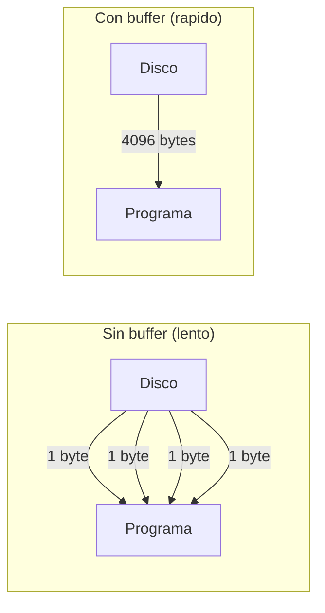
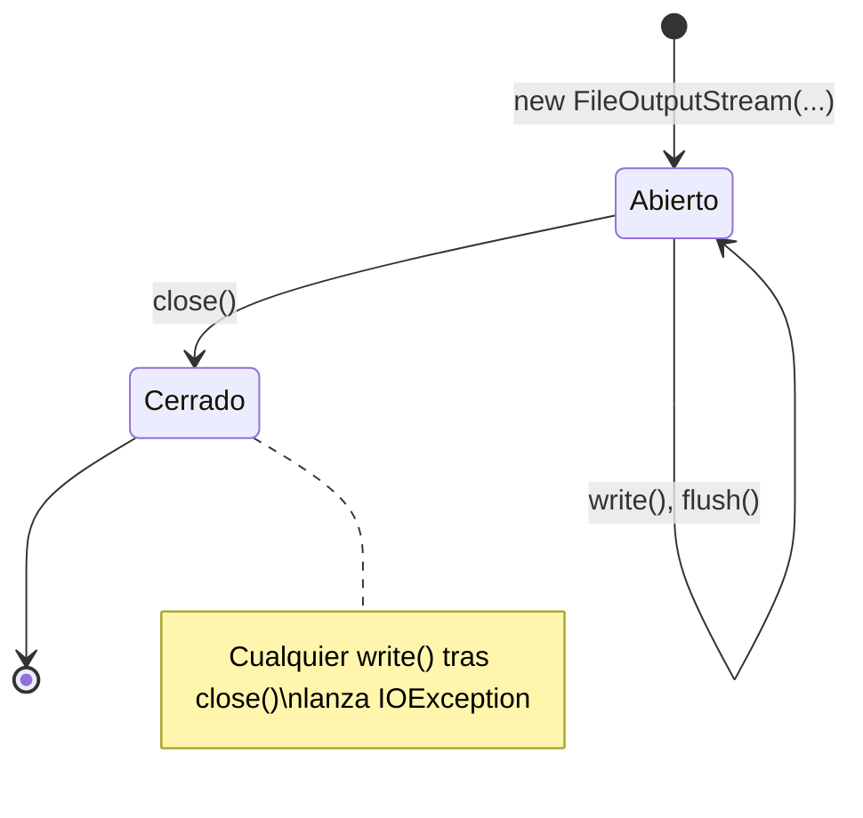

# Bloque I — Flujos de Datos (Streams I/O): La Tuberia Logica

> Referencia para ejercicios Ej01 a Ej06 en `src/main/java/bloque1/`

---

## 1. Que es un flujo de datos (Stream)?

En Java, un **flujo** (stream) es una secuencia ordenada de datos que viaja entre
tu programa (que vive en la RAM) y una fuente o destino externo (disco duro, red,
teclado, pantalla, etc.).

Piensa en una **tuberia de agua**: el agua solo fluye en una direccion. De la misma
forma, un stream de Java es **unidireccional**: o lees datos de el (Input), o escribes
datos en el (Output). Nunca ambas cosas con el mismo stream.

Tu programa **nunca toca el disco directamente**. Siempre abre una tuberia, envia o
recibe datos a traves de ella, y luego la cierra.

```java
// Abrir tuberia de SALIDA hacia un fichero
FileOutputStream fos = new FileOutputStream("datos.bin");
fos.write(65);   // escribe el byte 65 (letra 'A')
fos.close();     // cierra la tuberia

// Abrir tuberia de ENTRADA desde un fichero
FileInputStream fis = new FileInputStream("datos.bin");
int dato = fis.read();  // lee el byte 65
fis.close();
```



---

## 2. Las cuatro clases raiz abstractas

Java organiza todos sus streams en una jerarquia con **cuatro clases abstractas** en la cima.
Estas clases NO se instancian directamente; se usan sus hijas concretas.

| | **Bytes** (datos crudos) | **Caracteres** (texto) |
|---|---|---|
| **Lectura (Input)** | `InputStream` | `Reader` |
| **Escritura (Output)** | `OutputStream` | `Writer` |



**Regla de oro:** si trabajas con texto legible (`.txt`, `.csv`, `.html`), usa `Reader`/`Writer`.
Si trabajas con datos binarios (`.jpg`, `.mp3`, `.dat`), usa `InputStream`/`OutputStream`.

---

## 3. Lectura byte a byte con FileInputStream

El metodo `read()` sin argumentos devuelve **un byte** (0-255) o **-1** si se ha
llegado al final del fichero (EOF, End Of File).

```java
FileInputStream fis = new FileInputStream("archivo.bin");
int b;
while ((b = fis.read()) != -1) {
    System.out.print(b + " ");
}
fis.close();
```

> **Atencion:** `read()` devuelve `int`, no `byte`. Esto es para poder usar el
> valor -1 como indicador de fin de fichero (un byte real solo va de 0 a 255).



---

## 4. Escritura con FileOutputStream

El constructor de `FileOutputStream` tiene un segundo parametro booleano `append`:
- `new FileOutputStream("f.bin")` — **sobrescribe** el fichero si existe.
- `new FileOutputStream("f.bin", true)` — **anade** al final del fichero.

```java
FileOutputStream fos = new FileOutputStream("salida.bin");
byte[] datos = {72, 111, 108, 97};  // "Hola" en ASCII
fos.write(datos);
fos.close();
```

---

## 5. Lectura con buffer manual: read(byte[], offset, length)

Leer byte a byte es **muy lento** porque cada llamada a `read()` es una operacion
de acceso al disco. Es mucho mas eficiente leer **bloques** de bytes de golpe.

```java
FileInputStream fis = new FileInputStream("grande.bin");
byte[] buffer = new byte[4096];  // buffer de 4 KB
int bytesLeidos;
while ((bytesLeidos = fis.read(buffer, 0, buffer.length)) != -1) {
    // 'bytesLeidos' indica cuantos bytes se leyeron realmente
    // (puede ser menor que 4096 en la ultima lectura)
    procesarBloque(buffer, bytesLeidos);
}
fis.close();
```



---

## 6. Flujos de caracteres: FileReader y FileWriter

Para texto legible, Java ofrece `FileReader` y `FileWriter`. Internamente convierten
bytes a caracteres usando un **charset** (por defecto, el del sistema operativo).

```java
// Escribir texto
FileWriter fw = new FileWriter("nota.txt");
fw.write("Hola mundo\n");
fw.write("Segunda linea\n");
fw.close();

// Leer texto caracter a caracter
FileReader fr = new FileReader("nota.txt");
int c;
while ((c = fr.read()) != -1) {
    System.out.print((char) c);
}
fr.close();
```

> `FileReader.read()` devuelve `int` (el codigo Unicode del caracter) o -1.
> Hay que hacer cast a `(char)` para ver la letra.

---

## 7. flush() y close(): el ciclo de vida del stream

- **`flush()`**: Fuerza a que los datos pendientes en el buffer interno se
  escriban al destino. No cierra el stream.
- **`close()`**: Hace `flush()` automaticamente y luego **libera el recurso**
  (cierra el descriptor de fichero del sistema operativo).



**Si no cierras un stream:**
- Los datos pueden quedarse en el buffer y **no escribirse al disco**.
- El sistema operativo mantiene el fichero **bloqueado** (no puedes borrarlo ni moverlo).
- Si acumulas muchos streams sin cerrar, agotaras los **descriptores de fichero** del SO.

---

## Trampas y errores comunes

### 1. Olvidar cerrar el stream
```java
// MAL: si write() lanza excepcion, close() nunca se ejecuta
FileOutputStream fos = new FileOutputStream("f.bin");
fos.write(datos);
fos.close();
```
Solucion: usar `try-with-resources` (Bloque 4) o `try-finally`.

### 2. Confundir int con byte en read()
```java
// MAL: byte va de -128 a 127, perdemos informacion
byte b = (byte) fis.read();  // si read() devuelve 200, b sera -56

// BIEN: usar int
int b = fis.read();
```

### 3. Ignorar el valor de retorno de read(byte[])
```java
byte[] buf = new byte[1024];
fis.read(buf);
// MAL: asumimos que leyo 1024 bytes, pero puede haber leido menos
```
Siempre guarda el retorno: `int n = fis.read(buf);`

### 4. Escribir y leer con el mismo stream
No existe un stream bidireccional basico. Para leer y escribir el mismo fichero,
necesitas dos streams separados (o usar `RandomAccessFile`, que es otro tema).

### 5. No crear el directorio padre
```java
// Si la carpeta "datos/" no existe, esto lanza FileNotFoundException
new FileOutputStream("datos/archivo.bin");
```
Crea primero el directorio con `new File("datos").mkdirs();`
