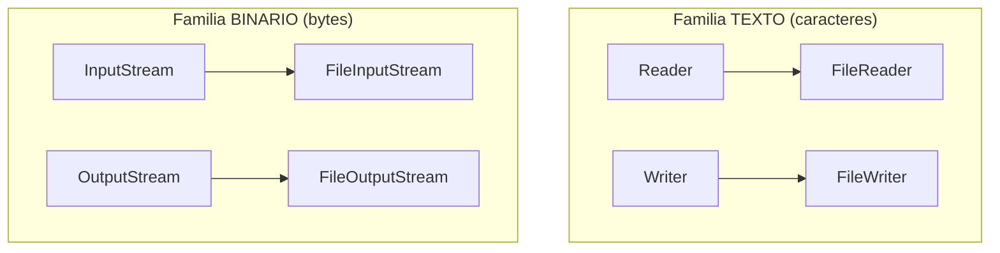
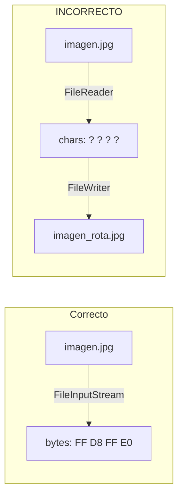
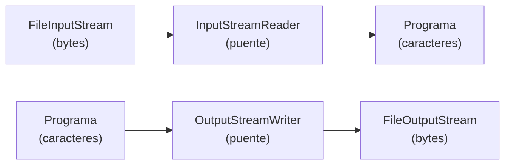

# Bloque II — Archivos de Texto vs. Archivos Binarios

> Referencia para ejercicios Ej07 a Ej12 en `src/main/java/bloque2/`

---

## 1. Las dos familias de clases en java.io

Java divide sus clases de I/O en dos familias segun el tipo de dato que manejan:

| Familia | Unidad minima | Clases base | Ejemplo de fichero |
|---------|--------------|-------------|-------------------|
| **Caracteres (texto)** | `char` (2 bytes, Unicode) | `Reader` / `Writer` | `.txt`, `.csv`, `.html`, `.json` |
| **Bytes (binario)** | `byte` (1 byte, 0-255) | `InputStream` / `OutputStream` | `.jpg`, `.mp3`, `.dat`, `.pdf` |



La regla es simple: **si puedes abrir el fichero con un editor de texto y leer su
contenido, es texto. Si ves simbolos raros, es binario.**

---

## 2. FileWriter y FileReader: texto legible

`FileWriter` convierte caracteres Java (`char`, que son Unicode) en bytes segun
la **codificacion** (charset) del sistema operativo, y los escribe en el disco.
`FileReader` hace lo inverso: lee bytes del disco y los convierte a `char`.

```java
// Escribir texto
FileWriter fw = new FileWriter("notas.txt");
fw.write("Nota 1: Comprar leche\n");
fw.write("Nota 2: Estudiar Java\n");
fw.close();

// Leer texto
FileReader fr = new FileReader("notas.txt");
int c;
while ((c = fr.read()) != -1) {
    System.out.print((char) c);
}
fr.close();
```

### Constructor con charset explicito (Java 11+)

```java
FileWriter fw = new FileWriter("notas.txt", java.nio.charset.StandardCharsets.UTF_8);
FileReader fr = new FileReader("notas.txt", java.nio.charset.StandardCharsets.UTF_8);
```

> **Buena practica:** Especifica siempre el charset para evitar problemas de
> portabilidad entre Windows (suele usar Windows-1252) y Linux/Mac (suelen usar UTF-8).

---

## 3. FileInputStream y FileOutputStream: datos binarios

Los streams de bytes no hacen ninguna conversion. Leen y escriben bytes tal cual.
Son la herramienta correcta para **imagenes, audio, video, datos serializados**
o cualquier fichero que no sea texto puro.

```java
// Escribir bytes (simula una "imagen" de 4 bytes)
FileOutputStream fos = new FileOutputStream("foto.dat");
fos.write(new byte[]{(byte)0xFF, (byte)0xD8, (byte)0xFF, (byte)0xE0}); // cabecera JPEG
fos.close();

// Leer bytes
FileInputStream fis = new FileInputStream("foto.dat");
int b;
while ((b = fis.read()) != -1) {
    System.out.printf("%02X ", b);
}
fis.close();
// Salida: FF D8 FF E0
```

---

## 4. Por que NO leer binario con Reader (ni texto con InputStream)

### Leer binario con FileReader: CORRUPCION

`FileReader` interpreta cada secuencia de bytes como un caracter Unicode.
Si los bytes no representan texto valido en el charset del sistema, el Reader
los reemplaza por el caracter `?` (U+FFFD) o los modifica. **El fichero se corrompe.**



### Leer texto con FileInputStream: funciona, pero mal

`FileInputStream` lee bytes crudos. Para texto ASCII simple (ingles, sin tildes),
coincide con los caracteres. Pero para caracteres multibyte (tildes, ene, emoji),
un `FileInputStream` leera bytes sueltos que no forman un caracter completo.

```java
// "cafe" ocupa 5 bytes en UTF-8 (la 'e' con tilde son 2 bytes)
// FileInputStream leera 5 bytes, no 4 caracteres
```

---

## 5. InputStreamReader: el puente bytes -> caracteres

A veces necesitas leer bytes de una fuente (como `System.in` o una conexion de red)
pero interpretarlos como texto. Para eso existe `InputStreamReader`, que envuelve
un `InputStream` y lo convierte en un `Reader`.

```java
// Leer de System.in como texto con charset explicito
InputStreamReader isr = new InputStreamReader(System.in, StandardCharsets.UTF_8);
int c = isr.read(); // lee un caracter (puede consumir 1-4 bytes internamente)
```

El inverso es `OutputStreamWriter`:

```java
OutputStreamWriter osw = new OutputStreamWriter(
    new FileOutputStream("datos.txt"), StandardCharsets.UTF_8);
osw.write("Hola con tilde: cafe\n");
osw.close();
```



---

## 6. Tabla de decision rapida

| Quiero... | Clase a usar |
|-----------|-------------|
| Escribir texto en un .txt | `FileWriter` |
| Leer texto de un .csv | `FileReader` |
| Copiar un .jpg | `FileInputStream` + `FileOutputStream` |
| Guardar un array de bytes | `FileOutputStream` |
| Leer un .pdf byte a byte | `FileInputStream` |
| Leer texto con charset especifico | `InputStreamReader` + `FileInputStream` |
| Escribir texto con charset especifico | `OutputStreamWriter` + `FileOutputStream` |

---

## Trampas y errores comunes

### 1. Asumir que "todo es texto"
Muchos alumnos usan `FileReader`/`FileWriter` para todo. Esto funciona para
`.txt` pero **corrompe** cualquier fichero binario.

### 2. Ignorar el charset
```java
// MAL: si el fichero fue escrito en UTF-8 en Linux y lo lees en Windows
// con charset Windows-1252, las tildes se ven mal
FileReader fr = new FileReader("datos.txt"); // usa charset del sistema

// BIEN: charset explicito
FileReader fr = new FileReader("datos.txt", StandardCharsets.UTF_8);
```

### 3. Confundir tamano en bytes con tamano en caracteres
En UTF-8, un caracter puede ocupar de 1 a 4 bytes:
- `'A'` = 1 byte
- `'e'` (con tilde) = 2 bytes
- `'€'` = 3 bytes
- Emojis = 4 bytes

Un fichero de 100 bytes **no** tiene necesariamente 100 caracteres.

### 4. Olvidar que FileWriter sobrescribe por defecto
```java
FileWriter fw = new FileWriter("log.txt");       // SOBRESCRIBE
FileWriter fw = new FileWriter("log.txt", true); // ANADE al final
```

### 5. No distinguir entre la extension y el contenido
Un fichero `.txt` que alguien renombro a `.jpg` sigue siendo texto internamente.
La extension es solo una pista, no una garantia. Lo que importa es el **contenido real**.
