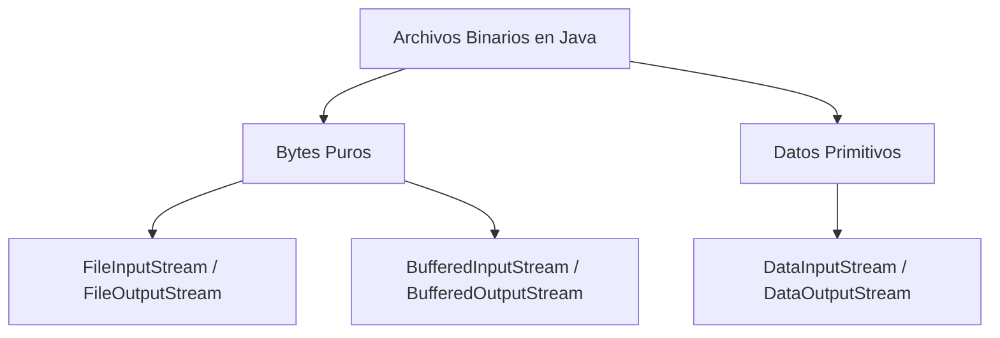
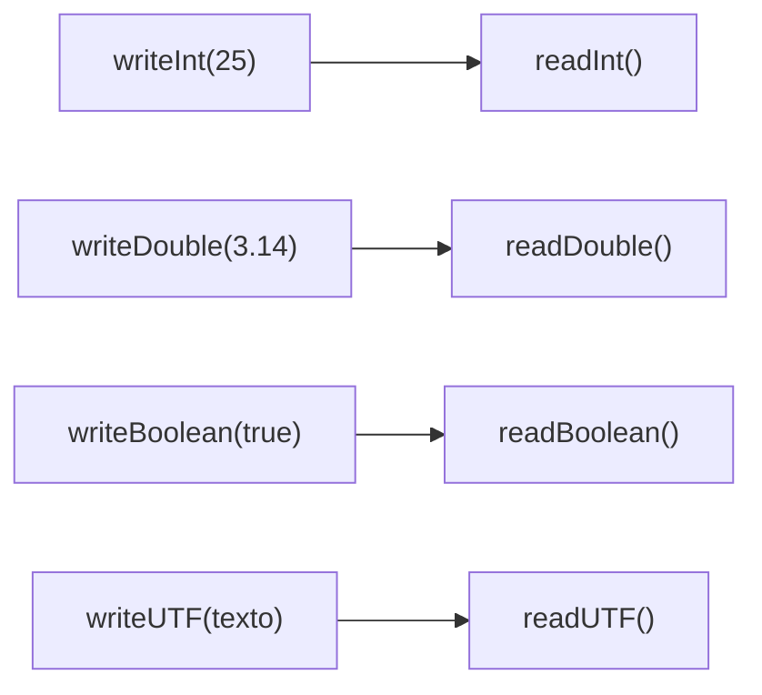

# Bloque III-B — Archivos Binarios (DataInputStream / DataOutputStream)

> 📋 **ENTRA EN EXAMEN** — Todo este bloque cubre contenido del Tema 10.
> Referencia para ejercicios Ej44 a Ej49 en `src/main/java/bloque3b/`

---

## 1. Que son los archivos binarios

Los **archivos binarios** almacenan datos en formato compacto, sin usar caracteres
legibles. Se usan para imagenes, audio, video, estructuras de datos y cualquier
contenido que no sea texto puro.

La diferencia clave: un **archivo de texto** se puede abrir con un editor y leerlo.
Un **archivo binario** se vera como caracteres extranos o ilegibles (`.jpg`, `.mp3`,
`.class`, `.bin`, `.dat`).

---

## 2. Dos niveles de trabajo con archivos binarios

Java ofrece dos niveles para archivos binarios:

| Nivel | Clases | Uso |
|-------|--------|-----|
| **Bytes puros** | `FileInputStream` / `FileOutputStream` | Copiar ficheros, leer/escribir bytes crudos |
| **Datos primitivos** | `DataInputStream` / `DataOutputStream` | Guardar/leer `int`, `double`, `boolean`, `String` en binario |



---

## 3. DataOutputStream: escribir datos primitivos en binario

`DataOutputStream` envuelve un `FileOutputStream` y permite escribir directamente
tipos como `int`, `double`, `boolean` y `String` en su representacion binaria.

```java
try (DataOutputStream dos = new DataOutputStream(new FileOutputStream("datos.bin"))) {
    dos.writeInt(25);            // 4 bytes
    dos.writeDouble(3.14);       // 8 bytes
    dos.writeBoolean(true);      // 1 byte
    dos.writeUTF("Hola, Java!"); // 2 bytes (longitud) + bytes UTF-8
}
```

### Metodos de escritura y tamanos

| Metodo | Tipo | Bytes escritos |
|--------|------|---------------|
| `writeInt(int)` | `int` | 4 |
| `writeDouble(double)` | `double` | 8 |
| `writeFloat(float)` | `float` | 4 |
| `writeLong(long)` | `long` | 8 |
| `writeShort(short)` | `short` | 2 |
| `writeBoolean(boolean)` | `boolean` | 1 |
| `writeChar(char)` | `char` | 2 |
| `writeUTF(String)` | `String` | 2 + longitud UTF-8 |

---

## 4. DataInputStream: leer datos primitivos desde binario

`DataInputStream` hace la operacion inversa: lee los bytes del fichero y los
reconstruye en el tipo de dato original.

```java
try (DataInputStream dis = new DataInputStream(new FileInputStream("datos.bin"))) {
    int    numero  = dis.readInt();
    double decimal = dis.readDouble();
    boolean estado = dis.readBoolean();
    String  texto  = dis.readUTF();

    System.out.println("Numero: "  + numero);   // 25
    System.out.println("Decimal: " + decimal);   // 3.14
    System.out.println("Estado: "  + estado);    // true
    System.out.println("Texto: "   + texto);     // Hola, Java!
}
```

---

## 5. Regla de oro: orden de escritura = orden de lectura

Los datos deben leerse **exactamente en el mismo orden y tipo** en que fueron
escritos. La codificacion binaria no incluye informacion de tipo.



Si cambias el orden o el tipo al leer, obtendras datos corruptos o una excepcion.

---

## 6. Copia de archivos binarios con buffer

Para copiar archivos binarios (imagenes, PDFs, etc.), se usa `FileInputStream` +
`FileOutputStream` con un buffer de bytes:

```java
try (FileInputStream  fis = new FileInputStream("imagen.jpg");
     FileOutputStream fos = new FileOutputStream("copia.jpg")) {

    byte[] buffer = new byte[1024]; // Buffer de 1 KB
    int bytesLeidos;
    while ((bytesLeidos = fis.read(buffer)) != -1) {
        fos.write(buffer, 0, bytesLeidos); // Solo los bytes realmente leidos
    }
}
```

> **Importante:** `fos.write(buffer, 0, bytesLeidos)` escribe solo los bytes
> leidos. Si usas `fos.write(buffer)` directamente, la ultima lectura puede
> escribir bytes basura del buffer.

---

## 7. Ventajas del formato binario vs texto

| Aspecto | Texto | Binario |
|---------|-------|---------|
| Legible por humanos | Si | No |
| Tamano | Mayor (cada digito es un caracter) | Menor (tamano fijo por tipo) |
| Velocidad | Mas lento (parseo) | Mas rapido (lectura directa) |
| Ejemplo: guardar `1234567890` | 10 bytes (un caracter por digito) | 4 bytes (un int) |

---

## 8. Recomendaciones de uso

| Caso de uso | Clase recomendada |
|-------------|-------------------|
| Leer/escribir bytes crudos | `FileInputStream` / `FileOutputStream` |
| Datos primitivos (int, double...) | `DataOutputStream` / `DataInputStream` |
| Copia de ficheros binarios | `FileInputStream` + `FileOutputStream` con buffer |
| Objetos Java completos | `ObjectOutputStream` / `ObjectInputStream` (Bloque V) |

---

## Trampas y errores comunes

### 1. Leer en orden distinto al de escritura
```java
// Escribimos: writeInt, writeDouble
// MAL: leemos readDouble, readInt -> datos corruptos
```

### 2. Olvidar que writeUTF tiene tamano variable
`writeUTF` escribe 2 bytes de longitud + los bytes del texto. Esto hace
que el tamano total del fichero dependa de la longitud de los strings.

### 3. Confundir write(int) con writeInt(int)
- `write(int)` de `OutputStream`: escribe **1 byte** (el byte menos significativo).
- `writeInt(int)` de `DataOutputStream`: escribe **4 bytes** (el int completo).

### 4. No usar try-with-resources
```java
// MAL: si readInt() falla, close() no se ejecuta
DataInputStream dis = new DataInputStream(new FileInputStream("f.bin"));
int n = dis.readInt();
dis.close();

// BIEN:
try (DataInputStream dis = new DataInputStream(new FileInputStream("f.bin"))) {
    int n = dis.readInt();
}
```

### 5. No detectar fin de fichero
Al leer multiples registros, usa `EOFException` para detectar el final:
```java
try {
    while (true) {
        int n = dis.readInt();
        // procesar n
    }
} catch (EOFException e) {
    // Normal: fin del fichero
}
```
