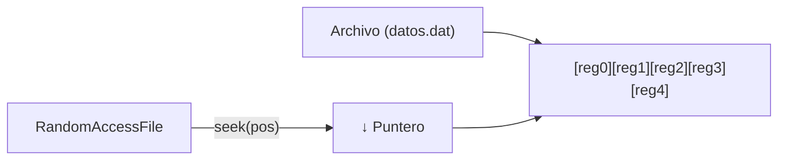

# Bloque III-C — Acceso Aleatorio (RandomAccessFile)

> ❌ **NO ENTRA EN EXAMEN** — Este bloque ha sido excluido del temario evaluable.
> El examen se centra en acceso **secuencial** (de principio a fin).
> `RandomAccessFile` y `seek()` no serán evaluados.
>
> Referencia para ejercicios Ej50 a Ej55 en `src/main/java/bloque3c/`
>
> | Ejercicio | Examen |
> |-----------|--------|
> | Ej50_EscrituraSecuencialRAF | ❌ NO ENTRA EN EXAMEN |
> | Ej51_LecturaConSeek | ❌ NO ENTRA EN EXAMEN |
> | Ej52_ActualizarRegistro | ❌ NO ENTRA EN EXAMEN |
> | Ej53_RegistrosEmpleados | ❌ NO ENTRA EN EXAMEN |
> | Ej54_UltimoRegistro | ❌ NO ENTRA EN EXAMEN |
> | Ej55_MostrarTodos | ❌ NO ENTRA EN EXAMEN |

---

## 1. Que es el acceso aleatorio

Los streams que hemos visto hasta ahora son **secuenciales**: leen o escriben
datos de principio a fin, como una cinta de cassette. Si quieres cambiar el
dato de la posicion 500, tienes que leer los 499 anteriores.

El **acceso aleatorio** permite saltar directamente a cualquier posicion del
fichero, como la aguja de un tocadiscos. Puedes leer o escribir en cualquier
punto sin tocar el resto.



---

## 2. La clase RandomAccessFile

`RandomAccessFile` es unica en Java:
- **No** hereda de `InputStream` ni de `OutputStream`.
- Implementa `DataInput` y `DataOutput` (puede leer Y escribir).
- Trabaja con un **puntero interno** que indica la posicion actual.

### Modos de apertura

| Modo | Descripcion |
|------|-------------|
| `"r"` | Solo lectura |
| `"rw"` | Lectura y escritura |

```java
RandomAccessFile raf = new RandomAccessFile("datos.dat", "rw");
```

---

## 3. El metodo seek()

`seek(long pos)` mueve el puntero a la posicion indicada (en bytes desde el inicio):

```java
raf.seek(0);   // Ir al inicio del fichero
raf.seek(16);  // Ir al byte 16
raf.seek(raf.length()); // Ir al final del fichero
```

---

## 4. Metodos de lectura y escritura

`RandomAccessFile` comparte los mismos metodos que `DataInputStream`/`DataOutputStream`:

| Escritura | Lectura | Bytes |
|-----------|---------|-------|
| `writeInt(int)` | `readInt()` | 4 |
| `writeDouble(double)` | `readDouble()` | 8 |
| `writeLong(long)` | `readLong()` | 8 |
| `writeUTF(String)` | `readUTF()` | Variable |
| `writeBoolean(boolean)` | `readBoolean()` | 1 |

Ademas:
- `length()` — devuelve el tamano total del fichero en bytes.
- `getFilePointer()` — devuelve la posicion actual del puntero.

---

## 5. Calculo de posiciones en registros de tamano fijo

La formula magica para acceder al registro numero `n`:

```
posicion = n × tamano_del_registro
```

Ejemplo con enteros (`int` = 4 bytes):

| Indice | Posicion (bytes) | Valor |
|--------|-----------------|-------|
| 0 | 0 | 0 |
| 1 | 4 | 10 |
| 2 | 8 | 20 |
| 3 | 12 | 30 |
| 4 | 16 | 40 |

Para leer el entero en el indice 3: `raf.seek(3 * 4);`

---

## 6. Ejemplo: escritura secuencial y lectura con seek

```java
try (RandomAccessFile raf = new RandomAccessFile("enteros.dat", "rw")) {
    // Escribir 10 enteros: 0, 10, 20, ..., 90
    for (int i = 0; i < 10; i++) {
        raf.writeInt(i * 10);
    }

    // Leer el 5to entero (indice 4) -> posicion 4 * 4 = 16
    raf.seek(4 * 4);
    int numero = raf.readInt();
    System.out.println("Valor en posicion 5: " + numero); // 40
}
```

---

## 7. Ejemplo: actualizar un registro in-place

```java
try (RandomAccessFile raf = new RandomAccessFile("enteros.dat", "rw")) {
    // Leer el registro 3 (indice 2)
    raf.seek(2 * 4);
    int anterior = raf.readInt();
    System.out.println("Antes: " + anterior); // 20

    // Volver al inicio del registro y sobreescribir
    raf.seek(2 * 4);
    raf.writeInt(999);
    System.out.println("Actualizado a 999");

    // Verificar
    raf.seek(2 * 4);
    System.out.println("Ahora: " + raf.readInt()); // 999
}
```

> **Patron clave:** leer → retroceder con `seek()` → escribir.
> Despues de `readInt()`, el puntero avanza 4 bytes automaticamente.
> Hay que volver a la posicion de inicio antes de escribir.

---

## 8. Ventajas de RandomAccessFile

| Ventaja | Descripcion |
|---------|-------------|
| **Flexibilidad** | Lee o modifica datos en cualquier posicion |
| **Eficiencia** | No necesita procesar todo el fichero para acceder a un registro |
| **Actualizacion in-place** | Modifica un registro sin reescribir todo el archivo |
| **Lectura + Escritura** | Un solo objeto puede leer y escribir |

---

## 9. Registros estructurados

Un uso comun es guardar registros con multiples campos de tamano fijo:

```java
// Registro: ID (int, 4 bytes) + Salario (double, 8 bytes) = 12 bytes por registro
int tamanoRegistro = Integer.BYTES + Double.BYTES; // 12

// Escribir 3 empleados
try (RandomAccessFile raf = new RandomAccessFile("empleados.dat", "rw")) {
    raf.writeInt(1);    raf.writeDouble(2500.0);
    raf.writeInt(2);    raf.writeDouble(3200.0);
    raf.writeInt(3);    raf.writeDouble(1800.0);
}

// Leer el empleado 2 (indice 1)
try (RandomAccessFile raf = new RandomAccessFile("empleados.dat", "r")) {
    raf.seek(1 * tamanoRegistro); // 1 * 12 = 12
    int id = raf.readInt();
    double salario = raf.readDouble();
    System.out.println("Empleado " + id + ": " + salario);  // 2: 3200.0
}
```

---

## Trampas y errores comunes

### 1. Olvidar que el puntero avanza con cada lectura/escritura
```java
raf.seek(8);
int n1 = raf.readInt();  // puntero ahora en 12, no en 8
int n2 = raf.readInt();  // lee la posicion 12, no la 8
```

### 2. Calcular mal la posicion
```java
// MAL: el 5to entero NO esta en la posicion 5
raf.seek(5); // esto es el byte 5, en medio del segundo int

// BIEN: el 5to entero (indice 4) esta en 4 * 4 = 16
raf.seek(4 * Integer.BYTES);
```

### 3. Escribir sin retroceder tras leer
```java
raf.seek(8);
int valor = raf.readInt();   // puntero ahora en 12
raf.writeInt(999);           // escribe en posicion 12, NO en 8!

// BIEN:
raf.seek(8);
int valor2 = raf.readInt();
raf.seek(8);                 // retroceder
raf.writeInt(999);           // ahora si escribe en 8
```

### 4. No cerrar el RandomAccessFile
Igual que cualquier stream, debe cerrarse. Usa `try-with-resources`.

### 5. Usar writeUTF para registros de tamano fijo
`writeUTF` escribe un tamano variable (2 + longitud del texto).
Para registros de tamano fijo con texto, hay que rellenar con espacios
o usar arrays de `char` de longitud fija.
