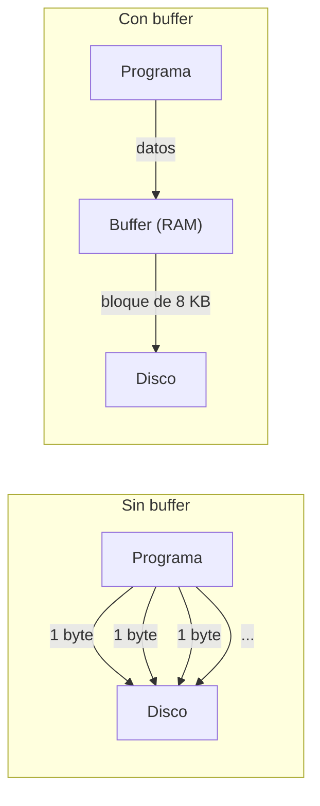
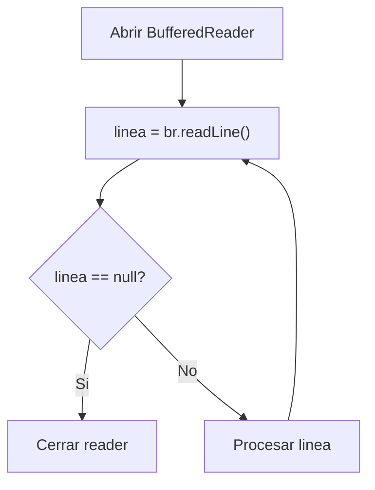

# Bloque III — Bufferizacion (Wrappers / Decoradores)

> Referencia para ejercicios Ej13 a Ej18 en `src/main/java/bloque3/`
>
> | Ejercicio | Examen |
> |-----------|--------|
> | Ej13_BufferedWriterBasico | 📋 ENTRA EN EXAMEN — Tema 04 (BufferedWriter) |
> | Ej14_BufferedReaderReadLine | 📋 ENTRA EN EXAMEN — Tema 04 (BufferedReader) |
> | Ej15_PrintWriterFormateado | 📋 ENTRA EN EXAMEN — Tema 03 (PrintWriter) |
> | Ej16_BufferedBinario | 📋 ENTRA EN EXAMEN — Tema 02 (BufferedInputStream/OutputStream) |
> | Ej17_CopiarTextoBuffered | 📋 ENTRA EN EXAMEN — Tema 04 (lectura+escritura simultanea) |
> | Ej18_CadenaDecoradores | 🔷 COMPLEMENTARIO (no entra en examen) |

---

## 1. El problema del cuello de botella

Acceder al disco duro es **miles de veces mas lento** que acceder a la RAM.
Cada vez que llamas a `fis.read()` para leer un solo byte, el programa pide
al sistema operativo que acceda al disco. Si lees un fichero de 1 MB byte a byte,
haces **un millon de accesos al disco**.

La solucion es usar un **buffer**: un bloque de memoria intermedia en la RAM
que acumula datos y hace el viaje al disco solo cuando esta lleno.



---

## 2. El patron Decorador en java.io

Java implementa los buffers con el **patron Decorador**: una clase que envuelve
a otra anadiendo funcionalidad sin cambiar su interfaz.

`BufferedWriter` no reemplaza a `FileWriter`; lo **envuelve** como una capa extra:

```java
// Sin buffer (lento)
FileWriter fw = new FileWriter("datos.txt");

// Con buffer (rapido) — decoramos FileWriter
BufferedWriter bw = new BufferedWriter(new FileWriter("datos.txt"));
```


---

## 3. BufferedWriter: escribir con buffer

```java
BufferedWriter bw = new BufferedWriter(new FileWriter("informe.txt"));
bw.write("Primera linea");
bw.newLine();  // anade salto de linea del sistema (\n en Linux, \r\n en Windows)
bw.write("Segunda linea");
bw.newLine();
bw.flush();    // forzar que el buffer se vuelque al disco
bw.close();    // cierra el writer (y hace flush automatico)
```

### Metodos clave de BufferedWriter
| Metodo | Descripcion |
|--------|-------------|
| `write(String)` | Escribe un String al buffer |
| `write(char[], off, len)` | Escribe una porcion de un array de chars |
| `newLine()` | Anade el salto de linea del sistema |
| `flush()` | Fuerza escritura del buffer al disco |
| `close()` | Hace flush + cierra el stream subyacente |

---

## 4. BufferedReader: leer con buffer y readLine()

La gran ventaja de `BufferedReader` es el metodo `readLine()`, que devuelve
una linea completa como String (sin el salto de linea al final).

```java
BufferedReader br = new BufferedReader(new FileReader("informe.txt"));
String linea;
while ((linea = br.readLine()) != null) {  // null = fin de fichero
    System.out.println(linea);
}
br.close();
```



### Metodos clave de BufferedReader
| Metodo | Descripcion |
|--------|-------------|
| `read()` | Lee un caracter (buffered) |
| `readLine()` | Lee una linea completa, devuelve `null` en EOF |
| `ready()` | True si hay datos listos para leer |
| `close()` | Cierra el reader y su stream subyacente |

---

## 5. PrintWriter: escritura formateada

`PrintWriter` es otro decorador que anade metodos de conveniencia para escribir
texto formateado: `println()`, `printf()`, `print()`.

```java
PrintWriter pw = new PrintWriter(new BufferedWriter(new FileWriter("log.txt")));
pw.println("=== Log de operaciones ===");
pw.printf("Operacion: %s | Hora: %s%n", "backup", "14:30");
pw.printf("Items procesados: %d%n", 42);
pw.close();
```

> **Tip:** `PrintWriter` tiene un constructor con autoFlush:
> `new PrintWriter(new FileWriter("f.txt"), true)` — hace flush tras cada `println`.

---

## 6. Cadena de decoradores para streams de bytes

El patron se aplica igual a streams de bytes:

```java
// Lectura buffered de bytes
BufferedInputStream bis = new BufferedInputStream(new FileInputStream("grande.bin"));

// Escritura buffered de bytes
BufferedOutputStream bos = new BufferedOutputStream(new FileOutputStream("salida.bin"));
```

Puedes encadenar mas decoradores:
```java
DataInputStream dis = new DataInputStream(
    new BufferedInputStream(
        new FileInputStream("datos.bin")
    )
);
int numero = dis.readInt();    // lee 4 bytes como int
double valor = dis.readDouble(); // lee 8 bytes como double
dis.close();
```


---

## 7. Tamano del buffer por defecto

| Clase | Buffer por defecto |
|-------|-------------------|
| `BufferedReader` | 8192 caracteres (16 KB) |
| `BufferedWriter` | 8192 caracteres (16 KB) |
| `BufferedInputStream` | 8192 bytes (8 KB) |
| `BufferedOutputStream` | 8192 bytes (8 KB) |

Puedes especificar un tamano personalizado:
```java
new BufferedReader(new FileReader("f.txt"), 32768); // buffer de 32 KB
```

---

## Trampas y errores comunes

### 1. No hacer flush antes de leer lo que escribiste
```java
BufferedWriter bw = new BufferedWriter(new FileWriter("f.txt"));
bw.write("Hola");
// Si intentas leer "f.txt" aqui, puede estar vacio!
// Los datos aun estan en el buffer, no en el disco.
bw.flush(); // ahora si estan en disco
```

### 2. Cerrar el decorador pero no el stream base (o viceversa)
```java
// BIEN: cerrar el mas externo, que cierra toda la cadena
bw.close();  // cierra BufferedWriter -> cierra FileWriter automaticamente

// MAL: cerrar solo el FileWriter dejando el buffer sin vaciar
// fw.close(); // el BufferedWriter puede perder datos!
```

### 3. Olvidar que newLine() no es "\n" en todos los sistemas
En Windows, `newLine()` escribe `\r\n`. En Linux, solo `\n`.
Si necesitas un formato concreto, usa `write("\n")` directamente.

### 4. Usar BufferedReader con readLine() y perder los saltos de linea
`readLine()` **no incluye** el salto de linea en el String devuelto.
Si necesitas preservar los saltos, anadelos manualmente al procesar.

### 5. Crear buffer sobre buffer (innecesario)
```java
// MAL: doble buffer no ayuda
BufferedWriter bw = new BufferedWriter(new BufferedWriter(new FileWriter("f.txt")));

// BIEN: un solo buffer
BufferedWriter bw = new BufferedWriter(new FileWriter("f.txt"));
```

---

## 8. Scanner para lectura de archivos (📋 ENTRA EN EXAMEN)

`Scanner` (del paquete `java.util`) es una clase versatil que puede leer desde
teclado, cadenas de texto y **ficheros**. Para leer ficheros, se combina con `File`.

### Constructores mas comunes

| Constructor | Descripcion |
|-------------|-------------|
| `Scanner(File fuente)` | Lee desde un archivo |
| `Scanner(InputStream)` | Lee desde teclado (`System.in`) |
| `Scanner(String texto)` | Lee desde una cadena de texto |

### Metodos utiles

| Metodo | Descripcion |
|--------|-------------|
| `hasNextLine()` | `true` si hay otra linea disponible |
| `nextLine()` | Lee una linea completa |
| `next()` | Lee la siguiente palabra (token) |
| `nextInt()` | Lee el siguiente entero |
| `nextDouble()` | Lee el siguiente numero decimal |
| `close()` | Cierra el recurso |

### Ejemplo: leer un fichero con Scanner

```java
import java.util.Scanner;
import java.io.File;
import java.io.FileNotFoundException;

File archivo = new File("datos.txt");
try (Scanner lector = new Scanner(archivo)) {
    while (lector.hasNextLine()) {
        String linea = lector.nextLine();
        System.out.println("Leido: " + linea);
    }
} catch (FileNotFoundException e) {
    System.out.println("Archivo no encontrado");
}
```

### Ejemplo combinado: PrintWriter + Scanner

```java
import java.io.*;
import java.util.*;

// Escribir con PrintWriter (modo append)
try (PrintWriter pw = new PrintWriter(new FileWriter("personas.txt", true))) {
    pw.println("Ana,25");
    pw.println("Luis,32");
}

// Leer con Scanner
try (Scanner sc = new Scanner(new File("personas.txt"))) {
    while (sc.hasNextLine()) {
        System.out.println(sc.nextLine());
    }
}
```

### Comparativa PrintWriter vs Scanner

| Caracteristica | PrintWriter | Scanner |
|---------------|-------------|----------|
| Uso principal | Escritura | Lectura |
| Metodos | `print()`, `println()`, `printf()` | `nextLine()`, `nextInt()`, `hasNextLine()` |
| Excepcion | `IOException` | `FileNotFoundException` |
