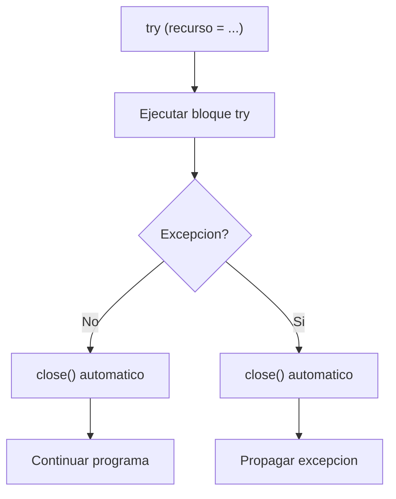
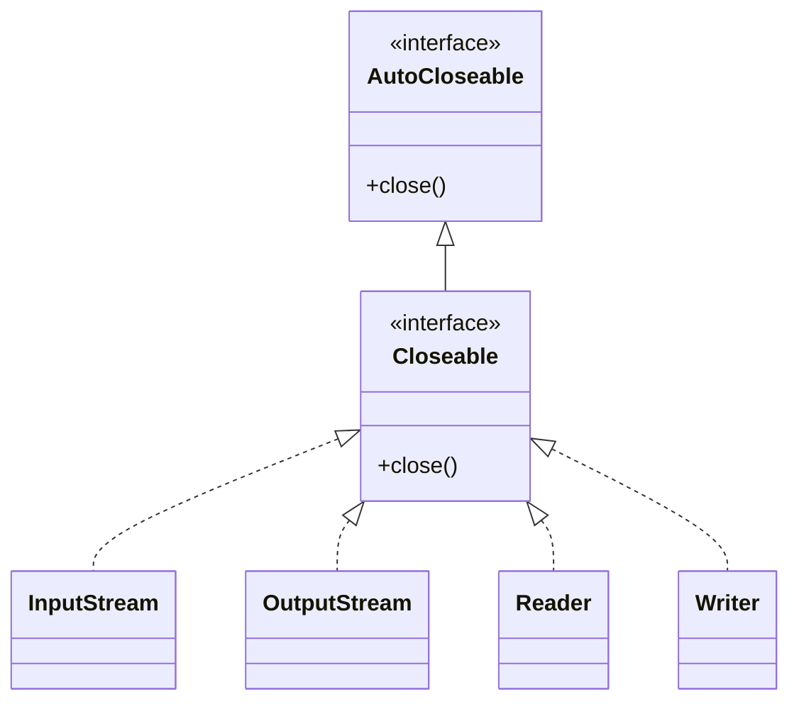

# Bloque IV — Gestion Segura de Recursos (try-with-resources)

> Referencia para ejercicios Ej19 a Ej24 en `src/main/java/bloque4/`

---

## 1. El problema: recursos que se quedan abiertos

Un stream es un **recurso del sistema operativo**. Cada vez que abres un
FileInputStream o un FileWriter, el SO reserva un descriptor de fichero.
Si no lo cierras, el descriptor se pierde (leak) y puede causar:

- **Datos perdidos**: el buffer no se ha volcado al disco.
- **Ficheros bloqueados**: en Windows, no puedes borrar un fichero abierto.
- **Agotamiento de descriptores**: el SO tiene un limite (tipicamente 1024-4096).

```java
// MAL: si write() lanza excepcion, close() nunca se ejecuta
FileWriter fw = new FileWriter("datos.txt");
fw.write("Hola");
fw.close(); // esta linea no se alcanza si write() falla
```

---

## 2. Solucion clasica: try-finally

Antes de Java 7, se usaba try-finally para garantizar el cierre:

```java
FileWriter fw = null;
try {
    fw = new FileWriter("datos.txt");
    fw.write("Hola");
} finally {
    if (fw != null) {
        fw.close(); // siempre se ejecuta, haya o no excepcion
    }
}
```

**Problemas del try-finally:**
- Codigo verbose y repetitivo.
- Si `close()` tambien lanza excepcion, se pierde la excepcion original.
- Facil olvidar el null-check.

---

## 3. try-with-resources (Java 7+)

La sintaxis `try-with-resources` cierra automaticamente cualquier recurso
que implemente la interfaz `AutoCloseable` (o `Closeable`):

```java
try (FileWriter fw = new FileWriter("datos.txt")) {
    fw.write("Hola");
} // fw.close() se llama automaticamente aqui
```



### Multiples recursos

```java
try (FileInputStream fis = new FileInputStream("origen.bin");
     FileOutputStream fos = new FileOutputStream("destino.bin")) {
    int b;
    while ((b = fis.read()) != -1) {
        fos.write(b);
    }
} // fos.close() primero, luego fis.close() (orden inverso)
```

> **Importante:** los recursos se cierran en **orden inverso** al que se declaran.

---

## 4. Suppressed exceptions

Si el bloque try lanza una excepcion Y el close() tambien lanza otra,
Java guarda la segunda como **suppressed exception**:

```java
try (MiRecurso r = new MiRecurso()) {
    throw new IOException("Error en try");
} // si r.close() lanza RuntimeException, se anade como suppressed

// En el catch puedes recuperarla:
catch (IOException e) {
    Throwable[] suprimidas = e.getSuppressed();
}
```

---

## 5. La interfaz AutoCloseable

Cualquier clase que implemente `AutoCloseable` puede usarse en try-with-resources:

```java
public class MiRecurso implements AutoCloseable {
    public MiRecurso() { System.out.println("Recurso abierto"); }

    public void trabajar() { System.out.println("Trabajando..."); }

    @Override
    public void close() { System.out.println("Recurso cerrado"); }
}

// Uso:
try (MiRecurso r = new MiRecurso()) {
    r.trabajar();
}
// Salida:
// Recurso abierto
// Trabajando...
// Recurso cerrado
```



---

## 6. Patron comun: leer + escribir en un solo try

```java
try (BufferedReader br = new BufferedReader(new FileReader("entrada.txt"));
     BufferedWriter bw = new BufferedWriter(new FileWriter("salida.txt"))) {
    String linea;
    while ((linea = br.readLine()) != null) {
        bw.write(linea.toUpperCase());
        bw.newLine();
    }
} // ambos se cierran automaticamente
```

---

## Trampas y errores comunes

### 1. Declarar el recurso fuera del try
```java
// MAL: el recurso no se cierra automaticamente
FileWriter fw = new FileWriter("f.txt");
try (fw) { ... } // Sintaxis valida en Java 9+, pero no en Java 7/8

// BIEN: declarar dentro del parentesis
try (FileWriter fw2 = new FileWriter("f.txt")) { ... }
```

### 2. Usar el recurso despues del try
```java
try (BufferedReader br = new BufferedReader(new FileReader("f.txt"))) {
    // ...
}
br.readLine(); // ERROR DE COMPILACION: br no esta en scope
```

### 3. No poner los decoradores en el try
```java
// MAL: si new BufferedWriter() falla, fw queda abierto
FileWriter fw = new FileWriter("f.txt");
try (BufferedWriter bw = new BufferedWriter(fw)) { ... }

// BIEN: toda la cadena dentro del try
try (BufferedWriter bw = new BufferedWriter(new FileWriter("f.txt"))) { ... }
```

### 4. Cerrar manualmente dentro del try
```java
try (FileWriter fw = new FileWriter("f.txt")) {
    fw.write("datos");
    fw.close(); // INNECESARIO: se cierra automaticamente
    // Ademas, si close() falla, el try-with-resources intentara cerrar otra vez
}
```

### 5. Olvidar que close() puede lanzar excepcion
Si necesitas manejar la excepcion del close(), usa catch:
```java
try (FileWriter fw = new FileWriter("f.txt")) {
    fw.write("datos");
} catch (IOException e) {
    // Aqui se captura tanto la excepcion del write() como la del close()
    System.err.println("Error: " + e.getMessage());
}
```
