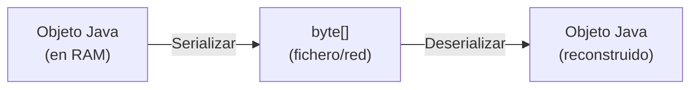
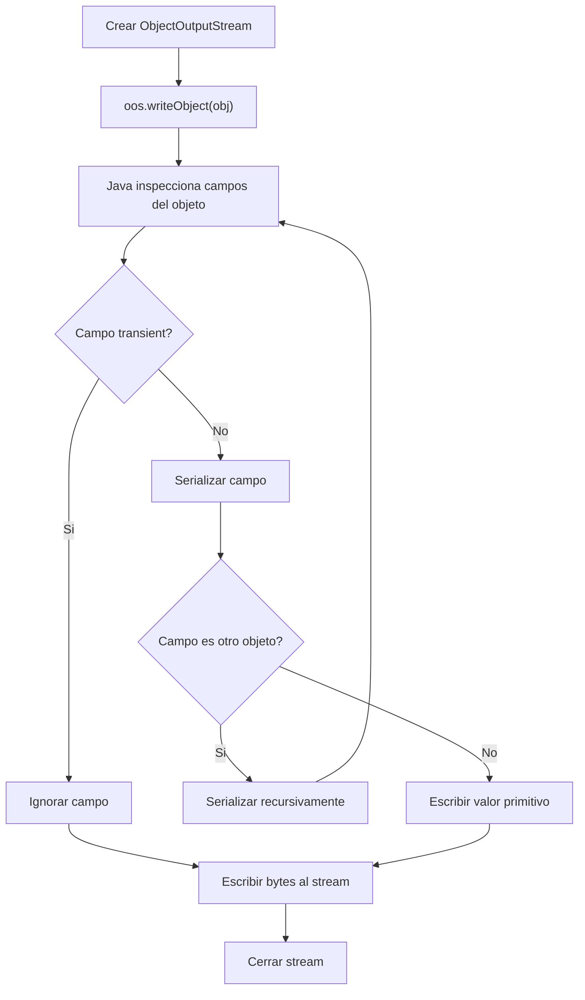

# Bloque V — Serializacion de Objetos

> Referencia para ejercicios Ej25 a Ej30 en `src/main/java/bloque5/`

---

## 1. Que es la serializacion

Serializar es convertir un **objeto en memoria** a una secuencia de bytes
que se puede guardar en un fichero o enviar por red. Deserializar es el
proceso inverso: reconstruir el objeto desde los bytes.



---

## 2. La interfaz Serializable

Para que una clase sea serializable, debe implementar `java.io.Serializable`.
Es una **interfaz marcadora** (no tiene metodos):

```java
import java.io.Serializable;

public class Producto implements Serializable {
    private static final long serialVersionUID = 1L;

    private String nombre;
    private double precio;
    private int stock;

    public Producto(String nombre, double precio, int stock) {
        this.nombre = nombre;
        this.precio = precio;
        this.stock = stock;
    }

    // getters, toString...
}
```

### serialVersionUID

Es un identificador de version de la clase. Si la clase cambia (por ejemplo,
se anade un campo) y el `serialVersionUID` no coincide con el del fichero,
la deserializacion lanza `InvalidClassException`.

> **Buena practica:** declara siempre `serialVersionUID` explicitamente.

---

## 3. ObjectOutputStream: escribir objetos

```java
try (ObjectOutputStream oos = new ObjectOutputStream(
        new FileOutputStream("productos.dat"))) {
    oos.writeObject(new Producto("Arroz", 1.20, 50));
    oos.writeObject(new Producto("Aceite", 3.75, 20));
}
```

`writeObject()` convierte el objeto completo (incluyendo todos sus campos
y objetos referenciados) a bytes y los escribe en el stream.

---

## 4. ObjectInputStream: leer objetos

```java
try (ObjectInputStream ois = new ObjectInputStream(
        new FileInputStream("productos.dat"))) {
    Producto p1 = (Producto) ois.readObject();
    Producto p2 = (Producto) ois.readObject();
    System.out.println(p1); // Producto reconstruido
}
```

- `readObject()` devuelve `Object`, necesitas hacer **cast**.
- Puede lanzar `ClassNotFoundException` si la clase no esta disponible.
- Cuando no quedan mas objetos, lanza `EOFException`.

---

## 5. Serializar colecciones

Las colecciones de Java (ArrayList, HashMap, etc.) ya implementan Serializable,
siempre que sus elementos tambien lo hagan:

```java
List<Producto> lista = new ArrayList<>();
lista.add(new Producto("Sal", 0.80, 100));
lista.add(new Producto("Pan", 1.50, 30));

// Serializar la lista completa
try (ObjectOutputStream oos = new ObjectOutputStream(
        new FileOutputStream("lista.dat"))) {
    oos.writeObject(lista);
}

// Deserializar
try (ObjectInputStream ois = new ObjectInputStream(
        new FileInputStream("lista.dat"))) {
    @SuppressWarnings("unchecked")
    List<Producto> recuperada = (List<Producto>) ois.readObject();
}
```

---

## 6. El modificador transient

Los campos marcados como `transient` **no se serializan**:

```java
public class Usuario implements Serializable {
    private static final long serialVersionUID = 1L;
    private String nombre;
    private transient String password; // no se guarda

    // Al deserializar, password sera null
}
```

Util para:
- Contrasenas y datos sensibles
- Campos calculados que se pueden recalcular
- Recursos no serializables (conexiones, streams)

---

## 7. Diagrama de flujo completo



---

## Trampas y errores comunes

### 1. No implementar Serializable
```java
// MAL: lanza NotSerializableException
oos.writeObject(new MiClaseSinSerializable());
```

### 2. Un campo referencia a un objeto no serializable
```java
public class Pedido implements Serializable {
    private ConexionBD conexion; // ConexionBD no es Serializable -> FALLA
    // Solucion: marcar como transient
}
```

### 3. Olvidar el cast al deserializar
```java
// readObject() devuelve Object, necesitas el cast
Producto p = ois.readObject(); // ERROR DE COMPILACION
Producto p = (Producto) ois.readObject(); // CORRECTO
```

### 4. No gestionar EOFException al leer multiples objetos
```java
// Si no sabes cuantos objetos hay:
try {
    while (true) {
        Producto p = (Producto) ois.readObject();
        lista.add(p);
    }
} catch (EOFException e) {
    // Normal: fin del fichero
}
```

### 5. Cambiar la clase sin actualizar serialVersionUID
Si anadiste un campo y no tienes serialVersionUID explicito, la VM genera
uno automatico que cambiara y los ficheros viejos no se podran leer.
