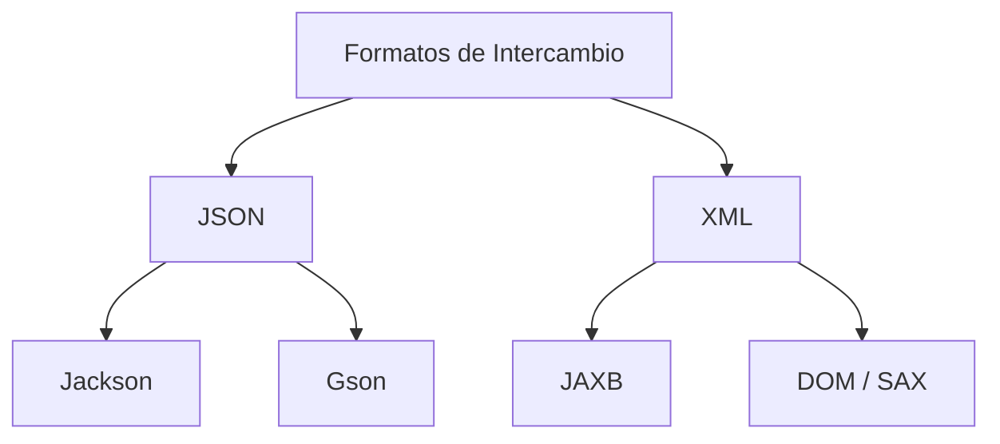

# Bloque VI-B — Manejo de JSON y XML en Java

> 📋 **ENTRA EN EXAMEN** — Todo este bloque cubre contenido del Tema 10.
> Referencia para ejercicios Ej56 a Ej61 en `src/main/java/bloque6b/`

---

## 1. Formatos de intercambio de datos

En la programacion moderna, dos formatos dominan el intercambio de datos:

| Formato | Descripcion | Ejemplo de uso |
|---------|-------------|----------------|
| **JSON** | JavaScript Object Notation — ligero, facil de leer | APIs REST, configuracion, web |
| **XML** | Extensible Markup Language — verboso, robusto | Configuracion empresarial, SOAP |



---

## 2. JSON en Java

**JSON** usa una sintaxis simple de pares clave-valor:
```json
{
  "nombre": "Carlos",
  "edad": 30
}
```

Para arrays: `[{"nombre": "Ana"}, {"nombre": "Luis"}]`

### Librerias populares

| Libreria | Paquete | Caracteristicas |
|----------|---------|-----------------|
| **Jackson** | `com.fasterxml.jackson` | La mas completa. Estandar en Spring Boot. |
| **Gson** | `com.google.gson` | Ligera. Desarrollada por Google. |
| **org.json** | `org.json` | Basica, integrada en algunos frameworks. |

---

## 3. Jackson ObjectMapper: la clase central

`ObjectMapper` es el nucleo de Jackson. Convierte objetos Java a JSON y viceversa.

### Requisitos de la clase modelo

Para que Jackson pueda serializar/deserializar una clase, necesita:
1. **Constructor sin parametros** (vacio).
2. Atributos **publicos** o **getters/setters**.

```java
public class Persona {
    public String nombre;
    public int edad;

    public Persona() {}  // Obligatorio para Jackson

    public Persona(String nombre, int edad) {
        this.nombre = nombre;
        this.edad = edad;
    }
}
```

---

## 4. Serializar un objeto a JSON (writeValue)

```java
import com.fasterxml.jackson.databind.ObjectMapper;
import java.io.File;

ObjectMapper mapper = new ObjectMapper();
Persona p = new Persona("Carlos", 30);

// Escribir a fichero
mapper.writeValue(new File("persona.json"), p);

// Convertir a String JSON
String json = mapper.writeValueAsString(p);
// {"nombre":"Carlos","edad":30}
```

---

## 5. Deserializar JSON a objeto (readValue)

```java
ObjectMapper mapper = new ObjectMapper();

// Leer desde fichero
Persona p = mapper.readValue(new File("persona.json"), Persona.class);
System.out.println(p.nombre + ", " + p.edad); // Carlos, 30

// Leer desde String
Persona p2 = mapper.readValue("{\"nombre\":\"Ana\",\"edad\":25}", Persona.class);
```

---

## 6. Serializar y deserializar listas

### Escritura de lista
```java
List<Persona> personas = Arrays.asList(
    new Persona("Ana", 25),
    new Persona("Luis", 35)
);
mapper.writeValue(new File("personas.json"), personas);
// [{"nombre":"Ana","edad":25},{"nombre":"Luis","edad":35}]
```

### Lectura de lista con TypeReference
```java
import com.fasterxml.jackson.core.type.TypeReference;

List<Persona> lista = mapper.readValue(
    new File("personas.json"),
    new TypeReference<List<Persona>>() {}
);
```

> `TypeReference` es necesario porque Java borra los genericos en tiempo de
> ejecucion (type erasure). Sin el, Jackson no sabe que la lista contiene `Persona`.

---

## 7. XML en Java con JAXB

**XML** usa etiquetas para estructurar datos:
```xml
<cliente>
    <nombre>Juan</nombre>
    <edad>40</edad>
</cliente>
```

### JAXB (Java Architecture for XML Binding)

JAXB usa **anotaciones** para mapear clases Java a elementos XML:

```java
import jakarta.xml.bind.annotation.XmlElement;
import jakarta.xml.bind.annotation.XmlRootElement;

@XmlRootElement  // Define el elemento raiz del XML
public class Cliente {
    private String nombre;
    private int edad;

    public Cliente() {}  // Obligatorio para JAXB

    public Cliente(String nombre, int edad) {
        this.nombre = nombre;
        this.edad = edad;
    }

    @XmlElement public String getNombre() { return nombre; }
    @XmlElement public int getEdad() { return edad; }

    public void setNombre(String nombre) { this.nombre = nombre; }
    public void setEdad(int edad) { this.edad = edad; }
}
```

---

## 8. Serializar a XML (Marshalling)

```java
import jakarta.xml.bind.JAXBContext;
import jakarta.xml.bind.Marshaller;

Cliente cliente = new Cliente("Juan", 40);
JAXBContext contexto = JAXBContext.newInstance(Cliente.class);
Marshaller marshaller = contexto.createMarshaller();
marshaller.setProperty(Marshaller.JAXB_FORMATTED_OUTPUT, true); // formato bonito
marshaller.marshal(cliente, new File("cliente.xml"));
```

Salida:
```xml
<cliente>
    <nombre>Juan</nombre>
    <edad>40</edad>
</cliente>
```

---

## 9. Deserializar XML a objeto (Unmarshalling)

```java
import jakarta.xml.bind.JAXBContext;
import jakarta.xml.bind.Unmarshaller;

JAXBContext contexto = JAXBContext.newInstance(Cliente.class);
Unmarshaller unmarshaller = contexto.createUnmarshaller();
Cliente cliente = (Cliente) unmarshaller.unmarshal(new File("cliente.xml"));
System.out.println(cliente.getNombre() + ", " + cliente.getEdad());
```

---

## 10. Comparacion JSON vs XML

| Caracteristica | JSON | XML |
|---------------|------|-----|
| **Simplicidad** | Mas simple y ligero | Mas verboso |
| **Legibilidad** | Mas facil de leer | Mas dificil |
| **Tamano** | Archivos mas pequenos | Archivos mas grandes |
| **Uso principal** | APIs REST, web moderna | Configuracion empresarial, SOAP |
| **Validacion** | JSON Schema | XSD (robusto) |
| **Librerias Java** | Jackson, Gson | JAXB, DOM, SAX |

> **Recomendacion:** Para proyectos nuevos, usa JSON con Jackson. Reserva XML
> para sistemas legacy o cuando la validacion XSD sea requerida.

---

## Trampas y errores comunes

### 1. Olvidar el constructor sin parametros
```java
// MAL: Jackson no puede crear instancias sin constructor vacio
public class Producto {
    public Producto(String nombre) { ... } // unico constructor
}

// BIEN: anadir constructor vacio
public class Producto {
    public Producto() {}
    public Producto(String nombre) { ... }
}
```

### 2. Campos privados sin getters
```java
// MAL: Jackson no puede acceder a campos privados sin getters
private String nombre; // sin getNombre() -> no se serializa
```

### 3. JAXB no incluido en JDK moderno
Desde Java 9+, JAXB no viene en el JDK. Necesitas anadir la dependencia
`jakarta.xml.bind-api` y `jaxb-runtime` al `pom.xml`.

### 4. Olvidar @XmlRootElement
Sin esta anotacion, JAXB no sabe cual es el elemento raiz del XML.

### 5. Confundir Marshaller/Unmarshaller
- **Marshalling** = Objeto → XML (escribir)
- **Unmarshalling** = XML → Objeto (leer)
