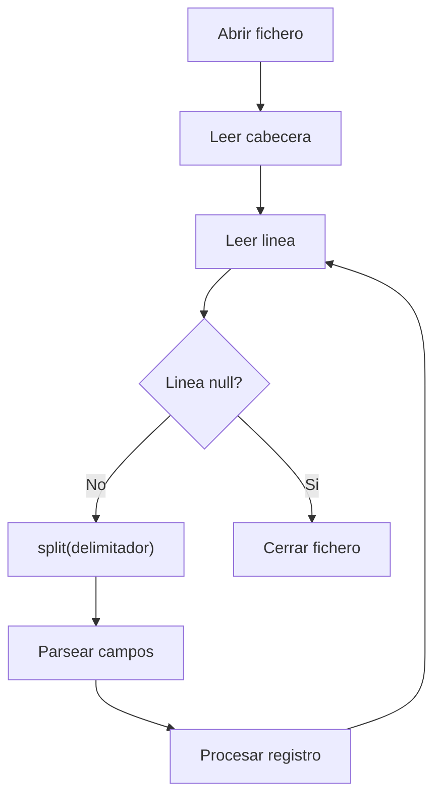

# Bloque VI — Procesamiento de Ficheros CSV

> Referencia para ejercicios Ej31 a Ej36 en `src/main/java/bloque6/`

---

## 1. Que es un fichero CSV

CSV (Comma-Separated Values) es un formato de texto plano donde cada linea
representa un registro y los campos se separan por un delimitador
(coma, punto y coma, tabulador...).

```
nombre;precio;stock
Arroz;1.20;50
Aceite;3.75;20
Sal;0.80;100
```

Es el formato mas comun para intercambiar datos tabulares entre sistemas.

---

## 2. Lectura basica con BufferedReader + split()

```java
try (BufferedReader br = new BufferedReader(new FileReader("productos.csv"))) {
    String cabecera = br.readLine(); // primera linea = nombres de columnas
    String linea;
    while ((linea = br.readLine()) != null) {
        String[] campos = linea.split(";");
        String nombre = campos[0];
        double precio = Double.parseDouble(campos[1]);
        int stock = Integer.parseInt(campos[2]);
        System.out.printf("%s -> %.2f EUR (x%d)%n", nombre, precio, stock);
    }
}
```

---

## 3. Escritura basica con BufferedWriter

```java
try (BufferedWriter bw = new BufferedWriter(new FileWriter("salida.csv"))) {
    bw.write("nombre;precio;stock");
    bw.newLine();
    bw.write("Pan;1.50;30");
    bw.newLine();
    bw.write("Leche;0.95;80");
    bw.newLine();
}
```

---

## 4. Delimitadores comunes

| Delimitador | Ejemplo            | Uso tipico        |
|-------------|--------------------|--------------------|
| `,`         | `a,b,c`            | Estandar USA       |
| `;`         | `a;b;c`            | Europa (decimal=,) |
| `\t`        | `a\tb\tc`          | TSV (Tab-Separated)|
| `|`         | `a|b|c`            | Sistemas legacy    |

> **Cuidado:** si el delimitador es `,` y un campo contiene comas,
> hay que escapar el campo entre comillas: `"campo con, coma"`.

---

## 5. Patron de procesamiento CSV



---

## 6. Validacion de datos

Al leer CSV, es fundamental validar:

```java
String[] campos = linea.split(";");
if (campos.length < 3) {
    System.err.println("Linea malformada: " + linea);
    continue; // saltar esta linea
}
try {
    double precio = Double.parseDouble(campos[1].trim());
} catch (NumberFormatException e) {
    System.err.println("Precio invalido: " + campos[1]);
    continue;
}
```

---

## 7. Transformaciones comunes

- **Filtrar**: quedarse solo con registros que cumplen una condicion
- **Ordenar**: leer todos, ordenar en memoria, escribir de nuevo
- **Agrupar**: contar o sumar por categoria
- **Convertir**: cambiar delimitador, formato de numeros, etc.
- **Unir**: combinar dos CSV con una columna en comun

---

## Trampas y errores comunes

### 1. Olvidar la cabecera
```java
// MAL: la primera linea se procesa como dato
while ((linea = br.readLine()) != null) { ... }

// BIEN: saltar o guardar la cabecera
String cabecera = br.readLine();
```

### 2. No hacer trim() de los campos
```java
// Si el CSV tiene espacios: "Arroz ; 1.20 ; 50"
double precio = Double.parseDouble(campos[1]); // FALLA: " 1.20 "
double precio = Double.parseDouble(campos[1].trim()); // OK
```

### 3. Confundir delimitadores
```java
// El CSV usa ; pero haces split(",") -> un solo campo enorme
```

### 4. No manejar NumberFormatException
```java
// Si una linea esta corrupta, parseDouble lanza NumberFormatException
// Siempre usar try-catch al parsear campos numericos
```

### 5. Asumir numero fijo de columnas
```java
// Algunas lineas pueden tener menos campos si hay datos vacios al final
// Siempre verificar campos.length antes de acceder
```
