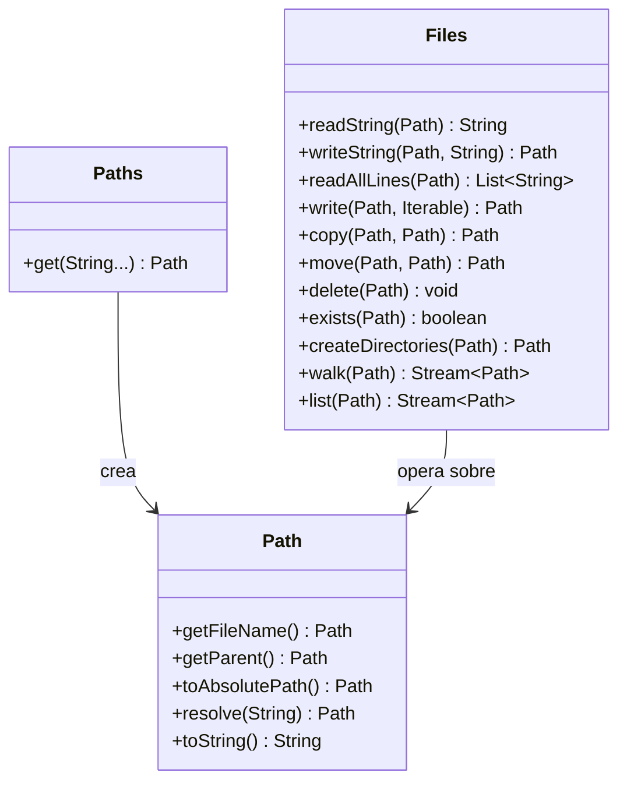

# Bloque VII — NIO.2 (java.nio.file)

> Referencia para ejercicios Ej37 a Ej42 en `src/main/java/bloque7/`

---

## 1. Por que NIO.2

Java NIO.2 (introducido en Java 7) moderniza la gestion de ficheros
con las clases `Path`, `Files` y `Paths`. Ventajas sobre `java.io.File`:

- API mas limpia e intuitiva
- Soporte para enlaces simbolicos
- Operaciones atomicas
- Acceso a atributos del sistema de ficheros
- Mejor manejo de errores (excepciones especificas)

---

## 2. Path y Paths

`Path` representa una ruta en el sistema de ficheros:

```java
import java.nio.file.Path;
import java.nio.file.Paths;

Path ruta = Paths.get("temp", "bloque7", "datos.txt");
// equivalente a: Path.of("temp/bloque7/datos.txt")  (Java 11+)

System.out.println(ruta.getFileName());  // datos.txt
System.out.println(ruta.getParent());    // temp/bloque7
System.out.println(ruta.toAbsolutePath());
```

---

## 3. La clase Files

`Files` contiene metodos estaticos para operaciones con ficheros:

### Leer y escribir
```java
// Escribir texto
Files.writeString(ruta, "Hola NIO.2");

// Leer texto completo
String contenido = Files.readString(ruta);

// Escribir lineas
Files.write(ruta, List.of("linea1", "linea2"));

// Leer todas las lineas
List<String> lineas = Files.readAllLines(ruta);
```

### Crear, copiar, mover, borrar
```java
// Crear directorio (y padres)
Files.createDirectories(Paths.get("temp/bloque7/sub"));

// Copiar fichero
Files.copy(origen, destino, StandardCopyOption.REPLACE_EXISTING);

// Mover fichero
Files.move(origen, destino, StandardCopyOption.ATOMIC_MOVE);

// Borrar
Files.delete(ruta);          // lanza si no existe
Files.deleteIfExists(ruta);  // no lanza si no existe
```

### Comprobar existencia y tipo
```java
Files.exists(ruta);
Files.isRegularFile(ruta);
Files.isDirectory(ruta);
Files.size(ruta);  // bytes
```

---

## 4. Listar contenido de directorios

```java
// Listado simple
try (DirectoryStream<Path> stream = Files.newDirectoryStream(dir)) {
    for (Path p : stream) {
        System.out.println(p.getFileName());
    }
}

// Con glob filter
try (DirectoryStream<Path> stream = Files.newDirectoryStream(dir, "*.txt")) {
    for (Path p : stream) { ... }
}

// Recursivo con walk
try (Stream<Path> stream = Files.walk(dir)) {
    stream.filter(Files::isRegularFile)
          .forEach(System.out::println);
}
```

---

## 5. Diagrama de las clases principales



---

## 6. Comparacion java.io.File vs java.nio.file

| Operacion        | java.io.File              | java.nio.file               |
|------------------|---------------------------|-----------------------------|
| Crear ruta       | `new File("a.txt")`       | `Paths.get("a.txt")`       |
| Existe?          | `f.exists()`              | `Files.exists(p)`           |
| Leer texto       | `BufferedReader+FileReader`| `Files.readString(p)`       |
| Escribir texto   | `BufferedWriter+FileWriter`| `Files.writeString(p, s)`   |
| Copiar           | Manual con streams        | `Files.copy(src, dst)`      |
| Borrar           | `f.delete()`              | `Files.delete(p)`           |
| Listar dir       | `f.listFiles()`           | `Files.list(p)`             |

---

## Trampas y errores comunes

### 1. No cerrar streams de walk/list
```java
// MAL: resource leak
Files.walk(dir).forEach(...);

// BIEN: try-with-resources
try (Stream<Path> s = Files.walk(dir)) {
    s.forEach(...);
}
```

### 2. Confundir resolve y relativize
```java
Path base = Paths.get("/home/user");
Path rel = Paths.get("docs/file.txt");

base.resolve(rel);     // /home/user/docs/file.txt
base.relativize(Paths.get("/home/user/docs/file.txt")); // docs/file.txt
```

### 3. NoSuchFileException vs FileNotFoundException
NIO.2 usa `NoSuchFileException` (subclase de `FileSystemException`),
no `FileNotFoundException` del paquete java.io.

### 4. Asumir que Path es multiplataforma
```java
// Usa / o Paths.get() con varargs, no hardcodees \
Path p = Paths.get("temp", "bloque7", "datos.txt"); // OK
```

### 5. Olvidar StandardCopyOption al copiar
```java
// Si el destino ya existe, lanza FileAlreadyExistsException
// Usa REPLACE_EXISTING si quieres sobreescribir
Files.copy(src, dst, StandardCopyOption.REPLACE_EXISTING);
```
