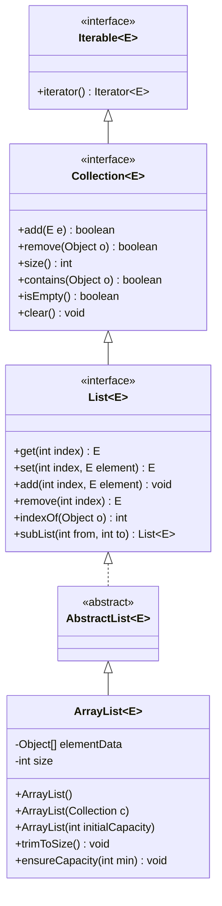
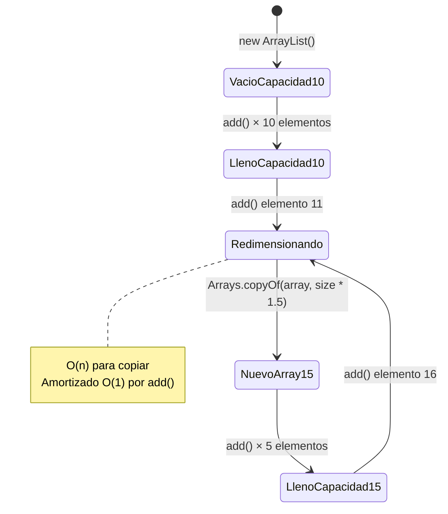
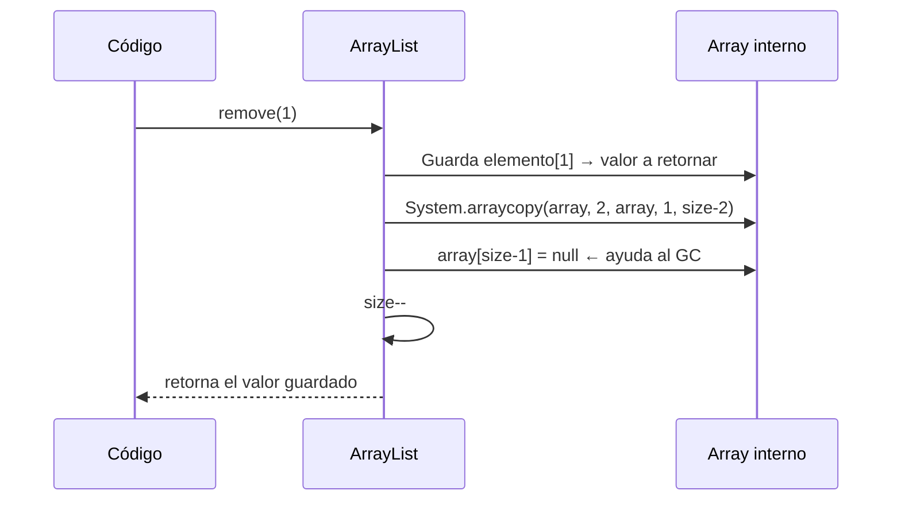
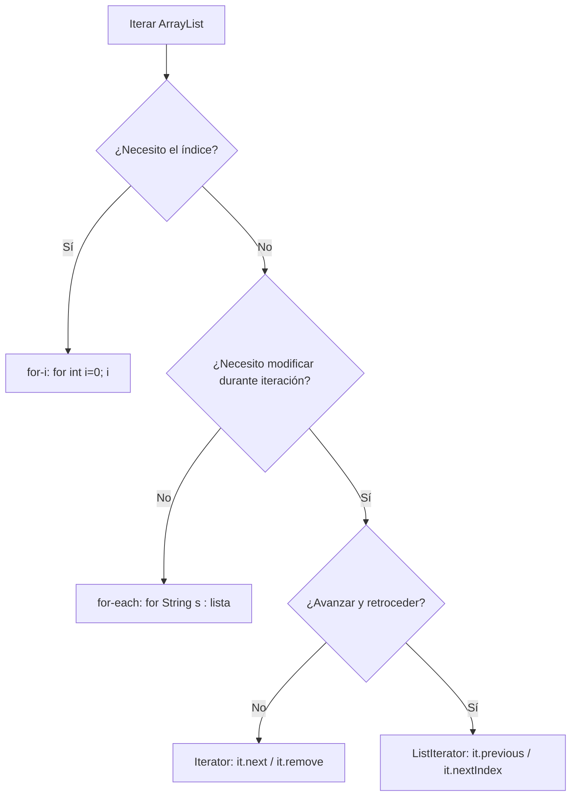
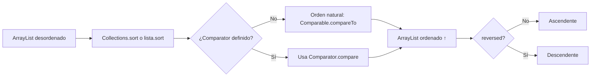
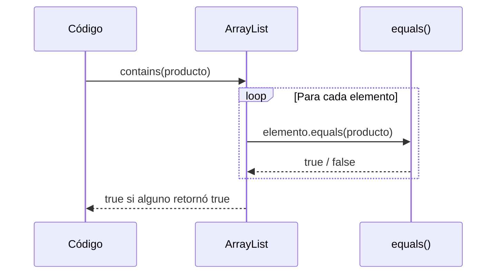

# 01 — ArrayList: Fundamentos

> **Referencia de ejercicios**: Ejercicio01 · Ejercicio02 · Ejercicio03 · Ejercicio04 · Ejercicio05 · Ejercicio06

---

## 1. ¿Qué es ArrayList?

`ArrayList<E>` es la implementación más usada de la interfaz `List`. Internamente almacena
elementos en un **array de objetos redimensionable**. Cuando el array se llena, Java crea
uno nuevo con un 50% más de capacidad y copia todos los elementos.

### Jerarquía de interfaces



---

## 2. Memoria interna: cómo crece ArrayList



**Coste de operaciones:**

| Operación | Coste temporal |
|---|---|
| `get(i)` / `set(i, e)` | O(1) |
| `add(e)` al final | O(1) amortizado |
| `add(i, e)` en medio | O(n) — desplaza elementos |
| `remove(i)` | O(n) — desplaza elementos |
| `contains(o)` | O(n) — búsqueda lineal |

---

## 3. Operaciones CRUD básicas

### Crear y añadir (`add`)

```
lista.add("A")          →  ["A"]
lista.add("B")          →  ["A", "B"]
lista.add(0, "X")       →  ["X", "A", "B"]   ← desplaza todo
lista.add(1, "Y")       →  ["X", "Y", "A", "B"]
```

### Leer (`get`) y modificar (`set`)

```
lista.get(0)            →  "X"
lista.set(0, "Z")       →  ["Z", "Y", "A", "B"]
```

### Eliminar (`remove`)

```
lista.remove(0)         →  "Z"  (retorna el eliminado)  → ["Y", "A", "B"]
lista.remove("A")       →  true (elimina la primera ocurrencia) → ["Y", "B"]
```

### Flujo de remove(int index)



---

## 4. Formas de iterar un ArrayList

### Comparativa visual



---

## 5. Búsqueda y filtrado

| Método | Descripción | Retorna |
|---|---|---|
| `indexOf(o)` | Primera posición de `o` | `int` (-1 si no existe) |
| `lastIndexOf(o)` | Última posición de `o` | `int` |
| `contains(o)` | ¿Existe `o`? | `boolean` |
| `subList(from, to)` | Vista parcial `[from, to)` | `List<E>` (backed view) |
| `removeIf(pred)` | Elimina todos los que cumplan el predicado | `boolean` |

> **Cuidado con `subList`**: retorna una **vista** del ArrayList original, no una copia.
> Modificar la sublista modifica el ArrayList original. Para una copia real:
> `new ArrayList<>(lista.subList(from, to))`

---

## 6. Ordenación con Comparator



**Comparator encadenado:**
```
Comparator.comparing(String::length)
          .thenComparing(Comparator.naturalOrder())
```
Ordena primero por longitud; si hay empate, aplica orden alfabético.

---

## 7. ArrayList con objetos propios — equals y hashCode

Para que `contains()`, `remove(Object)` e `indexOf()` funcionen correctamente con tus
propias clases, **debes sobrescribir `equals()`**. Si sobrescribes `equals()`, Java también
exige que sobrescribas `hashCode()` (contrato de Java SE).



---

## 8. Operaciones de colección (bulk)

| Método | Acción |
|---|---|
| `addAll(Collection c)` | Añade todos los elementos de `c` al final |
| `addAll(int i, Collection c)` | Inserta todos desde la posición `i` |
| `removeAll(Collection c)` | Elimina todos los elementos que estén en `c` |
| `retainAll(Collection c)` | Conserva solo los que estén en `c` (intersección) |
| `containsAll(Collection c)` | `true` si contiene todos los elementos de `c` |

---

## 9. Inmutabilidad y vistas no modificables

```
List<String> inmutable = List.of("A", "B", "C");   // Java 9+ — no permite null
List<String> envuelta  = Collections.unmodifiableList(lista);  // vista de otra lista
```

Intentar `add()`, `set()` o `remove()` sobre estas referencias lanza
`UnsupportedOperationException` en tiempo de ejecución.

---

## Puntos clave para los ejercicios

- `ArrayList` acepta `null` y elementos duplicados.
- El índice de acceso es base-0.
- `subList()` devuelve una vista; haz `new ArrayList<>(subList(...))` para copia independiente.
- Siempre sobrescribe `equals()` (y `hashCode()`) en tus clases antes de usarlas en una List.
- Prefiere `for-each` para lectura; usa `Iterator` o `removeIf` para eliminar durante iteración.
